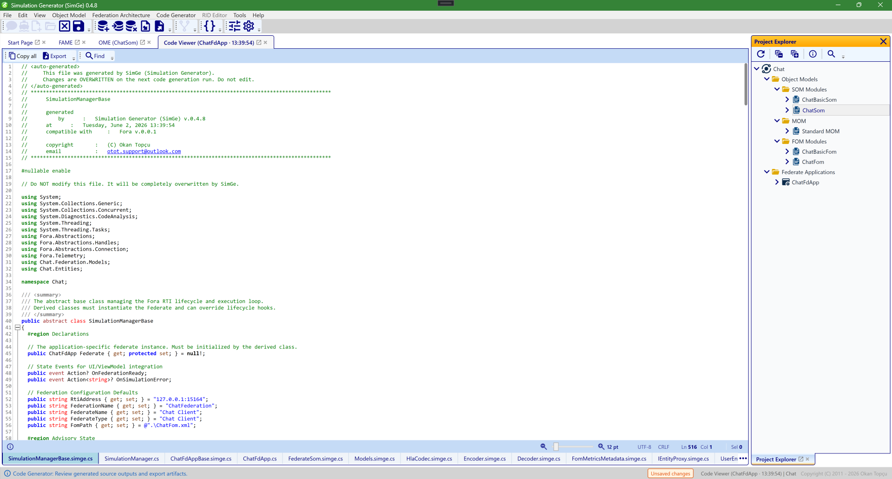

# Code Generator

This page documents the current **Fora-only** code generation flow in SimGe.

It explains:
- which generator classes participate in a Fora run
- which settings change the generated output
- which metric-driven strategies are available
- when each strategy becomes active

This document does **not** cover legacy RACoN / HLA 1.3 / HLA 1516e generators.



*The generated **code viewer** for a federate (here `ChatFdApp`). After a generation run, SimGe opens the produced C# files for read-only review — each generated file is a tab along the bottom — and you can copy (Ctrl+C) or export (Ctrl+E) the source. Generation is configured in the project's **Code Generator settings** (see [Project Structure & Settings](ProjectSettings.md)) and summarized in a per-federate report afterwards.*

---

## Scope

The Fora generator is selected when:

- `CodeGeneratorSettings.RtiLibraryType = HLA2025_Fora`

The entry point is:

- `SimGe.Application/CodeGenerator/CodeGeneratorManager.cs`

The main execution path is:

1. metric analysis is computed for the federate SOM
2. per-class `ClassGenStrategy` objects are derived
3. base Fora generators run
4. optional metric-driven variant generators run

---

## Main Flow

For a Fora generation run, `CCodeGeneratorManager.generateFora(...)` currently emits:

1. `CSimMngrClassGenerator_Fora`
2. `CFederateClassGenerator_Fora`
3. `CFederateManualClassGenerator`
4. `CSomClassGenerator_Fora`
5. `CModelsGenerator_Fora`
6. `CHlaCodecGenerator_Fora`
7. `CEncoderGenerator_Fora`
8. `CDecoderGenerator_Fora`
9. `CEntityGenerator_Fora`
10. `CDatatypeGenerator`
11. `CTagsGenerator`

If metric-driven variants are enabled, it also emits:

12. `CSpecializedCodecGenerator_Fora`
13. `CDeltaTrackerGenerator_Fora`

---

## Planned: Service-Driven Generation

A planned Fora enhancement is to synchronize generated code with the OMT **Services** usage table.

Target behavior:

- generate service-related boilerplate only when the corresponding service is marked `Used`
- reduce unused lifecycle/helper code in `SimulationManagerBase.simge.cs`
- reduce unused callback scaffolding in the generated Fora federate base where possible

Constraint:

- methods required by the Fora interfaces will still need to exist for type compliance; planning focuses on suppressing extra wrappers, helpers, and optional boilerplate around unused services

---

## Generated Structure

Typical Fora output is organized like this:

```text
Generated/
  Core/
    [Federate]Base.simge.cs
    SimulationManagerBase.simge.cs
  Som/
    FederateSom.simge.cs
  Models/
    Models.simge.cs
    HlaCodec.simge.cs
    Encoder.simge.cs
    Decoder.simge.cs
    Datatypes.simge.cs
    Tags.simge.cs
    SpecializedCodecs/
      [Class]Codec.simge.cs
    Delta/
      [Class]DeltaTracker.simge.cs
  Entities/
    IEntityProxy.simge.cs
    [Class]Entity.simge.g.cs

Entities/
  [Class]Entity.cs

SimulationManager.cs
[Federate].cs
```

Notes:

- `Generated/` is machine-owned and may be overwritten on regeneration.
- `Entities/[Class]Entity.cs` and `SimulationManager.cs` are user scaffolds.
- `SpecializedCodecs/` and `Delta/` appear only when metric-driven variants are active and applicable.

---

## Settings

The most important Fora settings are in:

- `SimGe.Application/CodeGenerator/CodeGeneratorSettings.cs`

### Core Selector

| Setting | Meaning |
|---|---|
| `RtiLibraryType = HLA2025_Fora` | activates the Fora generator path |

### Metric-Driven Settings

| Setting | Default | Effect |
|---|---:|---|
| `EnableMetricDrivenVariants` | `false` | turns metric-driven generator branches on |
| `SaturationThreshold` | `0.6` | hotspot threshold used by `MetricEngine` |
| `DispersionThreshold` | `1.0` | extra hotspot threshold based on relative payload |
| `EmitDispatchTable` | `true` | allows generated dispatch-table branches when metric mode is enabled |

Important behavior:

- if `EnableMetricDrivenVariants = false`, SimGe stays on the legacy Fora generation path
- dispatch-table output is now also gated by `EnableMetricDrivenVariants`

---

## Metric Pipeline

The current Fora metric path is:

1. `MetricAnalysisService.Analyze(...)`
2. `MetricEngine.Compute(...)`
3. `ClassGenStrategy.FromSnapshot(...)`

### Shared Metric Source

The generator no longer uses a fully separate placeholder metric model.

The code generation layer now derives its class snapshots from the same shared analysis family used by dashboard statistics:

- `SimGe.Model/Helpers/Metrics/MetricAnalysisCore.cs`
- `SimGe.Model/Helpers/Metrics/MetricAnalysisService.cs`
- `SimGe.Model/Helpers/Metrics/MetricAnalysisResult.cs`

This reduces drift between dashboard interpretation and code generation decisions.

### Current Strategy Inputs

`ClassGenStrategy` currently carries:

- `IsHotspot`
- `IsAnemic`
- `IsCritical`
- `IsPopulationGated`
- `IsPeriodic`
- `IsConditional`
- `IsStatic`
- `EmitSpecializedCodec`
- `EmitDeltaTracker`

Derived outputs today are:

- `EmitSpecializedCodec = EnableMetricDrivenVariants && IsHotspot`
- `EmitDeltaTracker = EnableMetricDrivenVariants && IsHotspot && IsPeriodic`

---

## Strategy Matrix

This is the current Fora behavior.

| Condition | Result |
|---|---|
| `EnableMetricDrivenVariants = false` | no specialized codec files, no delta tracker files, no metric-driven dispatch tables |
| `IsHotspot = true` | encoder/decoder may delegate to a specialized codec |
| `IsHotspot = true` and class is an **Object Class** | `CSpecializedCodecGenerator_Fora` emits `Generated/Models/SpecializedCodecs/[Class]Codec.simge.cs` |
| `IsHotspot = true` and `IsPeriodic = true` and class is an **Object Class** | `CDeltaTrackerGenerator_Fora` emits `Generated/Models/Delta/[Class]DeltaTracker.simge.cs` |
| `IsCritical = true` | generated `SimulationManagerBase` wraps register/update helpers in a `try/catch` and calls `OnCriticalFault(...)` |
| `EmitDispatchTable = true` and metric mode is enabled | generated federate and decoder include dispatch-table branches |

---

## Runtime Interpretation of Metric-Driven Variants

Metric-driven variants are intended to affect runtime behavior, not only generated-file
organization. Their current implementation has the following exact boundaries:

| Variant | Runtime value | Current limitation |
|---|---|---|
| Specialized codecs | Hotspot Object Class encode/decode calls delegate to a class-specific codec with explicit per-attribute statements and exact-capacity dictionaries. | Generated only for Object Classes; Interaction Classes still use the normal generated encoder/decoder methods. |
| Delta trackers | Periodic hotspot Object Classes receive a `GetDelta(...)` helper that compares consecutive DTO snapshots and returns a partial DTO containing changed attributes. | The default `UpdateAsync(...)` method does not automatically compute a delta. Scenario code must call `GetDelta(...)` and then pass the returned partial DTO to the update path. |
| Dispatch tables | Metric mode can emit dictionary-backed dispatch helpers where the generator has table-based routing support. | This is not a universal replacement for every generated callback branch; some ambassador dispatchers still use explicit class-handle checks. |
| Critical wrappers | Critical Object Class registration and update helpers call `OnCriticalFault(...)` inside generated `try/catch` wrappers and then rethrow. | The wrapper is limited to generated object registration/update helpers. |

Therefore the feature is implemented, but performance claims should be read as generated runtime
strategy potential rather than benchmark evidence. Actual speedup or bandwidth reduction depends
on the FOM shape, update frequency, payload sizes, subscriber topology, and whether scenario code
uses the generated delta helper for periodic hotspot objects.

---

## Current Generator Behaviors

### `CEncoderGenerator_Fora`

Behavior:

- always emits interaction encoders
- always emits object encoders
- if strategy says `EmitSpecializedCodec`, object encode methods delegate to `[Class]Codec.Encode(...)`

Current scope:

- specialized delegation is applied to Object Classes
- interaction classes still use normal generated encode logic

### `CDecoderGenerator_Fora`

Behavior:

- always emits interaction decoders
- always emits object-family dispatch methods
- if strategy says `EmitSpecializedCodec`, object decode methods delegate to `[Class]Codec.Decode(...)`
- if metric mode is enabled and `EmitDispatchTable = true`, object-family dispatch methods use generated dispatch dictionaries

### `CEntityGenerator_Fora`

Behavior:

- always emits generated entity proxy partials
- always emits user scaffold entity files
- if strategy says `EmitDeltaTracker`, entity proxy includes a delta-tracking hook

Important fix:

- the delta hook is now gated by `EmitDeltaTracker`, not merely by `IsPeriodic`
- this prevents generated entities from referencing tracker classes that were never emitted

### `CSimMngrClassGenerator_Fora`

Behavior:

- always emits generated `SimulationManagerBase`
- always emits `SimulationManager.cs` scaffold
- if strategy says `IsCritical`, generated register/update helpers wrap their body in `try/catch`

Current critical hook:

- `protected virtual void OnCriticalFault(string className, Exception ex)`

#### Generated `SimulationManagerBase.simge.cs` API & Lifecycle

The generated `SimulationManagerBase` defines the IEEE 1516-2025 async federation lifecycle. Its key API components include:

##### 1. Configuration Properties
- `RtiAddress`: The connection address for the RTI.
- `FederationName`: The name of the target federation execution.
- `FederateName` & `FederateType`: Identifiers for the federate execution.
- `FomPath`: Path to the single FDD/FOM XML file (defaults to the project's generated FOM).
- `FomModules`: A list of modular FOM paths (`IReadOnlyList<string>`). When populated, it triggers the multi-module federation creation.

##### 2. The `RunAsync` Orchestration
The simulation execution is started by calling the sealed `RunAsync(CancellationToken ct)`. The federation creation step is executed conditionally:
- If `FomModules` has elements, it invokes `CreateFederationExecutionAsync(FederationName, FomModules, ct)`.
- If `FomModules` is empty, it falls back to `CreateFederationExecutionAsync(FederationName, FomPath, ct)`.

This design makes the federate multi-module aware at runtime: the scenario driver simply sets the `FomModules` list with the ordered module file paths (base-first) prior to calling `RunAsync()`. Once the federation is created with all FDD modules, the join execution works automatically without further changes.

##### 3. Virtual Hook `OnPublishAndSubscribeAsync`
The generator emits a virtual method containing all default publish and subscribe calls derived from the SOM design:
`protected virtual async Task OnPublishAndSubscribeAsync(CancellationToken ct)`
This method can be overridden in the user subclass `SimulationManager.cs` to customize, extend, or defer P/S logic at runtime.

##### 4. Register Methods
The base class exposes type-safe registration methods for object classes, such as `Register[Class]Async` (e.g., `RegisterHumanAsync`). These methods register object instances with the RTI and return the corresponding generated entity wrapper.

### `CFederateClassGenerator_Fora`

Behavior:

- emits the generated federate ambassador base
- if metric mode is enabled and `EmitDispatchTable = true`, emits the generated `_dispatchNames` table

### `CSpecializedCodecGenerator_Fora`

Behavior:

- emits one file per hotspot **Object Class**
- inlines attribute encode/decode logic for that class

Current scope:

- Object Classes only
- no specialized interaction codec generator exists at the moment

### `CDeltaTrackerGenerator_Fora`

Behavior:

- emits one file per **periodic hotspot Object Class**
- compares successive DTO snapshots
- returns a partial delta DTO containing changed attributes only

Current scope:

- Object Classes only

---

## Current Scope Limits

The current Fora metric-driven implementation is intentionally narrower than the full strategy model.

### Object Classes vs Interaction Classes

Metric snapshots are computed for both OC and IC domains, but variant file generation is currently limited to Object Classes:

- `CSpecializedCodecGenerator_Fora` accepts `COmtOC`
- `CDeltaTrackerGenerator_Fora` accepts `COmtOC`
- `generateMetricVariants(...)` iterates only over `COmtOC`

Practical result:

- an Interaction Class can still be classified as a hotspot in strategy output
- but SimGe does not currently emit a specialized interaction codec file for it

### Delta Tracker Requirements

A delta tracker is generated only when all of these are true:

1. metric mode is enabled
2. the class is classified as a hotspot
3. the class is classified as periodic
4. the class is an Object Class

### Dispatch Tables

Dispatch-table generation is not global by default anymore.

It requires:

1. `EnableMetricDrivenVariants = true`
2. `EmitDispatchTable = true`

---

## Practical Examples

### Standard Fora Generation

Use this when you want predictable generated code without metric-driven specialization:

- `RtiLibraryType = HLA2025_Fora`
- `EnableMetricDrivenVariants = false`

Expected result:

- normal `Encoder.simge.cs`
- normal `Decoder.simge.cs`
- no `SpecializedCodecs/`
- no `Delta/`

### Hotspot Object Class

Use this when a class has high payload concentration and you want a tighter encode/decode path:

- `EnableMetricDrivenVariants = true`
- class is classified as `IsHotspot = true`

Expected result:

- `[Class]Codec.simge.cs` is generated
- object encode/decode methods delegate to it

### Periodic Hotspot Object Class

Use this when a frequently updated object should emit smaller partial DTO updates:

- `EnableMetricDrivenVariants = true`
- `IsHotspot = true`
- `IsPeriodic = true`

Expected result:

- `[Class]Codec.simge.cs`
- `[Class]DeltaTracker.simge.cs`
- generated entity includes `GetDelta(...)`

### Critical Object Class

Use this when a class is marked with critical semantics and you want generated manager helpers to expose failures cleanly:

- `EnableMetricDrivenVariants = true`
- `IsCritical = true`

Expected result:

- generated register/update helper wraps operation in `try/catch`
- `OnCriticalFault(className, ex)` is invoked before rethrow

---

## Files to Inspect

For the current implementation, these are the most relevant files:

- `SimGe.Application/CodeGenerator/CodeGeneratorManager.cs`
- `SimGe.Application/CodeGenerator/CodeGeneratorSettings.cs`
- `SimGe.Application/CodeGenerator/ClassGenStrategy.cs`
- `SimGe.Application/CodeGenerator/Metrics/MetricEngine.cs`
- `SimGe.Application/CodeGenerator/ClassCodeGen_Encoder_Fora.cs`
- `SimGe.Application/CodeGenerator/ClassCodeGen_Decoder_Fora.cs`
- `SimGe.Application/CodeGenerator/ClassCodeGen_Entity_Fora.cs`
- `SimGe.Application/CodeGenerator/ClassCodeGen_SimMngr_Fora.cs`
- `SimGe.Application/CodeGenerator/ClassCodeGen_FdGen_Fora.cs`
- `SimGe.Application/CodeGenerator/ClassCodeGen_SpecializedCodec_Fora.cs`
- `SimGe.Application/CodeGenerator/ClassCodeGen_DeltaTracker_Fora.cs`
- `SimGe.Model/Helpers/Metrics/MetricAnalysisCore.cs`
- `SimGe.Model/Helpers/Metrics/MetricAnalysisService.cs`

---

## Summary

The current Fora code generator has two operating modes:

- standard Fora generation
- metric-driven Fora generation

Metric-driven mode currently affects:

- object encoder/decoder delegation
- object delta tracking
- generated dispatch-table branches
- critical-class manager wrappers

The most important present limitation is that specialized metric-driven file generation is currently **Object Class only**, even though the metric analysis also evaluates Interaction Classes.

---
Updated June 25, 2026, 16:28:09