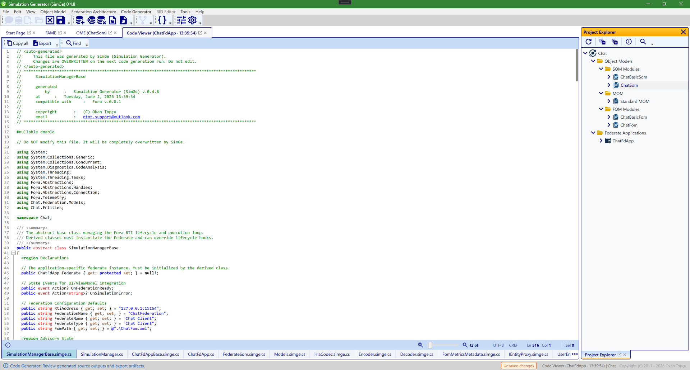

# Code Generator

This page documents the current **Fora-only** code generation flow in SimGe.

It explains:
- which generator classes participate in a Fora run
- which settings change the generated output
- which metric-driven strategies are available
- when each strategy becomes active

This document does **not** cover legacy RACoN / HLA 1.3 / HLA 1516e generators.

For definitions of the structural metrics behind analysis guidance, see the [published metric reference](MetricsReports.md#metric-definitions-and-published-reference). This page describes generation controls and output behavior.



*The generated **code viewer** for a federate (here `ChatFdApp`). After a generation run, SimGe opens the produced C# files for read-only review — each generated file is a tab along the bottom — and you can copy (Ctrl+C) or export (Ctrl+E) the source. Generation is configured in the project's **Code Generator settings** (see [Project Structure & Settings](ProjectSettings.md)) and summarized in a per-federate report afterwards.*

---

## Scope

The Fora generator is selected when:

- `CodeGeneratorSettings.RtiLibraryType = HLA2025_Fora`

The entry point is:

- `SimGe.Application/CodeGenerator/CodeGeneratorManager.cs`

The main execution path is:

1. metric analysis is computed for the federate SOM
2. per-class `ClassGenStrategy` objects are derived
3. base Fora generators run
4. optional metric-driven variant generators run

---

## Main Flow

For a Fora generation run, `CCodeGeneratorManager.generateFora(...)` currently emits:

1. `CSimMngrClassGenerator_Fora`
2. `CFederateClassGenerator_Fora`
3. `CFederateManualClassGenerator`
4. `CSomClassGenerator_Fora`
5. `CModelsGenerator_Fora`
6. `CHlaCodecGenerator_Fora`
7. `CEncoderGenerator_Fora`
8. `CDecoderGenerator_Fora`
9. `CEntityGenerator_Fora`
10. `CDatatypeGenerator`
11. `CTagsGenerator`
12. `CGeneratedReadmeGenerator_Fora`

If metric-driven variants are enabled, it also emits:

13. `CSpecializedCodecGenerator_Fora`
14. `CDeltaTrackerGenerator_Fora`

---

## Planned: Service-Driven Generation

A planned Fora enhancement is to synchronize generated code with the OMT **Services** usage table.

Target behavior:

- generate service-related boilerplate only when the corresponding service is marked `Used`
- reduce unused lifecycle/helper code in `SimulationManagerBase.simge.cs`
- reduce unused callback scaffolding in the generated Fora federate base where possible

Constraint:

- methods required by the Fora interfaces will still need to exist for type compliance; planning focuses on suppressing extra wrappers, helpers, and optional boilerplate around unused services

---

## Generated Structure

Typical Fora output is organized like this:

```text
Generated/
  Core/
    [Federate]Base.simge.cs
    SimulationManagerBase.simge.cs
  Som/
    FederateSom.simge.cs
  Models/
    Models.simge.cs
    HlaCodec.simge.cs
    Encoder.simge.cs
    Decoder.simge.cs
    Datatypes.simge.cs
    Tags.simge.cs
    SpecializedCodecs/
      [Class]Codec.simge.cs
    Delta/
      [Class]DeltaTracker.simge.cs
  Entities/
    IEntityProxy.simge.cs
    [Class]Entity.simge.g.cs

Entities/
  [Class]Entity.cs

SimulationManager.cs
[Federate].cs
README.generated.md
```

Notes:

- `Generated/` is machine-owned and may be overwritten on regeneration.
- `Entities/[Class]Entity.cs` and `SimulationManager.cs` are user scaffolds.
- `SpecializedCodecs/` and `Delta/` appear only when metric-driven variants are active and applicable.
- `README.generated.md` is emitted at the federate output root and summarizes the generated API surface, target compatibility, metric-strategy decisions, and regeneration guidance.

---

## Generated API Summary README

For each Fora federate output, SimGe writes:

- `README.generated.md`

The README is generated into the same root folder as `SimulationManager.cs`, `[Federate].cs`, and the `Generated/` tree. For example:

```text
C:\ProgramData\SimGe\Samples\Chat\SourceCode\[timestamp]\ChatFdApp\README.generated.md
```

It is intended for simulation developers who need to understand the generated integration surface without reading every generated C# file.

The README includes:

- generation provenance: output path, timestamp, SimGe version, target, HLA version, namespace root
- Fora API profile: the committed `ForaClientApiProfile.json` profile ID, minimum/tested `Fora.Client` version, required package, API namespace surface, SDK assemblies that provide that surface, and .NET/C# target expectations. If generated code is placed near a target `.csproj`, the README also reports the resolved target project version as secondary validation metadata.
- generated vs scaffold file ownership
- metric-based generation settings and emitted variant status
- per-object-class strategy results, including hotspot, periodic, critical, specialized-codec, delta-tracker, and critical-wrapper decisions
- analytical synthesis diagnostics such as `CG1010`
- object-class API summary: generated model, entity wrapper, registration helper, lifecycle events, and attributes
- interaction-class API summary: DTO, sender helper, receive event, and parameters
- DDM dimension handles
- generated datatype and codec/converter summary
- recommended extension points in `SimulationManager.cs` and `[Federate].cs`
- regeneration notes for syncing the output into a target Fora application

The README is regenerated on each run and should be treated as generated documentation, not hand-edited source.

SimGe does not require `Fora.Client` as a NuGet dependency in order to generate code. The generator reports the embedded Fora API profile it was authored and tested against. End-user projects must reference a compatible `Fora.Client` package or project when compiling the generated code.

For SimGe **0.5.2**, the embedded profile is **HLA2025-ForaClient-20260720**, with minimum and tested `Fora.Client` version **20260720.1.0**, targeting **.NET 10 / C# 14**. Use the profile recorded in a fresh `README.generated.md` when checking an existing application's package references. A newer package version still requires compatibility verification.

The standard client interface is `IForaClient`. Scenario annotations use the optional `IForaTelemetry` capability; generated `SetScenarioStep` calls do nothing when the client does not provide that capability. Clock-alignment probes belong to `IForaClockProbe`. When adapting hand-written scenario code, use the appropriate optional capability rather than calling these extensions through `IForaClient`. See [Fora Telemetry & Validation](ForaTelemetry.md).

---

## Fora Contract Validation

For Fora generation runs, SimGe validates the generator's intended `Fora.Client` usage against the bundled API contract snapshot before reporting success.

The validation answers this question:

```text
Do the Fora service and codec calls emitted by this generator still exist with the expected signatures in the targeted Fora API snapshot?
```

The current validator checks:

- 36 generated Fora service-call shapes, including lifecycle, handle resolution, publish/subscribe, object registration, encoded update/send helpers, advisory switches, late-join attribute-value requests, and cleanup
- 28 generated `Fora.Encoding.HlaPrimitives` codec-call shapes
- the configured `Fora.Client` contract snapshot recorded by `ForaClientApiProfile.json`

The result is shown in the code-generation report, for example:

```text
FORA CONTRACT VALIDATION
  INFO  [CG1020] Fora.Client API contract validation passed (36 service call(s), 28 codec call(s)).
```

If the bundled contract snapshot is missing, generation is not blocked; the validator reports `NotRun` so the missing validation is visible. If a required API member or signature does not match, SimGe reports a `CG1021` issue so generator/Fora compatibility can be fixed before relying on the generated code.

Internally, generated Fora service-call emission is routed through `ForaClientCallWriter`. This keeps the generator templates from scattering raw `Fora.Client` method strings across many files. The writer is not the API source of truth; the bundled DLL metadata snapshot remains the validation source of truth.

---

## Settings

The most important Fora settings are in:

- `SimGe.Application/CodeGenerator/CodeGeneratorSettings.cs`

### Core Selector

| Setting | Meaning |
|---|---|
| `RtiLibraryType = HLA2025_Fora` | activates the Fora generator path |

### Metric-Driven Settings

| Setting | Default | Effect |
|---|---:|---|
| `EnableMetricDrivenVariants` | `false` | turns metric-driven generator branches on |
| `SaturationThreshold` | `0.6` | hotspot threshold used by `MetricEngine` |
| `DispersionThreshold` | `1.0` | extra hotspot threshold based on relative payload |
| `EmitDispatchTable` | `true` | allows generated dispatch-table branches when metric mode is enabled |

Important behavior:

- if `EnableMetricDrivenVariants = false`, SimGe stays on the legacy Fora generation path
- dispatch-table output is now also gated by `EnableMetricDrivenVariants`

### Fora Telemetry Settings

**Enable Fora Telemetry** (`EnableForaTelemetry`, default `false`) enables instrumentation in the generated code. See [Fora Telemetry & Validation](ForaTelemetry.md) for capture and inspection steps. Scenario annotations additionally require a client that supports `IForaTelemetry`.

### Inactive-branch pruning (experimental / programmatic)

`EnableInactiveBranchPruning` defaults to `false`. It is used by the experimental generation/campaign path and is not currently exposed as a checkbox in the Code Generator settings UI. It is separate from the metric-driven variant switch.

Pruning requires both the switch and a per-run set of eligible class names. The caller supplies workload reachability, external-reference, and modular-dependency information to the eligibility evaluator. A branch qualifies only when it has no exchange-participating class, contributes no inherited members to an active class, is not referenced by another generated artifact, is unreachable under the supplied workload, and is not needed for modular resolution. A class's Publish/Subscribe value alone is insufficient.

For eligible branches, generation suppresses the affected class artifacts. In 0.5.2 this also covers SOM object-class, interaction-class, attribute, and parameter handle declarations and their `InitHandlesAsync` RTI lookups. Base MIM handles (`HLAobjectRoot`, `HLAinteractionRoot`, and `HLAprivilegeToDeleteObject`) remain, as do the `FomMetricsMetadata.simge.cs` design-time snapshots when emitted. Pruning changes generated output; it does not delete classes from the source model.

Re-evaluate eligibility whenever the workload or model dependencies change. The class-name set and emission counters are computed for each run and are not stored as project state. The behavior descriptions below refer to retained classes when this experimental option is active.

---

## Metric Pipeline

The current Fora metric path is:

1. `MetricAnalysisService.Analyze(...)`
2. `MetricEngine.Compute(...)`
3. `ClassGenStrategy.FromSnapshot(...)`

### Shared Metric Source

The generator no longer uses a fully separate placeholder metric model.

The code generation layer now derives its class snapshots from the same shared analysis family used by dashboard statistics:

- `SimGe.Model/Helpers/Metrics/MetricAnalysisCore.cs`
- `SimGe.Model/Helpers/Metrics/MetricAnalysisService.cs`
- `SimGe.Model/Helpers/Metrics/MetricAnalysisResult.cs`

This reduces drift between dashboard interpretation and code generation decisions.

### Current Strategy Inputs

`ClassGenStrategy` currently carries:

- `IsHotspot`
- `IsAnemic`
- `IsCritical`
- `IsPopulationGated`
- `IsPeriodic`
- `IsConditional`
- `IsStatic`
- `EmitSpecializedCodec`
- `EmitDeltaTracker`

Derived outputs today are:

- `EmitSpecializedCodec = EnableMetricDrivenVariants && IsHotspot`
- `EmitDeltaTracker = EnableMetricDrivenVariants && IsHotspot && IsPeriodic`

---

## Strategy Matrix

This is the current Fora behavior.

| Condition | Result |
|---|---|
| `EnableMetricDrivenVariants = false` | no specialized codec files, no delta tracker files, no metric-driven dispatch tables |
| `IsHotspot = true` | encoder/decoder may delegate to a specialized codec |
| `IsHotspot = true` and class is an **Object Class** | `CSpecializedCodecGenerator_Fora` emits `Generated/Models/SpecializedCodecs/[Class]Codec.simge.cs` |
| `IsHotspot = true` and `IsPeriodic = true` and class is an **Object Class** | `CDeltaTrackerGenerator_Fora` emits `Generated/Models/Delta/[Class]DeltaTracker.simge.cs` |
| `IsCritical = true` | generated `SimulationManagerBase` wraps register/update helpers in a `try/catch` and calls `OnCriticalFault(...)` |
| `EmitDispatchTable = true` and metric mode is enabled | generated federate and decoder include dispatch-table branches |

---

## Runtime Interpretation of Metric-Driven Variants

Metric-driven variants are intended to affect runtime behavior, not only generated-file
organization. Their current implementation has the following exact boundaries:

| Variant | Runtime value | Current limitation |
|---|---|---|
| Specialized codecs | Hotspot Object Class encode/decode calls delegate to a class-specific codec with explicit per-attribute statements and exact-capacity dictionaries. | Generated only for Object Classes; Interaction Classes still use the normal generated encoder/decoder methods. |
| Delta trackers | Periodic hotspot Object Classes receive a `GetDelta(...)` helper that compares consecutive DTO snapshots and returns a partial DTO containing changed attributes. | The default `UpdateAsync(...)` method does not automatically compute a delta. Scenario code must call `GetDelta(...)` and then pass the returned partial DTO to the update path. |
| Dispatch tables | Metric mode can emit dictionary-backed dispatch helpers where the generator has table-based routing support. | This is not a universal replacement for every generated callback branch; some ambassador dispatchers still use explicit class-handle checks. |
| Critical wrappers | Critical Object Class registration and update helpers call `OnCriticalFault(...)` inside generated `try/catch` wrappers and then rethrow. | The wrapper is limited to generated object registration/update helpers. |

Therefore the feature is implemented, but performance claims should be read as generated runtime
strategy potential rather than benchmark evidence. Actual speedup or bandwidth reduction depends
on the FOM shape, update frequency, payload sizes, subscriber topology, and whether scenario code
uses the generated delta helper for periodic hotspot objects.

---

## Current Generator Behaviors

### `CEncoderGenerator_Fora`

Behavior:

- emits interaction encoders for retained classes
- emits object encoders for retained classes
- if strategy says `EmitSpecializedCodec`, object encode methods delegate to `[Class]Codec.Encode(...)`

Current scope:

- specialized delegation is applied to Object Classes
- interaction classes still use normal generated encode logic

### `CDecoderGenerator_Fora`

Behavior:

- emits interaction decoders for retained classes
- emits object-family dispatch methods, excluding pruned classes from routing
- if strategy says `EmitSpecializedCodec`, object decode methods delegate to `[Class]Codec.Decode(...)`
- if metric mode is enabled and `EmitDispatchTable = true`, object-family dispatch methods use generated dispatch dictionaries

### `CEntityGenerator_Fora`

Behavior:

- emits generated entity proxy partials for retained object classes
- emits user scaffold entity files for retained object classes
- if strategy says `EmitDeltaTracker`, entity proxy includes a delta-tracking hook

Important fix:

- the delta hook is now gated by `EmitDeltaTracker`, not merely by `IsPeriodic`
- this prevents generated entities from referencing tracker classes that were never emitted

### `CSimMngrClassGenerator_Fora`

Behavior:

- always emits generated `SimulationManagerBase`
- always emits `SimulationManager.cs` scaffold
- if strategy says `IsCritical`, generated register/update helpers wrap their body in `try/catch`

Current critical hook:

- `protected virtual void OnCriticalFault(string className, Exception ex)`

#### Generated `SimulationManagerBase.simge.cs` API & Lifecycle

The generated `SimulationManagerBase` defines the IEEE 1516-2025 async federation lifecycle. Its key API components include:

##### 1. Configuration Properties
- `RtiAddress`: The connection address for the RTI.
- `FederationName`: The name of the target federation execution.
- `FederateName` & `FederateType`: Identifiers for the federate execution.
- `FomPath`: Path to the single FDD/FOM XML file (defaults to the project's generated FOM).
- `FomModules`: A list of modular FOM paths (`IReadOnlyList<string>`). When populated, it triggers the multi-module federation creation.

##### 2. The `RunAsync` Orchestration
The simulation execution is started by calling the sealed `RunAsync(CancellationToken ct)`. The federation creation step is executed conditionally:
- If `FomModules` has elements, it invokes `CreateFederationExecutionAsync(FederationName, FomModules, ct)`.
- If `FomModules` is empty, it falls back to `CreateFederationExecutionAsync(FederationName, FomPath, ct)`.

This design makes the federate multi-module aware at runtime: the scenario driver simply sets the `FomModules` list with the ordered module file paths (base-first) prior to calling `RunAsync()`. Once the federation is created with all FDD modules, the join execution works automatically without further changes.

##### 3. Virtual Hook `OnPublishAndSubscribeAsync`
The generator emits a virtual method containing all default publish and subscribe calls derived from the SOM design:
`protected virtual async Task OnPublishAndSubscribeAsync(CancellationToken ct)`
This method can be overridden in the user subclass `SimulationManager.cs` to customize, extend, or defer P/S logic at runtime.

##### 4. Register Methods
The base class exposes type-safe registration methods for object classes, such as `Register[Class]Async` (e.g., `RegisterHumanAsync`). These methods register object instances with the RTI and return the corresponding generated entity wrapper.

### `CFederateClassGenerator_Fora`

Behavior:

- emits the generated federate ambassador base
- if metric mode is enabled and `EmitDispatchTable = true`, emits the generated `_dispatchNames` table

### `CSpecializedCodecGenerator_Fora`

Behavior:

- emits one file per hotspot **Object Class**
- inlines attribute encode/decode logic for that class

Current scope:

- Object Classes only
- no specialized interaction codec generator exists at the moment

### `CDeltaTrackerGenerator_Fora`

Behavior:

- emits one file per **periodic hotspot Object Class**
- compares successive DTO snapshots
- returns a partial delta DTO containing changed attributes only

Current scope:

- Object Classes only

### `CGeneratedReadmeGenerator_Fora`

Behavior:

- emits `README.generated.md` at the federate output root
- summarizes the generated object classes, interaction classes, dimensions, datatypes, helper APIs, and extension points
- records the embedded Fora API profile as the target compatibility baseline, with a resolved target-project `Fora.Client` version as additional metadata when available
- records metric-driven settings and per-class strategy outcomes
- includes analytical synthesis diagnostics collected during the generation run

Current scope:

- Fora target only
- generated after the source files so it can document the final strategy/diagnostic state of the run

---

## Current Scope Limits

The current Fora metric-driven implementation is intentionally narrower than the full strategy model.

### Object Classes vs Interaction Classes

Metric snapshots are computed for both OC and IC domains, but variant file generation is currently limited to Object Classes:

- `CSpecializedCodecGenerator_Fora` accepts `COmtOC`
- `CDeltaTrackerGenerator_Fora` accepts `COmtOC`
- `generateMetricVariants(...)` iterates only over `COmtOC`

Practical result:

- an Interaction Class can still be classified as a hotspot in strategy output
- but SimGe does not currently emit a specialized interaction codec file for it

### Delta Tracker Requirements

A delta tracker is generated only when all of these are true:

1. metric mode is enabled
2. the class is classified as a hotspot
3. the class is classified as periodic
4. the class is an Object Class

### Dispatch Tables

Dispatch-table generation is not global by default anymore.

It requires:

1. `EnableMetricDrivenVariants = true`
2. `EmitDispatchTable = true`

---

## Practical Examples

### Standard Fora Generation

Use this when you want predictable generated code without metric-driven specialization:

- `RtiLibraryType = HLA2025_Fora`
- `EnableMetricDrivenVariants = false`

Expected result:

- normal `Encoder.simge.cs`
- normal `Decoder.simge.cs`
- no `SpecializedCodecs/`
- no `Delta/`

### Hotspot Object Class

Use this when a class has high payload concentration and you want a tighter encode/decode path:

- `EnableMetricDrivenVariants = true`
- class is classified as `IsHotspot = true`

Expected result:

- `[Class]Codec.simge.cs` is generated
- object encode/decode methods delegate to it

### Periodic Hotspot Object Class

Use this when a frequently updated object should emit smaller partial DTO updates:

- `EnableMetricDrivenVariants = true`
- `IsHotspot = true`
- `IsPeriodic = true`

Expected result:

- `[Class]Codec.simge.cs`
- `[Class]DeltaTracker.simge.cs`
- generated entity includes `GetDelta(...)`

### Critical Object Class

Use this when a class is marked with critical semantics and you want generated manager helpers to expose failures cleanly:

- `EnableMetricDrivenVariants = true`
- `IsCritical = true`

Expected result:

- generated register/update helper wraps operation in `try/catch`
- `OnCriticalFault(className, ex)` is invoked before rethrow

---

## Files to Inspect

For the current implementation, these are the most relevant files:

- `SimGe.Application/CodeGenerator/CodeGeneratorManager.cs`
- `SimGe.Application/CodeGenerator/CodeGeneratorSettings.cs`
- `SimGe.Application/CodeGenerator/ClassGenStrategy.cs`
- `SimGe.Application/CodeGenerator/Metrics/MetricEngine.cs`
- `SimGe.Application/CodeGenerator/ClassCodeGen_Encoder_Fora.cs`
- `SimGe.Application/CodeGenerator/ClassCodeGen_Decoder_Fora.cs`
- `SimGe.Application/CodeGenerator/ClassCodeGen_Entity_Fora.cs`
- `SimGe.Application/CodeGenerator/ClassCodeGen_SimMngr_Fora.cs`
- `SimGe.Application/CodeGenerator/ClassCodeGen_FdGen_Fora.cs`
- `SimGe.Application/CodeGenerator/ClassCodeGen_SpecializedCodec_Fora.cs`
- `SimGe.Application/CodeGenerator/ClassCodeGen_DeltaTracker_Fora.cs`
- `SimGe.Application/CodeGenerator/ClassCodeGen_GeneratedReadme_Fora.cs`
- `SimGe.Application/CodeGenerator/Fora/ForaClientApiProfile.json`
- `SimGe.Application/CodeGenerator/Fora/ForaClientApiProfile.cs`
- `SimGe.Application/CodeGenerator/Fora/Contract/ForaClientCallCatalog.cs`
- `SimGe.Application/CodeGenerator/Fora/Contract/ForaClientApiContractValidator.cs`
- `SimGe.Application/CodeGenerator/Fora/Writing/ForaClientCallWriter.cs`
- `SimGe.Application/CodeGenerator/Fora/ApiContract/`
- `tools/Update-ForaClientApiProfile.ps1`
- `tools/Update-ForaClientApiProfile.cmd`
- `tools/Update-ForaClientApiContractSnapshot.ps1`
- `tools/Update-ForaClientApiContractSnapshot.cmd`
- `SimGe.Model/Helpers/Metrics/MetricAnalysisCore.cs`
- `SimGe.Model/Helpers/Metrics/MetricAnalysisService.cs`

---

## Summary

The current Fora code generator has two operating modes:

- standard Fora generation
- metric-driven Fora generation

Metric-driven mode currently affects:

- object encoder/decoder delegation
- object delta tracking
- generated dispatch-table branches
- critical-class manager wrappers

The most important present limitation is that specialized metric-driven file generation is currently **Object Class only**, even though the metric analysis also evaluates Interaction Classes.

---
Updated September 14, 2026
