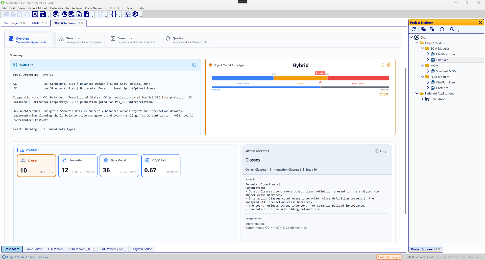
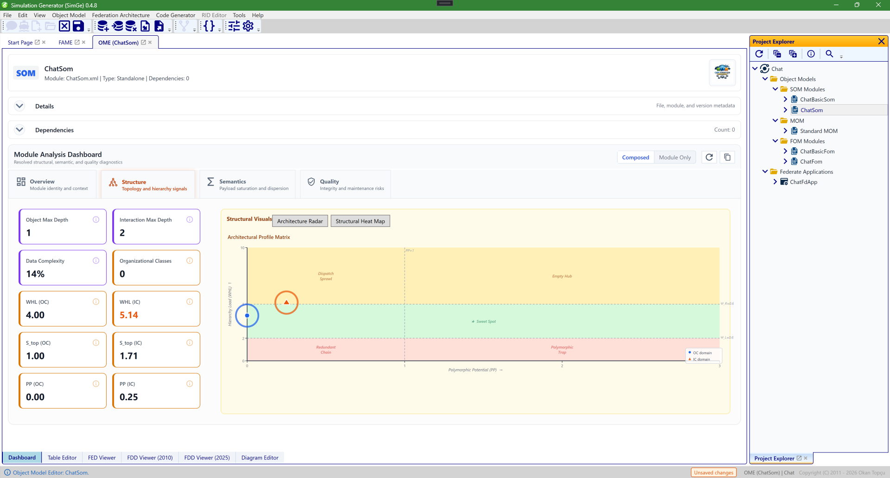
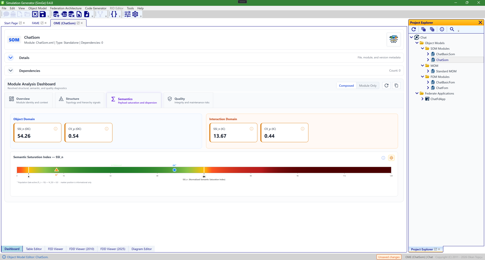

# FOM Dashboard

The **Module Analysis Dashboard** gives a quantitative, at-a-glance view of a model — its size, structure, semantics, and quality — so you can assess an object model without reading every table. It opens as the **Dashboard** tab of a module's [Object Model Editor](OME.md), and a **Composed / Module Only** toggle lets you analyze the merged composition or just the selected module.

*The dashboard's **Overview** tab. It reports the object-model **archetype** (here "Hybrid"), a written summary of the model, and headline metric cards — class count, property count, datatype count, and the **OC/IC ratio** — alongside an Object Model Archetype gauge.*

## The dashboard tabs

The dashboard is organized into four tabs:

| Tab | Shows |
|---|---|
| **Overview** | Module identity and context — archetype, summary, and the headline counts (classes, properties, datatypes, OC/IC ratio). |
| **Structure** | Topology and hierarchy signals — max depth and breadth, class complexity, and architectural metrics (e.g. `WHL`, `S_top`, `CV_D`) — with an Architecture Shape matrix and a Structure Heat Map. |
| **Semantics** | Payload saturation and dispersion — the Semantic Saturation Index (`SSI_n`) and coefficient of variation (`CV_p`) for each domain — with a saturation gauge. |
| **Quality** | Integrity and maintenance risks — diagnostic findings and warnings. |

Most figures are computed separately for the **Object Class (OC)** and **Interaction Class (IC)** domains, and a single analysis engine is the source of truth, so the dashboard numbers stay consistent with the [reports](MetricsReports.md).

*The **Structure** tab. It surfaces topology and hierarchy signals — object max depth and breadth, class complexity, and architectural metrics such as `WHL(OC)`, `S_top`, and `CV_D` — and visualizes the model's "structured shape" via an Architecture Profile Matrix (with an alternate Structure Heat Map view).*

*The **Semantics** tab. It characterizes payload **saturation and dispersion** rather than raw counts: the Semantic Saturation Index `SSI_n` and dispersion `CV_p` are shown for both the Object and Interaction domains, with a Semantic Saturation Index gauge. These signals feed metric-driven code generation.*

## Toolbar actions

The dashboard toolbar lets you **refresh** the analysis, **copy** the summary or the full textual report to the clipboard, and toggle between **Composed** and **Module Only** scope.

In the **Structure** tab, the **Structural Visuals** panel includes an image export button. The export captures the full framed Structural Visuals panel, not only the chart canvas. For the **Heat Map** view, the PNG includes the panel heading, visual selector, heatmap, axes, color scale, guide lines, and OC/IC markers. If the calibration tools are open, the calibration panel is included in the exported image as well; if they are closed, only the visible Structural Visuals content is exported.

The heat map's OC and IC markers support two levels of inspection. Hover over a marker for a compact tooltip, or click/right-click it to open **Metric Details**. The details popover shows the same domain, coordinates, propensity breakdown, structural condition, engineering guidance, and gate notes in selectable text, with a **Copy** button that places the Markdown/plain-text version on the clipboard.

Read the marker header as the post-gate profile. A small hierarchy can have a raw coordinate on the horizontal anchor, but the minimum population gate can suppress the final horizontal and compound propensity; in that case the marker is reported as **Sweet Spot - Low Risk**. Moderate horizontal propensity is reported with the paper's transitional profile terminology, for example **Broad Concrete (Transitional) - Moderate Risk**.

## How to read it

1. Start on **Overview** to grasp the model's archetype and scale.
2. Check **Quality** for anything flagged — resolve unresolved dependencies and structural issues first (see [Managing Modules](ManagingModules.md) and [FOM Validation](Validation.md)).
3. Use **Structure** and **Semantics** to judge whether the model's shape and payload profile match your intent.
4. **Refresh** after edits to see the effect.

> Use the **Composed** scope to analyze the merged result that will actually be exported; use **Module Only** to focus on the selected module's own content.

---

**Next:** [Model Metrics & Reports](MetricsReports.md)
