# FOM Dashboard

The **Module Analysis Dashboard** gives a quantitative, at-a-glance view of a model — its size, structure, semantics, and quality — so you can assess an object model without reading every table. It opens as the **Dashboard** tab of a module's [Object Model Editor](OME.md), and a **Composed / Module Only** toggle lets you analyze the merged composition or just the selected module.

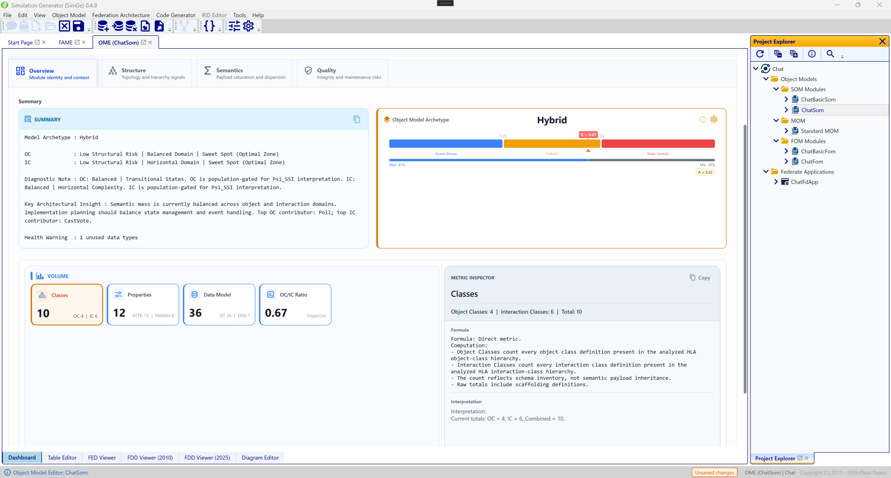

*The dashboard's **Overview** tab. It reports the object-model **archetype** (here "Hybrid"), a written summary of the model, and headline metric cards — class count, property count, datatype count, and the **OC/IC ratio** — alongside an Object Model Archetype gauge.*

## The dashboard tabs

The dashboard is organized into four tabs:

| Tab | Shows |
|---|---|
| **Overview** | Module identity and context — archetype, summary, the headline counts (classes, properties, datatypes, OC/IC ratio), and the **Two lenses** strip pairing each domain's structural profile with its payload diagnosis. |
| **Structure** | Topology and hierarchy signals — max depth and breadth, class complexity, and architectural metrics (e.g. `WHL`, `S_top`, `CV_D`) — with an Architecture Shape matrix and a Structure Heat Map. |
| **Semantics** | Raw `SSI_n` and `CV_p` with Ψ, bands, populations, and calibration stability; the joint saturation × dispersion grid; sigmoid curves with calibration ranges; payload Pareto charts with drill-down; and the depth × W_i scatter. |
| **Quality** | Integrity and maintenance risks — unresolved type references, diagnostic findings, and warnings. |

Most figures are computed separately for the **Object Class (OC)** and **Interaction Class (IC)** domains. The dashboard and [reports](MetricsReports.md) share an analysis engine; compare the same model, scope, and calibration settings.

For structural metric definitions and the published methodology, see [Model Metrics & Reports — Metric definitions and published reference](MetricsReports.md#metric-definitions-and-published-reference). The dashboard provides interactive inspection and calibration of those indicators.

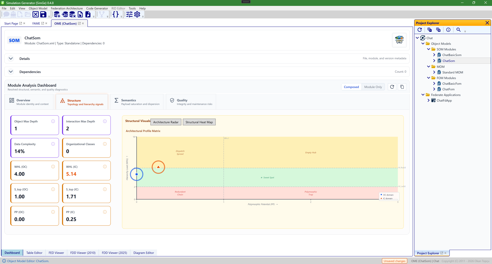

*The **Structure** tab. It surfaces topology and hierarchy signals — object max depth and breadth, class complexity, and architectural metrics such as `WHL(OC)`, `S_top`, and `CV_D` — and visualizes the model's "structured shape" via an Architecture Profile Matrix (with an alternate Structure Heat Map view).*

![[Pasted image 20260924173244.png]]

*The **Semantics** tab. It characterizes payload **saturation and dispersion** rather than raw counts: the Semantic Saturation Index `SSI_n` and dispersion `CV_p` are shown for both the Object and Interaction domains, with domain-specific propensity curves and class-level payload-concentration views. The region badge identifies the dominant diagnostic component; Pareto shares identify the contributing classes.*

## Semantic diagnosis

Terminology follows Fom2: `w(T)` is structural byte weight (an approximation, not an encoded byte count); `W_i` is update-adjusted class semantic weight; `μ_W` is mean class weight; `SSI_n` describes normalized payload density; `Ψ` is a diagnostic score, not a probability; and `CV_p` measures relative dispersion. High dispersion motivates inspection for potential hotspots; individual weights and shares identify the contributing classes. Concrete is an analysis convention based on Publish, Subscribe, or PublishSubscribe sharing, and `\|P_c\|` is the population size.

The **Semantics** tab answers two questions about the payload of each domain, separately for the Object Class (OC) and Interaction Class (IC) domains:

1. **Saturation** — how much resolved data the classes carry relative to hierarchy depth and population (`SSI_n`, scored as the propensity **Ψ**).
2. **Dispersion** — the relative variation in class weights (`CV_p`); individual weights and shares identify any concentration.

The two answers are independent and must be read together: a domain can be Balanced on average and still hide one very heavy class. The screenshots below use the NETN sample, module **NETN-CBRN**, analyzed with its full dependency closure.

### Reading the cards

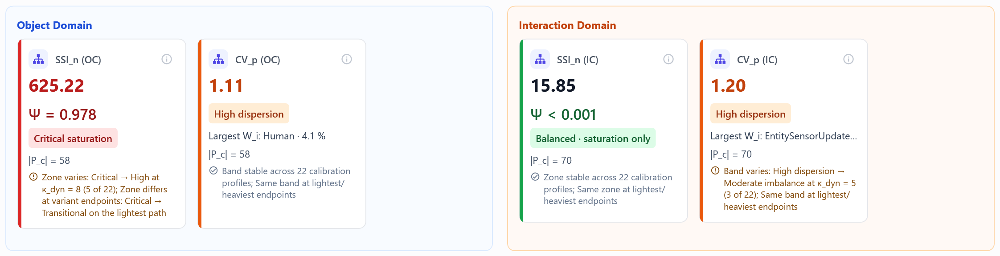

*NETN-CBRN. Objects: SSI_n = 625.22, Ψ = 0.978, Critical saturation, with high payload dispersion; `Human` has the largest W_i but only about 4.15% of total Object-domain weight. Interactions: Ψ < 0.001, Balanced (saturation only), with high payload dispersion and `EntitySensorUpdate` as the largest contributor. The last line of each card reports sampled calibration results and the comparison of the lightest/heaviest variant endpoints.*

Each domain has two cards.

**SSI_n card.** The large number is the raw Normalized Semantic Saturation Index. Below it:

| Line | Meaning |
| --- | --- |
| `Ψ = …` | Propensity score in [0, 1]. **OC** uses the larger of the anemia and saturation components, so both too little and too much payload raise Ψ. **IC** uses saturation only: lightweight events are never penalized for anemia. |
| Badge | The zone and its driving side, for example **Critical saturation**, **High anemia**, or **Balanced · saturation only** for interactions. |
| `\|P_c\| = …` | Concrete classes with active sharing semantics (Publish, Subscribe, or PublishSubscribe). |
| Stability line | Whether the zone differs across the 22 calibration profiles or between the two variant endpoints (see [Robustness view](#robustness-view)). |

| Zone | Propensity | Suggested response |
| --- | --- | --- |
| Balanced | Ψ < 0.30 | Check payload dispersion and class-level weights before selecting an engineering response. |
| Transitional | 0.30 ≤ Ψ < 0.60 | Inspect affected classes and monitor evolution across revisions. |
| High | 0.60 ≤ Ψ < 0.95 | Consider schema-level review or implementation-level mitigation. |
| Critical | Ψ ≥ 0.95 | Prioritize architectural review; refactor only if consistent with interoperability constraints. |

For **\|P_c\| < 10** the diagnosis is **Gated**: the raw SSI_n is shown for information, but no zone is assigned. An empty population or an undefined index shows **Unavailable**. Neither state means Balanced.

**CV_p card.** The large number is the payload dispersion, the coefficient of variation of the class weights W_i. Below it:

| Line | Meaning |
| --- | --- |
| Band | **Homogeneous** (≤ 0.5), **Moderate imbalance** (0.5–< 1.0), or **High dispersion** (≥ 1.0). |
| `Largest W_i: …` | The class with the largest semantic weight and its share of the domain total. |
| `\|P_c\| = …` | The same population as the SSI_n card. CV_p has no population gate. |
| Stability line | Whether the band differs across the 22 calibration profiles or between the two variant endpoints. |

CV_p is **Unavailable** for an empty population or zero mean payload. A single class shows **Single class**, because its zero dispersion holds by construction. A high CV_p marks uneven weights; it does not by itself identify a design problem. Open **Payload concentration** to see which classes carry the weight.

### Card colors

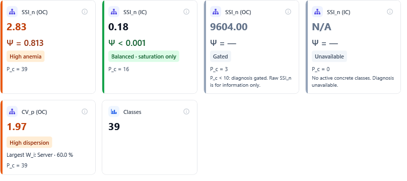

Every dashboard card uses the same color language:

| Element | Meaning |
| --- | --- |
| Left strip and value color | The assessment: green Balanced or Homogeneous, yellow Transitional or Moderate imbalance, orange High or high dispersion, red Critical or an error, grey withheld (Gated, Unavailable). Descriptive values such as counts have no strip. |
| Icon badge beside the label | The card's category (Volume, Complexity, Capability, Health, Architecture). It never uses a status color. |
| Blue outline and fill | The selected card. |

Use the card's information button to expand or copy its full explanation, including the unrounded Ψ.

### Three views

The cards stay at the top. Below them, choose one of three views:

| View | Shows | Question it answers |
| --- | --- | --- |
| **Diagnosis** | Joint diagnosis grid and propensity curves | Which zone is each domain in, and why? |
| **Payload** | Payload concentration with drill-down, and structure × payload | Which classes carry the weight, and where does it come from? |
| **Robustness** | Calibration and variant ranges, calibration profiles, variant records | How much do the results depend on modeling assumptions? |

SimGe remembers the last view for the session, so every module's dashboard opens on it.

## Diagnosis view

### Joint diagnosis

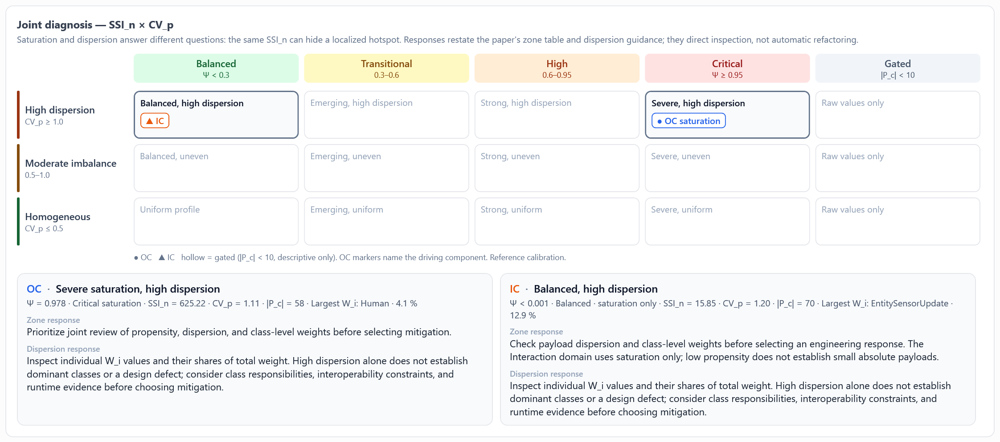

*NETN-CBRN in the joint grid. The object domain (●) has severe saturation with high dispersion; the interaction domain (▲) has Balanced propensity with high dispersion. Neither position establishes class dominance or absolute message size.*

The **Joint diagnosis — SSI_n × CV_p** grid places both domains at once:

- **Columns** are the Ψ zones, plus a **Gated** column for populations below 10.
- **Rows** are the CV_p bands.
- **● OC** and **▲ IC** mark where each domain falls. Object markers name the driving side, for example `● OC saturation` or `● OC anemia`. Hollow markers (○, △) are gated and descriptive only.

Below the grid, one card per domain gives its position, for example *Severe saturation, high dispersion*, *High normalized density, uniform*, or *Balanced, high dispersion*, the values behind it, and two suggestions:

- **Zone response** — the paper's suggestion for the Ψ zone.
- **Dispersion response** — what to do about the CV_p band. For high dispersion: inspect individual W_i values and their shares, then class responsibilities and interoperability constraints. Dispersion alone does not establish class dominance or a design defect.

Two situations the grid makes visible that a single number hides:

| Situation | Example | Reading |
| --- | --- | --- |
| Different joint profiles | NETN-AIS (Ψ 0.295, Balanced, CV_p 2.37) and NETN-ENTITY (Ψ 0.608, High, CV_p 0.16) | AIS warrants class-level inspection despite its Balanced score; ENTITY has higher normalized density with homogeneous weights. |
| Low normalized density, high dispersion | NETN-CBRN interactions (Ψ < 0.001, CV_p 1.20) | Inspect class weights and shares; `EntitySensorUpdate` from NETN-ETR is the largest contributor. |

The suggestions direct inspection; they are not automatic refactoring instructions. A domain whose SSI_n or CV_p is unavailable is described under the grid but not placed.

### Propensity curves

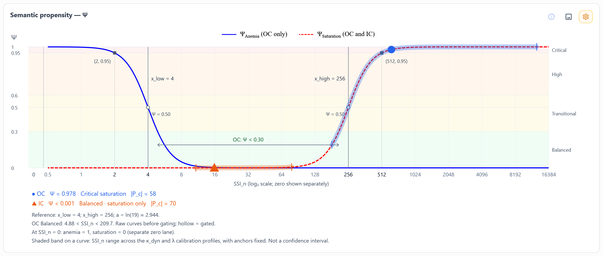

*The object marker (●) sits on the saturation plateau at SSI_n ≈ 625; the interaction marker (▲) sits near the bottom at SSI_n ≈ 16. The shaded bands along the curves show how far each SSI_n moves across the calibration profiles.*

The chart shows how SSI_n is turned into Ψ:

| Element | Meaning |
| --- | --- |
| Blue solid curve | Ψ_Anemia, used by objects only. Rises as SSI_n falls below x_low = 4. |
| Red dashed curve | Ψ_Saturation, used by objects and interactions. Rises as SSI_n exceeds x_high = 256. |
| Anchors | x_low = 4 and x_high = 256, where each curve equals 0.50. |
| Square markers | Critical points (2, 0.95) and (512, 0.95), one doubling beyond each anchor (slope a = ln 19). |
| Double arrow | The object Balanced interval, about 4.88 < SSI_n < 209.7 (the 0.30 crossings). It does not apply to interactions. |
| ● and ▲ | The object marker follows the larger component; the interaction marker follows saturation only. Hollow markers are gated. |
| Shaded band with end ticks | The domain's SSI_n range across the 22 calibration profiles, drawn along its reference curve. Hover an end for the values. |

The horizontal axis is logarithmic (base 2), with zero in a separate lane; at SSI_n = 0, anemia is 1 and saturation is 0. The curves are drawn before the population gate; the markers keep their Gated or Unavailable state. The image button in the header exports the chart as a high-resolution PNG. For all modules at once, use [Object Model Analysis](MetricsReports.md#object-model-analysis).

**Interpretation preview.** The gear button opens sliders for the anemia anchor, saturation anchor, and log slope. The paper treats these thresholds as heuristic, so the sliders only preview them: moving them adds pale dotted curves, while cards, markers, reports, and the robustness analysis keep the reference values. **Reset** restores them. κ_dyn is shown read-only because it changes class weights, not the curve shape; its effect is in the [Robustness view](#robustness-view).

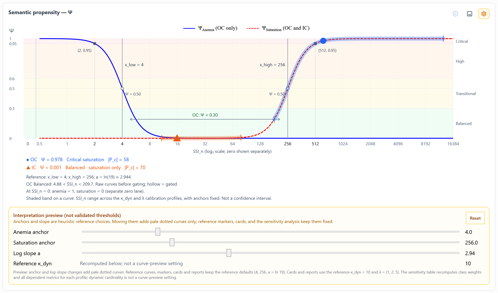

## Robustness view

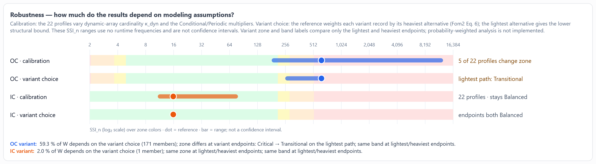

*NETN-CBRN. Objects change zone in 5 of 22 weight profiles and move from Critical to Transitional on the lightest variant path; interactions remain Balanced in all profiles and at both variant endpoints.*

The results use modeling assumptions. The Robustness view shows how far the results move when those assumptions change. Each domain gets two rows:

| Row | Assumption varied |
| --- | --- |
| **calibration** | Dynamic-array cardinality κ_dyn and the Conditional/Periodic update multipliers, over 22 profiles. |
| **variant choice** | Which alternative of each variant record is weighed: the reference uses the **heaviest** (Fom2 Eq. 6); the lower bound uses the **lightest**. |

How to read a row: the horizontal axis is SSI_n on a log scale; the background shows that domain's zones (objects two-sided, interactions saturation only); the **dot** is the reference value; the **bar** spans the range under the assumption. If the bar stays inside one color, the zone does not depend on that assumption. The note on the right states the result, for example *22 profiles · stays Critical* or *3 of 22 profiles change zone*. Below the rows, one line per domain gives the variant share of the payload.

Both ranges are **deterministic perturbations of modeling assumptions, not confidence intervals**, and neither uses runtime usage frequencies. They show which conclusions depend on the assumptions; they do not validate the assumptions against runtime behavior.

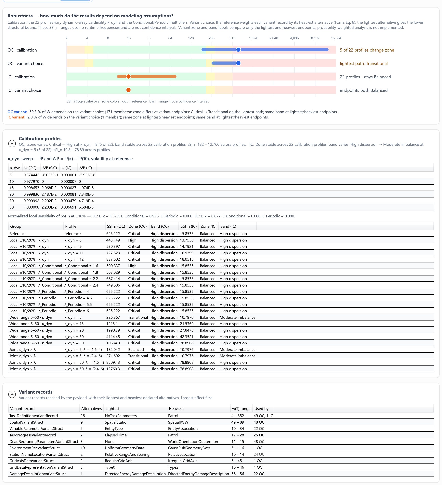

*Both tables opened for NETN-CBRN.*

### Calibration sensitivity

The results above use the reference calibration: dynamic-array cardinality κ_dyn = 10 and update-volatility multipliers λ = 1 (Static/NA), 2 (Conditional), 5 (Periodic). These are modeling assumptions, so SimGe also shows how much the results depend on them. After every analysis it recomputes the same resolved model under **22 calibration profiles**, recalculating every datatype weight, W_i, SSI_n, Ψ, and CV_p for each one. Nothing is read from a stored table: the profiles are fixed, the results come from your model.

| Group | Profiles | What changes |
| --- | --- | --- |
| Reference | 1 | κ_dyn = 10, λ_Conditional = 2, λ_Periodic = 5 |
| Local ±10/20% · κ_dyn | 4 | κ_dyn = 8, 9, 11, 12 |
| Local ±10/20% · λ_Conditional | 4 | λ_Conditional = 1.6, 1.8, 2.2, 2.4 |
| Local ±10/20% · λ_Periodic | 4 | λ_Periodic = 4, 4.5, 5.5, 6 |
| Wide range 5–50 · κ_dyn | 5 | κ_dyn = 5, 15, 20, 30, 50 |
| Joint κ_dyn × λ | 4 | κ_dyn ∈ {5, 50} with (λ_Conditional, λ_Periodic) = (1.6, 4) or (2.4, 6) |

The **local** groups show whether a small calibration change moves a result; the **wide** group covers the engineering range of κ_dyn; the **joint** group combines extreme κ_dyn with low or high volatility. The anchors, slope, and population gate stay fixed, as in the paper.

Where to read the results:

| Where | Shows |
| --- | --- |
| Card stability line | `Zone stable across 22 calibration profiles; Same zone at lightest/heaviest endpoints`, or the first change, for example `Zone varies: Balanced → High at κ_dyn = 50 (3 of 22)`. |
| Ψ chart (Diagnosis view) | The shaded SSI_n range along each curve. |
| Robustness view | The calibration rows, and **Calibration profiles** (collapsible): the κ_dyn sweep with Ψ and ΔΨ = Ψ(κ) − Ψ(10), the normalized local sensitivities E_κ, E_Conditional, and E_Periodic, and all 22 profiles with SSI_n, zone, and band. |

How to read NETN-CBRN: the object zone varies from Balanced to Critical across the 22 weight profiles, while raw SSI_n spans 182 to 12 760. At the upper end, a score near one conceals substantial raw-index changes. Interactions remain Balanced in all profiles. Periodic multipliers have no effect here because no Periodic attribute contributes weight.

For the same tables across all modules, and exports, use [Object Model Analysis](MetricsReports.md#object-model-analysis).

### Variant choice

A variant record carries one of several alternatives, selected at runtime by its discriminant. The object model does not say how often each alternative is used, so the paper weighs every variant record by its **heaviest** alternative: a conservative structural reference. If a light alternative carries most of the traffic, this overstates the realized payload.

SimGe therefore also computes the **lightest-path bound**: the same analysis with every variant record weighed by its lightest alternative. This needs no usage assumptions; it is still derived from the model alone. The range between the two shows how much the heaviest-path rule can move the results, not the payload realized at runtime.

| Where | Shows |
| --- | --- |
| Robustness rows | The SSI_n range from the lightest path to the heaviest path, with zone labels at those two endpoints. |
| Variant line | The share of the domain's W that depends on the variant choice and the number of members involved, for example *59.3 % of W depends on the variant choice (171 members)*. |
| **Variant records** (collapsible) | Every variant record reached by the payload: number of alternatives, the lightest and heaviest alternative, the w(T) range, and how many OC and IC members use it. Largest effect first. |
| Payload view | **Split bars by → Variant choice** shows each class's lightest-path weight and heaviest-path excess; the member table prints a variant-dependent size as a range, for example `8–28 × 1`. |

How to read NETN-CBRN: 59.3 % of the object weight depends on the variant choice — `TaskDefinitionVariantRecord` alone ranges from 4 to 352 bytes — yet the object zone changes from Critical to Transitional on the lightest path. The interaction domain has one variant-dependent member (2.0 % of W) and does not change. These statements compare the two computed endpoints. Equal endpoint zones or dispersion bands do not establish stability throughout the interval. The bounds hold for the structural index with the resolved model and other calibration parameters fixed; they are not runtime traffic estimates. Probability-weighted analysis would require explicit usage probabilities and is not implemented.

## Payload view

### Payload concentration and drill-down

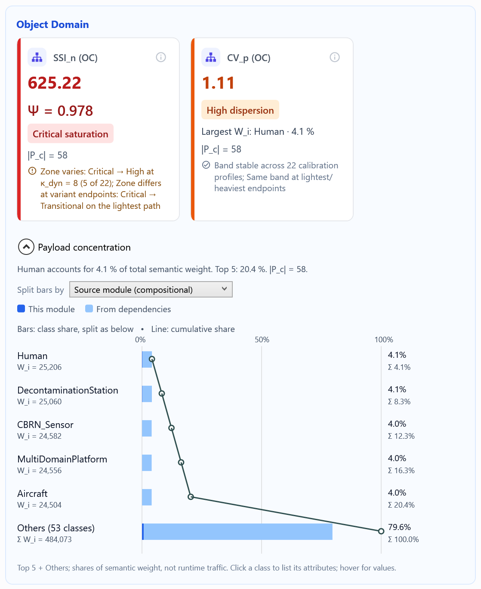

*Object domain of NETN-CBRN, bars split by source module. Nearly all weight comes from dependencies; `Human` is open, listing inherited members and the modules that declare them.*

In the Payload view, **Payload concentration** is open under each domain's cards; collapse either independently. The Pareto chart ranks the **five classes with the largest W_i**, followed by **Others**. Bars are each class's share of the domain total; the line and **Σ** labels are cumulative shares. Shares use the whole concrete population, including inherited members, so they agree with CV_p. They are **design-time semantic weight**, not measured traffic.

**Split bars by** shows what each bar is made of:

| Breakdown | Segments | Question it answers |
| --- | --- | --- |
| Total | One bar | Which classes are heaviest? |
| Source module (compositional) | This module / from dependencies | How much payload arrives through module composition? |
| Update type (temporal) | Static, NA, or parameter / Conditional / Periodic | How much weight comes from volatile attributes? |
| κ_dyn dependence | Fixed size / dynamic-array members | How much weight depends on the κ_dyn assumption? |
| Variant choice (heaviest path) | Lightest-path weight / heaviest-path excess | How much weight comes from weighing variant records by their heaviest alternative? |

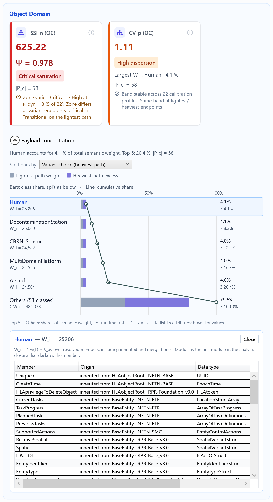

*Split by variant choice: in every top class, part of the weight (violet) exists only because variant records are weighed by their heaviest alternative.*

**Click a class** to list its attributes or parameters:

| Column | Meaning |
| --- | --- |
| Member | Attribute or parameter name. |
| Origin | *declared* in this class or *inherited from* an ancestor, and the module that declares it. |
| Data type | Declared data type. |
| w(T) × λ | Resolved structural weight times the update-volatility multiplier; `(κ)` marks a κ_dyn-dependent size, and a range such as `8–28` a variant-dependent size (lightest–heaviest). |
| W | The member's contribution. The column sums to the class's W_i. |

Hover a row for all details. Click the class again or **Close** to hide the list; the selection survives a refresh while the class exists.

### Structure and payload

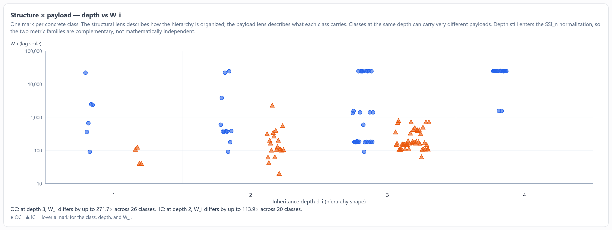

*NETN-CBRN. At depth 3, object classes differ by up to 272× in W_i: hierarchy position alone does not say how much a class carries.*

**Structure × payload — depth vs W_i** plots one mark per concrete class: inheritance depth on the horizontal axis, W_i on a logarithmic vertical axis (● objects, ▲ interactions). Hover a mark for the class, depth, and weight. The caption gives the largest W_i ratio found at one depth.

The Structure tab describes **how the hierarchy is organized**; this view shows **what the hierarchy carries**. The two are complementary lenses. They are not mathematically independent, because depth also enters the SSI_n normalization.

On **Overview**, the **Two lenses** strip shows the same pairing for each domain:

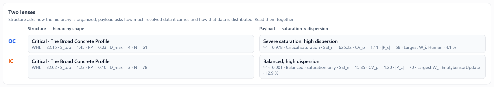

*Left, the structural profile and its indicators; right, the joint payload diagnosis.*

## Resolution health and analysis scope

The module card at the top of the dashboard states what was analyzed. It is quiet when everything resolves and specific when something doesn't.

*NETN-CBRN: strict composition of 10 modules, every type reference resolved, no missing dependency.*

*NETN-ENTITY: strict composition failed, so the analysis uses lenient composition.*

| Badge | Meaning | Click |
| --- | --- | --- |
| **Resolved · strict · N modules** (green) | Composed analysis with strict composition, no unresolved type reference, and no missing dependency. Shown only when nothing below applies. | Opens Dependencies and composition |
| **Lenient composition** (orange) | Strict OMT composition failed; weights use the first-declaration policy. The tooltip gives the conflict. | Opens Dependencies and composition |
| **N unresolved type refs** (orange) | Data type references that could not be resolved; they receive a minimal fallback weight. | Opens the findings in **Quality** |
| **N missing dependencies** (orange) | Declared dependencies, direct or transitive, that are not in the project. | Opens Dependencies and composition |
| **N outside analysis scope** (yellow) | Available dependencies that the composed analysis did not include. | Opens Dependencies and composition |
| **Module only · dependencies not merged** (gray) | The **Module Only** scope is selected; this is a choice, not a problem. | Opens Dependencies and composition |

The text next to the badges counts the direct and transitive dependencies in the analysis. An **Unsaved changes** badge next to the module name appears when the module has edits that are not saved to disk.

### Dependencies and composition

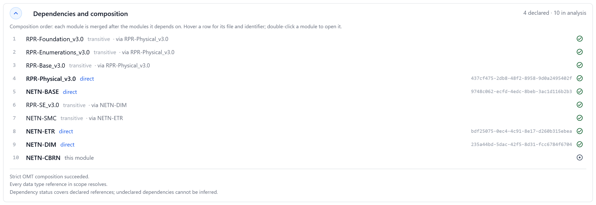

*The four declared dependencies of NETN-CBRN and the six modules they bring in, in composition order.*

This section lists every module in the analysis in **composition order**: each module is merged after the modules it depends on, and the selected module comes last.

| Column | Meaning |
| --- | --- |
| Number | Position in the composition order. `–` marks a dependency outside the analysis scope (for example in **Module Only**); `!` marks a missing one. |
| Name and role | **direct** for dependencies the module declares itself, **transitive** for modules brought in by them (with the module that declares them: *via NETN-DIM*), and **this module**. |
| Identifier | The module GUID for direct dependencies. Hover any row for its file and identifier. |
| Status | Resolved, outside scope, or missing. A missing dependency declared by name has an **Import** button. |

Double-click a module to open its editor; if it is already open, SimGe switches to it.

The notes below the list state the composition policy (and the conflict, if strict composition failed), whether every type reference resolves, and that dependency status covers declared references only: undeclared dependencies cannot be inferred.

### Details

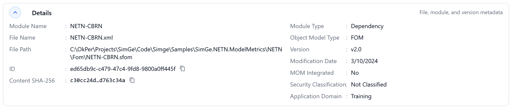

| Field | Meaning |
| --- | --- |
| ID | The module GUID; the button copies it. |
| Content SHA-256 | Hash of the module's content file on disk: the same value Object Model Analysis records, so you can confirm which file a result came from. Hover for the full hash; the button copies it. Unsaved edits are not included. |
| MOM Integrated | Whether the MOM is integrated into the module, which changes the analyzed content. |
| Security Classification, Application Domain, Copyright | From the module's identification, shown only when present. The full identification is on **Table Editor → Information**. |

When a condition may distort the payload, the **Semantics** tab repeats it above the cards:

*NETN-ENTITY composes only with lenient fallback, so its weights are static estimates under the first-declaration policy.*

| Caveat | Why it matters |
| --- | --- |
| Unresolved types | An unresolved type gets only a minimal fallback weight, so affected classes look lighter than they are. |
| Missing dependencies | Payload inherited or merged from a missing module is not counted. |
| Lenient composition | Weights are estimates under the first-declaration policy, not evidence of strict OMT merge conformance. |

**Lenient fallback does not establish strict conformance.** Likewise, zero unresolved type references does not prove a complete dependency closure: missing modules may contain definitions that the loaded content does not reference. The check follows declared dependencies only. Module Only explicitly reports that closure was not applied.

## Toolbar actions

The dashboard toolbar lets you **refresh** the analysis, **copy** the summary or the full textual report to the clipboard, and toggle between **Composed** and **Module Only** scope.

In the **Structure** tab, the **Structural Visuals** panel includes an image export button. The export captures the full framed Structural Visuals panel, not only the chart canvas. For the **Heat Map** view, the PNG includes the panel heading, visual selector, heatmap, axes, color scale, guide lines, and OC/IC markers. If the calibration tools are open, the calibration panel is included in the exported image as well; if they are closed, only the visible Structural Visuals content is exported.

The heat map's OC and IC markers support two levels of inspection. Hover over a marker for a compact tooltip, or click/right-click it to open **Metric Details**. The details popover shows the same domain, coordinates, propensity breakdown, structural condition, engineering guidance, and gate notes in selectable text, with a **Copy** button that places the Markdown/plain-text version on the clipboard.

Read the marker header as the post-gate profile. A small hierarchy can have a raw coordinate on the horizontal anchor, but the minimum population gate can suppress the final horizontal and compound propensity; in that case the marker is reported as **Sweet Spot - Low Risk**. Moderate horizontal propensity is reported with the paper's transitional profile terminology, for example **Broad Concrete (Transitional) - Moderate Risk**.

## How to read it

1. Start on **Overview** to grasp the model's archetype and scale.
2. Check **Quality** for anything flagged — resolve unresolved dependencies, unresolved data type references, and structural issues first (see [Managing Modules](ManagingModules.md) and [FOM Validation](Validation.md)).
3. Use **Structure** and **Semantics** to judge whether the model's shape and payload profile match your intent.
4. **Refresh** after edits to see the effect.

The archetype gauge's **Domain Dominance (A)** describes distance from a balanced semantic-mass profile, not confidence in the assigned archetype. Read **R** and the archetype label for which domain dominates. A Hybrid model can therefore have low dominance without indicating an unreliable classification.

> Use **Composed** to analyze the dependency composition and check the module card badges for its actual merge policy and completeness. Use **Module Only** to inspect the selected module without composing its dependencies.

## Integrity findings

**Duplicate Type Names** flags names shared by multiple data type definitions, including definitions in different tables. For example, an enum and an array cannot both be named `test`. IEEE 1516.2-2025 §4.14.1 requires uniqueness across all data types and basic data representations. Rename the conflicting definition in the Table Editor and review its references. The dashboard continues calculating; its unused-type analysis follows all definitions sharing a referenced name until the ambiguity is resolved.

If analysis fails unexpectedly, an inline message explains the failure and warns that displayed results may be out of date. Correct the model and select **Refresh Analysis** to retry.

The **Quality** tab reports unresolved data type references when an attribute, parameter, or structural data type still carries a preserved XML type name that cannot be resolved to a concrete data type in the selected analysis scope.

- In **Module Only** scope, these rows may indicate dependency-owned types that are intentionally supplied by another module.
- In **Composed** scope, remaining rows indicate an incomplete dependency closure and must be resolved before reliable code generation.

When no unresolved type references remain, the **Unresolved Type Refs** card states whether the clean result applies to the standalone module scope or to the composed dependency scope. This is separate from XML schema validation: standalone XML validation may still fail document-local keyref checks for dependency-owned types; use [FOM Validation](Validation.md) with **Composed dependency closure** scope to validate the merged model.

The **Unresolved Type Refs** card gives the count. The **Integrity Findings** table lists the severity, scope, owner, member, reference kind, and missing type so the affected element can be located directly.

Use the copy button in the table header to place the findings on the clipboard as GitHub-flavored Markdown. The copied text starts with the active module name and then includes the findings as a Markdown table, which is suitable for issue reports, review notes, and release validation records.

---

**Next:** [Model Metrics & Reports](MetricsReports.md)

---
Updated September 26, 2026
