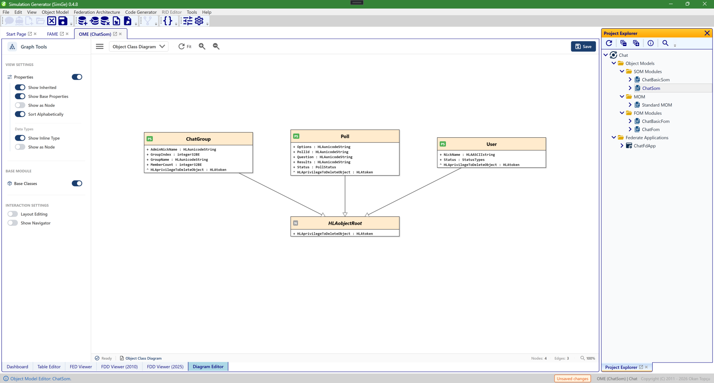

# Diagrams

SimGe provides powerful visualization tools for analyzing your object models and federation architectures.

## Object Class Diagram (OME Diagram Editor)

The OME Diagram Editor renders a module's **object classes** as a UML-style class diagram — a visual complement to the Objects table in the [OME](OME.md). Classes appear as boxes with their attributes, connected by generalization links that show the inheritance hierarchy.

*The Object Class diagram in the OME's **Diagram Editor** tab. Each box is an object class with its attributes (here `ChatGroup`, `Poll`, and `User`, all generalizing `HLAobjectRoot`), and the connectors show the inheritance hierarchy. The **Graph Tools** panel on the left toggles what is shown — inherited members, base properties, base classes, inline data types, alphabetical sorting, and layout/navigator options. Pan, zoom, selection, and mini-map navigation work as described under [Interaction, Navigation, and Toolbar Controls](#interaction-navigation-and-toolbar-controls).*

## Federation Structure Diagram (FSD)
The FSD provides a high-level overview of the federation architecture, showing how different federate applications interact with the RTI.

- **Interactive Navigation**: Double-click any "Note" icon to jump directly to that module's Object Model Editor (OME).
- **Selection Sync**: Clicking a federate box in the diagram automatically selects and focuses that federate in the side properties panel.
- **Visual Multiplicity**: Federates with multiplicity greater than one are rendered with a "stacked box" effect, providing an instant visual cue for multi-instance deployments.
- **Dynamic Feedback**: Connection lines to the RTI "pulse" and glow when hovered, indicating an active architectural link.
- **Rich Tooltips**: Hovering over a federate box displays a parsed, human-readable summary of its RTI connection settings (Target, Port, Protocol).

## Directed Interactions Diagram
This diagram visualizes the flow of interactions between object and interaction classes. It helps in understanding the messaging patterns and coupling within the federation.

## FOM Modules Dependency Graph
This graph displays the relationships and dependencies between the FOM modules in your project. It lives on the Start Page — see [Start Page → FOM Modules Dependency Graph](StartPage.md#fom-modules-dependency-graph) for details.

---

## Interaction, Navigation, and Toolbar Controls

This section describes the standard interaction model used in diagram editors within the Object Model Graphical Modeling Environment. The interaction design follows widely accepted graphical modeling conventions to provide an intuitive, efficient, and predictable user experience.

### Pan, Zoom, and Selection Controls

Users can navigate, inspect, and manipulate diagrams using a combination of mouse and keyboard inputs. All interactions are designed to preserve selection state unless explicitly modified by the user.

#### Keyboard and Mouse Combinations

| Action | Shortcut | Description |
| :--- | :--- | :--- |
| **Zoom In** | CTRL + Mouse Wheel Up | Zooms in toward the mouse cursor position. |
| **Zoom Out** | CTRL + Mouse Wheel Down | Zooms out away from the mouse cursor position. |
| **Pan (Move Canvas)** | CTRL + Left Mouse Button + Drag | Moves the diagram canvas without modifying the current selection. |
| **Single Selection** | Left Mouse Button (Click) | Selects a single node and clears any previous selection. |
| **Multi-Selection** | SHIFT + Left Mouse Button (Click) | Toggles the selection state of the clicked node, enabling multi-selection. |
| **Select All** | CTRL + A | Selects all nodes in the diagram. |
| **Clear Selection** | ESC or Click on Canvas | Clears the current selection. |
| **Delete** | DELETE | Deletes the selected node(s) after user confirmation. |

### Toolbar Controls

Frequently used diagram operations are also accessible through the toolbar, providing quick access without requiring keyboard shortcuts.

#### Toolbar Buttons and Commands

| Icon | Command | Description |
| :--- | :--- | :--- |
| **Refresh** | RelayoutCommand | Recomputes the diagram layout and applies Fit Graph to optimally adjust the view. |
| **Zoom In** | ZoomInCommand | Zooms in by 110% relative to the diagram center. |
| **Zoom Out** | ZoomOutCommand | Zooms out by 90% relative to the diagram center. |
| **Export** | ExportGraphCommand | Exports the diagram as a PNG image at 3× resolution for high-quality output. |

### Mini-Map Navigation

The Mini-Map provides an overview of the entire diagram and enables fast, context-aware navigation within large and complex models. It displays a scaled representation of the diagram along with a viewport indicator representing the currently visible area.

#### Mini-Map Interactions

| Action | Result |
| :--- | :--- |
| **Scroll** | Moves the viewport indicator to reflect the current canvas position. |
| **Zoom** | The Mini-Map remains unchanged; the viewport indicator scales to reflect the zoom level. |
| **Click on Mini-Map** | Instantly jumps the main view to the selected region. |
| **Drag within Mini-Map** | Enables smooth navigation by continuously moving the viewport. |

### Interaction Design Principles

The diagram interaction model is based on the following principles:
- **Consistency**: Aligns with standard graphical modeling tools and user expectations.
- **Non-destructive Navigation**: Panning and zooming do not alter selection state.
- **Precision**: Cursor-centered zoom and explicit multi-selection control.
- **Scalability**: Mini-Map support enables efficient navigation in large diagrams.
- **Efficiency**: Common operations are accessible via both shortcuts and toolbar buttons.
