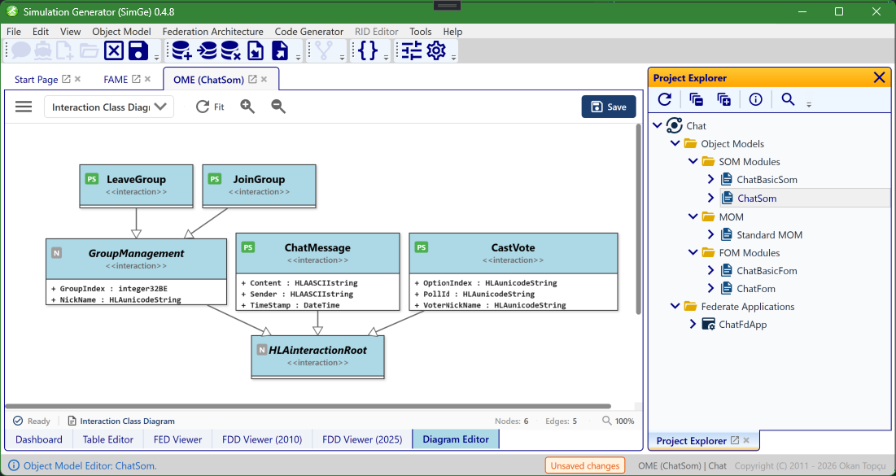
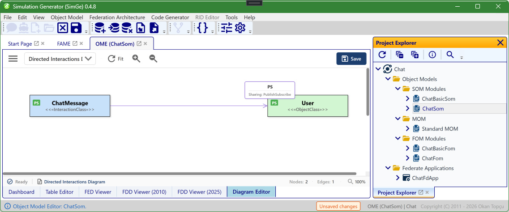

# Object Model Diagrams

The OME **Diagram Editor** visualizes a module's object model graphically — a complement to the [OME](OME.md) tables. Open a module, select the **Diagram Editor** tab, and pick a view from the editor's **View** dropdown. Three object-model views are available: the **Object Class**, **Interaction Class**, and **Directed Interactions** diagrams.

> Federation-level diagrams — the Federation Structure Diagram and the UML Deployment Diagram — live in [FAME](FAME.md), and the cross-module [FOM Modules Dependency Graph](StartPage.md#fom-modules-dependency-graph) lives on the Start Page.

## Object Class Diagram

Renders a module's **object classes** as a UML-style class diagram. Classes appear as boxes with their attributes, connected by generalization links that show the inheritance hierarchy.

*The Object Class diagram in the OME's **Diagram Editor** tab. Each box is an object class with its attributes (here `ChatGroup`, `Poll`, and `User`, all generalizing `HLAobjectRoot`), and the connectors show the inheritance hierarchy. The **Graph Tools** sidebar on the left controls what is shown and how the diagram behaves (see [The Graph Tools sidebar](#the-graph-tools-sidebar)); pan, zoom, selection, and mini-map navigation work as described under [Interaction, Navigation, and Toolbar Controls](#interaction-navigation-and-toolbar-controls).*

## Interaction Class Diagram

Switch the editor's **View** dropdown to *Interaction Class Diagram* to render the module's **interaction classes**.

*The Interaction Class diagram. Each box is an interaction class with its parameters (here `JoinGroup`, `LeaveGroup`, `ChatMessage`, `CastVote`, and `GroupManagement`), all generalizing `HLAinteractionRoot`; the connectors show the inheritance hierarchy. The same Graph Tools toggles and navigation controls apply as for the object-class view.*

## Directed Interactions Diagram

Visualizes how interaction classes relate to object classes — the publish/subscribe relationships and coupling within the model.

*The Directed Interactions diagram, available from the **View** dropdown. A directed arrow links an interaction class to an object class and is labelled with its sharing (here `ChatMessage` «InteractionClass» → `User` «ObjectClass», `Sharing: PublishSubscribe`), making the publish/subscribe relationships and coupling visible at a glance. The same pan, zoom, selection, and mini-map controls apply.*

---

## The Graph Tools sidebar

The **Graph Tools** sidebar on the left of the Diagram Editor controls what each diagram shows and how it behaves. Toggles apply immediately and re-render the diagram. The toolbar's sidebar button collapses the panel to maximize canvas space. It has three groups.

### View Settings

| Toggle | Default | What it does |
|---|---|---|
| **Properties** | On | Master switch — show or hide each class's properties (attributes / parameters) inside its node. When off, the options below are hidden. |
| **Show Inherited** | Off | Also show properties inherited from parent classes **in the same module**. |
| **Show Base Properties** | Off | Also show properties that come from **base-module** classes (drawn with a ◦ prefix in grey italic). |
| **Show as Node** | Off | Draw each property as its own node instead of a line inside the class box. |
| **Sort Alphabetically** | On | Sort each class's properties A–Z. |
| **Data Types → Show Inline Type** | On | Show the datatype next to each property (e.g. `NickName: HLAunicodeString`). |
| **Data Types → Show as Node** | Off | Render data types as separate nodes linked to the properties that use them (automatically turns Show Inline Type on). |

### Base Module

| Toggle | Default | What it does |
|---|---|---|
| **Base Classes** | On | Show or hide the **base-module** class nodes — the standard/dependency classes (such as `HLAobjectRoot`) drawn with a `«ModuleName»` stereotype. |

### Interaction Settings

| Toggle | Default | What it does |
|---|---|---|
| **Layout Editing** | Off | Allow dragging nodes to adjust the layout manually. |
| **Show Navigator** | Off | Reserved for a navigator overlay (not currently active). |

---

## Interaction, Navigation, and Toolbar Controls

This section describes the standard interaction model used in the diagram editors. The interaction design follows widely accepted graphical modeling conventions to provide an intuitive, efficient, and predictable user experience.

### Pan, Zoom, and Selection Controls

Users can navigate, inspect, and manipulate diagrams using a combination of mouse and keyboard inputs. All interactions are designed to preserve selection state unless explicitly modified by the user.

#### Keyboard and Mouse Combinations

| Action | Shortcut | Description |
| :--- | :--- | :--- |
| **Zoom In** | CTRL + Mouse Wheel Up | Zooms in toward the mouse cursor position. |
| **Zoom Out** | CTRL + Mouse Wheel Down | Zooms out away from the mouse cursor position. |
| **Pan (Move Canvas)** | CTRL + Left Mouse Button + Drag | Moves the diagram canvas without modifying the current selection. |
| **Single Selection** | Left Mouse Button (Click) | Selects a single node and clears any previous selection. |
| **Multi-Selection** | SHIFT + Left Mouse Button (Click) | Toggles the selection state of the clicked node, enabling multi-selection. |
| **Select All** | CTRL + A | Selects all nodes in the diagram. |
| **Clear Selection** | ESC or Click on Canvas | Clears the current selection. |
| **Delete** | DELETE | Deletes the selected node(s) after user confirmation. |

### Toolbar Controls

Frequently used diagram operations are also accessible through the toolbar, providing quick access without requiring keyboard shortcuts.

#### Toolbar Buttons and Commands

| Icon | Command | Description |
| :--- | :--- | :--- |
| **Refresh** | RelayoutCommand | Recomputes the diagram layout and applies Fit Graph to optimally adjust the view. |
| **Zoom In** | ZoomInCommand | Zooms in by 110% relative to the diagram center. |
| **Zoom Out** | ZoomOutCommand | Zooms out by 90% relative to the diagram center. |
| **Export** | ExportGraphCommand | Exports the diagram as a PNG image at 3× resolution for high-quality output. |

### Mini-Map Navigation

The Mini-Map provides an overview of the entire diagram and enables fast, context-aware navigation within large and complex models. It displays a scaled representation of the diagram along with a viewport indicator representing the currently visible area.

#### Mini-Map Interactions

| Action | Result |
| :--- | :--- |
| **Scroll** | Moves the viewport indicator to reflect the current canvas position. |
| **Zoom** | The Mini-Map remains unchanged; the viewport indicator scales to reflect the zoom level. |
| **Click on Mini-Map** | Instantly jumps the main view to the selected region. |
| **Drag within Mini-Map** | Enables smooth navigation by continuously moving the viewport. |

### Interaction Design Principles

The diagram interaction model is based on the following principles:
- **Consistency**: Aligns with standard graphical modeling tools and user expectations.
- **Non-destructive Navigation**: Panning and zooming do not alter selection state.
- **Precision**: Cursor-centered zoom and explicit multi-selection control.
- **Scalability**: Mini-Map support enables efficient navigation in large diagrams.
- **Efficiency**: Common operations are accessible via both shortcuts and toolbar buttons.

---

**Next:** [Importing & Exporting](ImportExport.md)
