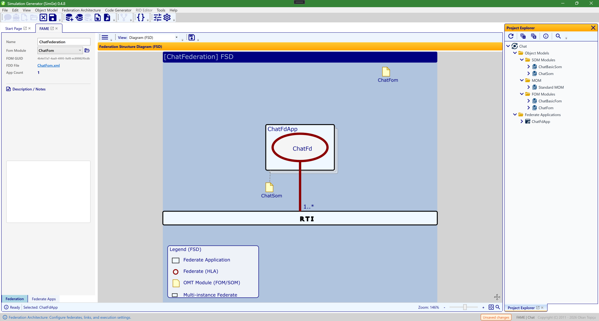
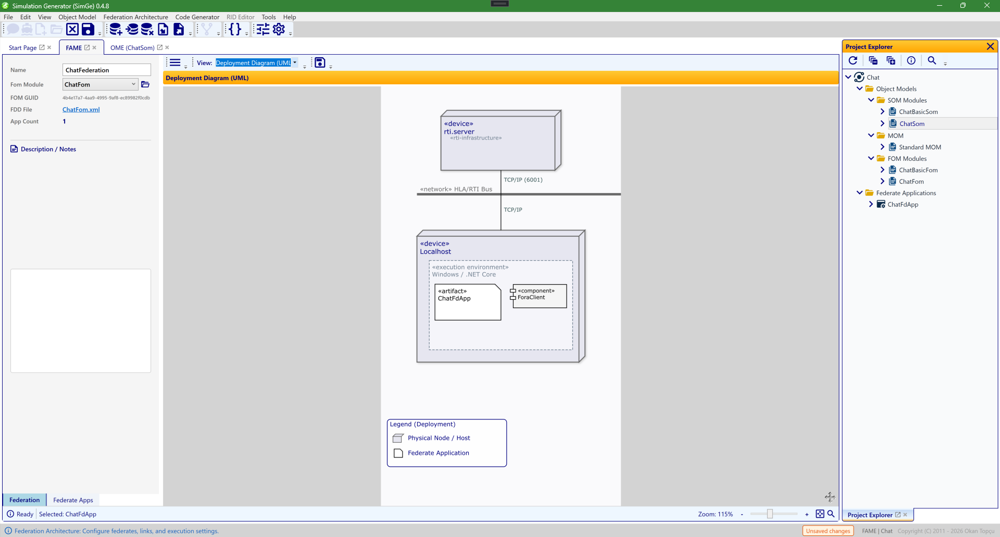

# FAME (Federation Architecture)

The Federation Architecture Modeling Environment (FAME) is the central workspace for designing and managing your HLA federation structure. It allows you to define federate applications, link them to RTI settings, and associate them with specific Object Models.

*The FAME workspace showing the Chat federation in the **Federation Structure Diagram (FSD)** view (chosen from the **View** dropdown). The federate application `ChatFdApp` (containing the `ChatFd` federate) links to its `ChatFom` / `ChatSom` modules with `1..*` multiplicity and connects to the central **RTI**. The properties pane on the left configures the federation and the selected federate; double-clicking a federate's note icon jumps to its Object Model Editor.*

---

## Workspace Layout

The FAME interface is divided into three main areas:
1.  **Main Toolbar**: Common operations like toggling the property pane and exporting the diagram.
2.  **FSD Diagram (Center)**: A visual representation of the architecture.
3.  **Properties Pane (Left)**: Configuration tabs for the Federation and individual Federate Applications.

---

## The Federation Tab

This tab contains global settings for the entire federation execution.

-   **Federation Name**: The identifier for the federation execution.
-   **Fom Module**: Select the root FOM module for the federation. 
    *   Click the **Folder (Open)** icon next to the dropdown to immediately jump to that module's Object Model Editor (OME).
-   **FOM GUID**: Displays the unique identifier of the selected FOM module.
-   **FDD File**: Shows the path where the Federation Design Document (FDD) is generated. Clicking the link opens the folder in Windows Explorer.

---

## The Federate Apps Tab

Manage individual simulation components (federate applications) here.

### Toolbar Actions
Located at the top of the tab:
-   ➕ **Add**: Creates a new federate application and automatically focuses the **App Name** field.
-   🗑️ **Remove**: Deletes the selected application. This button is automatically disabled if no applications exist.
-   **{ } Generate Code**: Scaffolds the source code for the selected federate using the active code generator template.

### Application Properties
-   **App Name**: The C#-compatible name for the application class.
-   **Som Module**: Select the SOM module associated with this federate.
    *   Click the **Folder (Open)** icon to jump to its OMT editor.
-   **SOM GUID**: Displays the unique identifier of the linked SOM module.
-   **Federate Name & Type**: HLA-specific naming for the federate execution.
-   **Multiplicity**: Defines how many instances of this federate will exist in the federation (e.g., `0..1`, `1..*`, `5`).
-   **Connection**: Technical RTI connection string (e.g., `localhost:6001`).
-   **Notes**: Personal documentation and implementation details for the federate.

---

## Interactive FSD Diagram

The Federation Structure Diagram (FSD) is a "living" model that provides real-time feedback.

### Visual Indicators
-   **Stacked Boxes**: If a federate's multiplicity is greater than one, it appears as a stack of boxes to indicate a multi-instance cluster.
-   **Interactive Pulse**: Hovering over a federate box or its "Lollipop" icon makes the connection line to the RTI glow and thicken, representing an active link.
-   **Rich Tooltips**: Hover over any federate box to see a human-readable summary of its connection settings, multiplicity, and linked modules.
-   **Legend**: A guide in the bottom-left corner explains the symbols used in the diagram (FdApp, Federate, OMT Module, Multi-instance).

### Health Diagnostics
Diagnostic badges appear in the top-right corner of federate boxes to catch modeling errors early:
- 🛑 **Critical (Red)**: Severe errors like invalid names that would break code generation.
- ⚠️ **Warning (Orange)**: Missing required associations like a SOM Module.
- ℹ️ **Information (Gray)**: Optional fields like connection settings are empty.

---

## Deployment Diagram (UML)

Switch the **View** dropdown from *Diagram (FSD)* to *Deployment Diagram (UML)* to see the same federation as a UML deployment diagram — useful for documenting how the federation maps onto physical hosts and the network.

*The Deployment Diagram (UML) view of the Chat federation. UML «device» nodes — an `rti.server` «infrastructure» node and a `Localhost` node with a Windows / .NET Core «execution environment» — are joined by the «network» **HLA/RTI Bus** over TCP/IP (port 6001). The federate is shown as an «artifact» (`ChatFdApp`) together with its «component» (`ForaClient`). A legend in the bottom-left explains the node and federate symbols.*

---

## Status Bar Controls

Located at the bottom of the workspace:
-   **Status Message**: Shows current system activity or "Ready" state.
-   **Selection Info**: Displays the name of the currently selected federate application.
-   **Zoom Controls**: 
    *   **Slider**: Smoothly adjust diagram magnification from 20% to 250%.
    *   **+/- Buttons**: Step-wise zoom adjustment.
    *   **Fit-to-Window**: Click the square frame icon to instantly scale the entire diagram to fit the screen.
