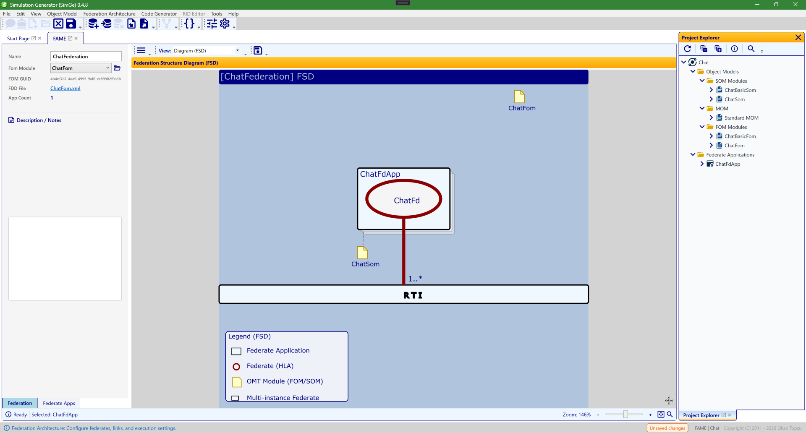
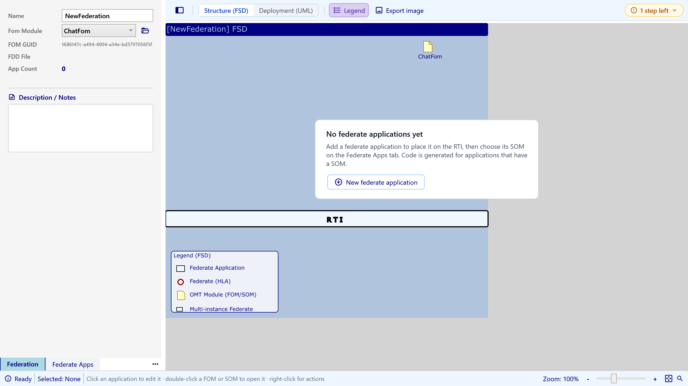
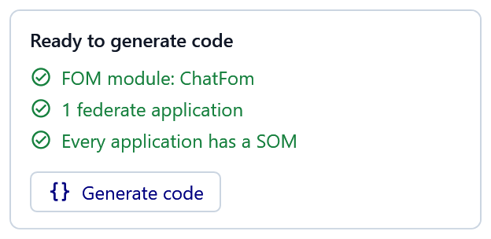
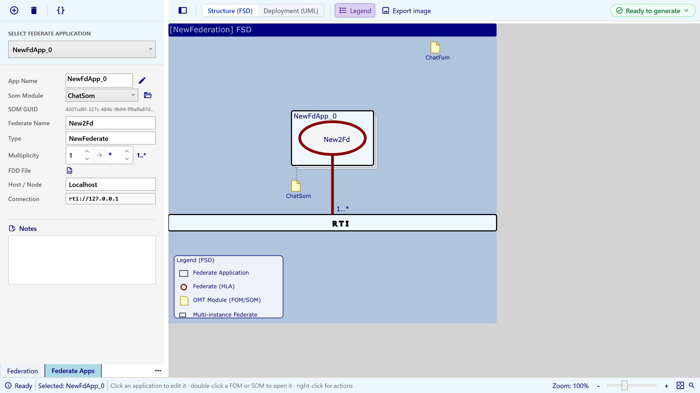
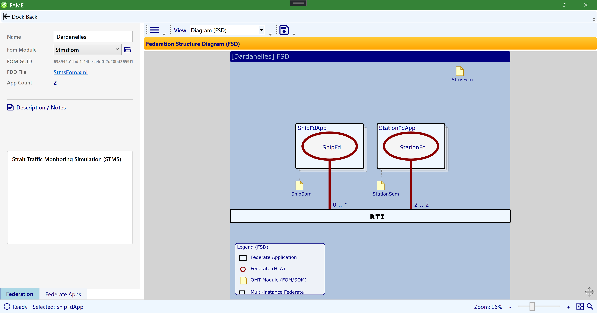
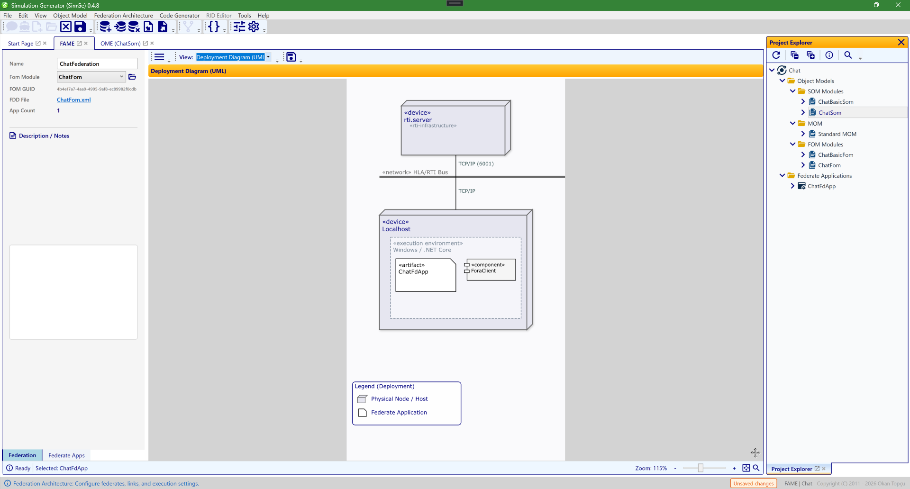

# FAME (Federation Architecture)

The Federation Architecture Modeling Environment (FAME) is the central workspace for designing and managing your HLA federation structure. It allows you to define federate applications, link them to RTI settings, and associate them with specific Object Models.

*The FAME workspace showing the Chat federation in the **Federation Structure Diagram (FSD)** view (chosen with the **Structure (FSD)** / **Deployment (UML)** selector). The federate application `ChatFdApp` (containing the `ChatFd` federate) links to its `ChatFom` / `ChatSom` modules with `1..*` multiplicity and connects to the central **RTI**. The properties pane on the left configures the federation and the selected federate; double-clicking a federate's note icon jumps to its Object Model Editor.*

---

## Workspace Layout

The FAME interface is divided into three main areas:
1.  **Toolbar**: Show or hide the properties pane, switch between **Structure (FSD)** and **Deployment (UML)**, show or hide the **Legend**, **Export image**, and, on the right, the **readiness badge**.
2.  **Diagram (Center)**: A visual representation of the architecture. Right-click it for **New federate application**, **Rename** or **Remove** the selected application, **Legend**, **Zoom to fit**, and **Export image**; right-clicking an application selects it first.
3.  **Properties Pane (Left)**: Tabs for the Federation and individual Federate Applications.

---

## Readiness

*A new federation with its FOM selected and no federate application yet.*

The badge at the right of the toolbar summarizes what code generation still needs: **2 steps left**, **1 step left**, **Ready · 1 warning** (code is generated, but an application without a SOM is skipped), or **Ready to generate** in green. Click it for the checklist:

| Item | Met when |
|---|---|
| **FOM modules** | The federation has at least one FOM module, every module they depend on is in the project, and the modules combine without conflict. Otherwise the item names the problem: **Select FOM modules**, **FOM module not available**, **N missing dependencies**, **Circular module dependency**, or **FOM modules conflict**. |
| **Federate applications** | At least one application exists. |
| **SOM for every application** | Each application has a SOM module. Code generation skips applications without one. |

When the FOM modules and at least one application with a SOM are in place, the checklist reads **Ready to generate code** and its **Generate code** button generates code for every application. Hover an item for details.

*The same federation with one application and its SOM. Clicking an application on the diagram opens it on the Federate Apps tab.*

While the federation has no application, the diagram shows **No federate applications yet** with a **New federate application** button.

---

## The Federation Tab

This tab contains global settings for the entire federation execution.

-   **Federation Name**: The identifier for the federation execution.
-   **FOM Modules**: The modules the federation is created with. IEEE 1516.1-2025 §4.5 creates a federation from a set of FOM modules, and the RTI combines them.
    *   Choose a module in the dropdown and click **+**. Select only the modules you need; SimGe adds every module they depend on.
    *   The list shows every module in load order, dependencies before the modules that use them. Selected modules are bold, and each required module says which module needs it. Double-click a module to open it in the Object Model Editor. **×** removes a selected module.
    *   A dependency that is not in the project is listed in amber with an **Import** button, as on the dashboard. A selected module that was removed from the project is listed too; import it or remove it.
    *   Below the list, SimGe composes the modules with the IEEE 1516.2 merging rules the RTI applies. If two modules define the same element differently, the RTI would reject Create Federation Execution, so the conflict is reported here first.
-   **MIM**: The Management Object Model the RTI loads before the FOM modules. Keep **HLAstandardMIM (RTI default)**, or choose an imported OMT of type MIM to use a user-extended MIM.
-   **Logical Time**: The time implementation named at creation: **HLAfloat64Time** (default) or **HLAinteger64Time**. Fora RTI supports only HLAfloat64Time and rejects any other; the tab warns when you choose another.
-   **FDD File**: Shows the composed FDD that code generation writes. Clicking the link opens the folder in Windows Explorer.

Projects saved with a single FOM module open with that module selected.

---

## The Federate Apps Tab

Manage individual simulation components (federate applications) here.

### Toolbar Actions
Located at the top of the tab:
-   ➕ **Add**: Creates a new federate application and automatically focuses the **App Name** field.
-   🗑️ **Remove**: Deletes the selected application. This button is automatically disabled if no applications exist.
-   **{ } Generate Code**: Scaffolds the source code for the selected federate using the active code generator template.

### Application Properties
-   **App Name**: The C#-compatible name for the application class.
-   **Som Module**: Select the SOM module associated with this federate.
    *   Click the **Folder (Open)** icon to jump to its OMT editor.
-   **SOM GUID**: Displays the unique identifier of the linked SOM module.
-   **Federate Name & Type**: HLA-specific naming for the federate execution.
-   **Multiplicity**: Defines how many instances of this federate will exist in the federation (e.g., `0..1`, `1..*`, `5`).
-   **Connection**: Technical RTI connection string (e.g., `localhost:6001`).
-   **Host / Node**: The physical host or node this federate application is deployed to. Drives the [Deployment Diagram (UML)](#deployment-diagram-uml) view; when left empty it is shown as `LocalHost`.
-   **Join Modules**: Additional FOM modules this application supplies when it joins (IEEE 1516.1-2025 §4.11), for extensions only it uses. Modules already in the federation's FOM are not offered, and their dependencies are added automatically. The composition check on the Federation tab also checks each application's join modules against the federation's FOM.
-   **Notes**: Personal documentation and implementation details for the federate.

---

## Interactive FSD Diagram

The Federation Structure Diagram (FSD) is a "living" model that provides real-time feedback.

*The interactive FSD (here the STMS sample's `Dardanelles` federation). The federate applications `ShipFdApp` and `StationFdApp` link to their SOM modules and to the central RTI, annotated with multiplicity (`0..*`, `2..2`); the `StmsFom` module appears top-right. Connection lines glow on hover, health badges flag modeling issues, multi-instance federates render as stacked boxes, and a legend in the bottom-left explains the symbols.*

### Visual Indicators
-   **Stacked Boxes**: If a federate's multiplicity is greater than one, it appears as a stack of boxes to indicate a multi-instance cluster.
-   **Interactive Pulse**: Hovering over a federate box or its "Lollipop" icon makes the connection line to the RTI glow and thicken, representing an active link.
-   **Rich Tooltips**: Hover over any federate box to see a human-readable summary of its connection settings (Target, Port, Protocol), multiplicity, and linked modules.
-   **Legend**: A guide in the bottom-left corner explains the symbols used in the diagram (FdApp, Federate, OMT Module, Multi-instance). Hide it with **Legend** in the toolbar or the diagram's context menu; the choice holds for the session.

### Navigation
-   **Interactive Navigation**: Double-click a module's "Note" icon to jump straight to that module's [Object Model Editor](OME.md).
-   **Selection Sync**: Clicking a federate box selects and focuses that federate in the properties pane.

### Health Diagnostics
Diagnostic badges appear in the top-right corner of federate boxes to catch modeling errors early:
- 🛑 **Critical (Red)**: Severe errors like invalid names that would break code generation.
- ⚠️ **Warning (Orange)**: Missing required associations like a SOM Module.
- ℹ️ **Information (Gray)**: Optional fields like connection settings are empty.

---

## Deployment Diagram (UML)

Select **Deployment (UML)** in the toolbar to see the same federation as a UML deployment diagram — useful for documenting how the federation maps onto physical hosts and the network.

Each federate application is drawn as its own host node, labeled with its **Host / Node** value from the Federate Apps tab (or `LocalHost` when that field is empty). Inside the host, the federate appears as a UML «artifact» alongside its `ForaClient` «component», and every host connects to the central `rti.server` node through the **HLA/RTI network bus**, with each link labeled by the federate's connection protocol. Set the **Host / Node** field on each federate to control how the deployment topology is laid out.

*The Deployment Diagram (UML) view of the Chat federation. UML «device» nodes — an `rti.server` «infrastructure» node and a `Localhost` node with a Windows / .NET Core «execution environment» — are joined by the «network» **HLA/RTI Bus** over TCP/IP (port 6001). The federate is shown as an «artifact» (`ChatFdApp`) together with its «component» (`ForaClient`). A legend in the bottom-left explains the node and federate symbols.*

---

## Status Bar Controls

Located at the bottom of the workspace:
-   **Status Message**: Shows current system activity or "Ready" state.
-   **Selection Info**: Displays the name of the currently selected federate application.
-   **Hint**: How to work with the diagram: click an application to edit it, double-click a FOM or SOM to open it, right-click for actions.
-   **Zoom Controls**: 
    *   **Slider**: Smoothly adjust diagram magnification from 20% to 250%.
    *   **+/- Buttons**: Step-wise zoom adjustment.
    *   **Fit-to-Window**: Click the square frame icon to instantly scale the entire diagram to fit the screen.

---
Updated June 25, 2026, 16:28:09
