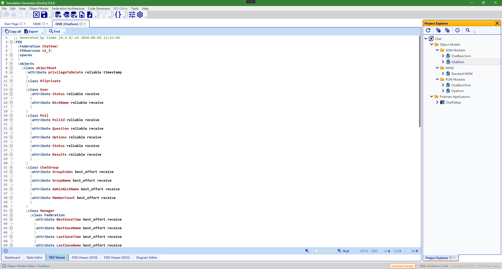
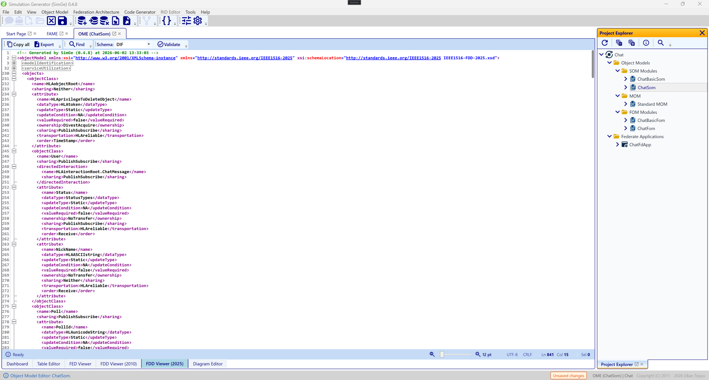

# Importing & Exporting

SimGe interoperates with the standard HLA model file formats. You can **import** existing models to start from them, and **export** your composed model back to a standard file for an RTI or for sharing.

## Importing

Importing brings an external HLA model into SimGe's modular representation.

| Source format | Notes |
|---|---|
| **HLA 1.3 FED** (`.fed`) | Legacy federation execution data. |
| **IEEE 1516-2010 FDD** (`.xml`) | 2010 FOM Document Data. |
| **IEEE 1516-2025 FDD** (`.xml`) | The current standard. |

Where to import from:

- During project creation — the New Project wizard's **Object Module Configuration** step (see [Creating a Project](CreatingProjects.md)).
- Into an existing project — the application's **Import** command, which accepts the formats above.

> **Automatic upgrade.** When you import a 1.3 or 2010 model, SimGe upgrades it to the IEEE 1516-2025 representation so you work in a single, modern model. The imported content becomes one or more modules you can edit in the [OME](OME.md).

Imports are validated as they are read; if the source has issues, SimGe reports them (see [FOM Validation](Validation.md)).

## Exporting

Exporting writes your model to a standard file. Because SimGe authors models as [modules](ModularFOM.md), an export first **merges** the relevant modules into a single, standard-compliant FOM, then writes the chosen format.

| Target format | Use |
|---|---|
| **HLA 1.3 FED** (`.fed`) | For legacy 1.3 RTIs. |
| **IEEE 1516-2010 FDD** (`.xml`) | For 2010 RTIs/tools. |
| **IEEE 1516-2025 FDD** (`.xml`) | For current-standard RTIs/tools. |
| **DIF (2025)** | The 2025 dependency/interface document. |

Where to export from:

- **Project Explorer** — right-click a model and choose **Export FDD…** or **Export FED…**.
- The **FDD/FED preview** surfaces, where you can pick the standard, preview the generated document, validate it, and save.

When you export, SimGe writes the merged document to the location you choose. The generated file is suitable for initializing a federation in a compatible RTI.

*The FED viewer (HLA 1.3). It renders the generated `.fed` document so you can review it before saving, with toolbar actions to copy the content (Ctrl+C) and export it to a file (Ctrl+E).*

*The FDD viewer (IEEE 1516-2025). It renders the generated FDD for the current standard, where you can pick the standard, preview the document, validate it against the schema, and save — copy with Ctrl+C and export with Ctrl+E.*

## Choosing a format

- Use **IEEE 1516-2025** unless a specific RTI or partner requires an older standard.
- Use **HLA 1.3 FED** only for legacy infrastructure.
- Use **DIF** when a 2025 toolchain expects the dependency/interface document alongside the FDD.

## Validate before you ship

Before handing an exported FOM to an RTI, validate it so structural or schema problems surface early. The export/preview surfaces let you validate the generated document directly — see [FOM Validation](Validation.md).

---

**Next:** [FOM Validation](Validation.md)

---
Updated June 25, 2026, 16:28:09