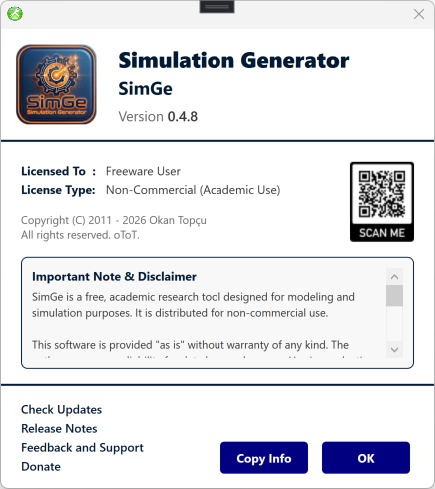

# Installation & Updates

SimGe is distributed as a Windows installer (`.msi`). This chapter covers installing, updating, repairing, and removing it.

## System requirements

| Requirement | Notes |
|---|---|
| **Operating system** | Windows 10 or Windows 11 (64-bit). SimGe is a WPF desktop application and runs on Windows only. |
| **.NET runtime** | **.NET 10 Desktop Runtime (x64)**. The installer is framework-dependent, so the runtime must be present. If it is missing, install it from Microsoft's .NET download page. |
| **Disk space** | A few hundred MB, including the bundled sample projects. |

## Installing

1. Download the latest installer: **[SimGe.msi](https://github.com/otopcu/simge-site/releases/latest/download/SimGe.msi)**.
2. Run `SimGe.msi` and follow the prompts.
3. When finished, SimGe is available from the **Start menu**.

The installer also:

- Registers the **`.fap`** file association, so double-clicking a project file opens it in SimGe.
- Installs the bundled **sample projects** under `C:\ProgramData\SimGe\Samples` (read-only — see below).

> The download link always points to the current release, so bookmarks and shortcuts keep working across updates.

## First launch

On first launch the **SimGe — Get Started** dialog appears. From here you can create a new project, open an existing one, or open a bundled sample. See the [Quick Start](QuickStart.md) for a guided first session.

## Sample projects are read-only

The bundled samples live in a shared, machine-wide location (`C:\ProgramData\SimGe\Samples`) that standard users cannot modify. As a result, **Save is disabled** for a sample. To keep changes, use **Save As** to store an editable copy in a writable folder such as your Documents. See [Opening & Saving Projects](OpeningSaving.md).

## Updating

To move to a newer version, download the latest `SimGe.msi` and run it. The installer performs a major upgrade — it replaces the previously installed version in place. Your own projects (saved outside the install location) are untouched.

To check which version you currently have, open **Help → About**.

*The About dialog (Help → About) shows the installed SimGe version and copyright — handy for confirming whether you are on the latest release.*

## Repairing or removing

Use **Windows Settings → Apps → Installed apps → SimGe** (or the classic **Control Panel → Programs and Features**):

- **Modify / Repair** — restores missing or changed program files, including the bundled sample files. Use this if a sample's files are reported missing.
- **Uninstall** — removes SimGe. Projects you saved elsewhere are not affected.

> If SimGe reports a sample module's files as missing, a **Repair SimGe** hint is offered in the recovery dialog. See [Troubleshooting](Troubleshooting.md) and [Project Explorer → Recovering Missing Module Files](ProjectExplorer.md#recovering-missing-module-files).

---

**Next:** [Quick Start: Your First Project](QuickStart.md)
