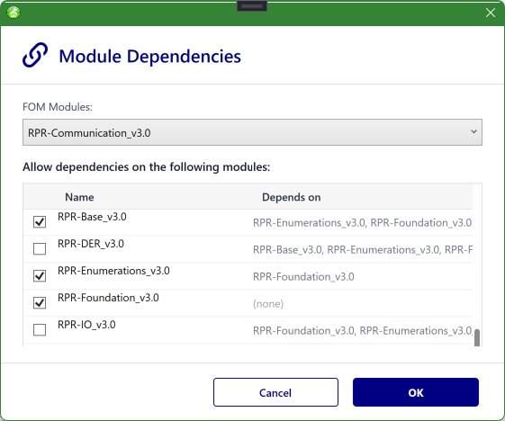

# Managing Modules

This chapter covers the everyday operations on FOM/SOM modules. For the underlying ideas (roles, dependencies, composition), see [Modular FOM Concepts](ModularFOM.md). Module commands live in the [Project Explorer](ProjectExplorer.md) — right-click the **FOM Modules** folder or an individual module.

## Adding modules

| Command | What it does |
|---|---|
| **Add New FOM Module…** | Creates a fresh, empty module in the project, ready to edit in the [OME](OME.md). |
| **Add Existing FOM Module(s)…** | Brings one or more existing module files into the project. |

> To bring in a standard HLA file (FED / FDD) rather than an existing SimGe module, use [Importing & Exporting](ImportExport.md) instead.

## Opening a module

**Double-click** a module (or use **Open in Editor**) to open it in the [Object Model Editor](OME.md).

- Editable **FOM/SOM** modules open for editing.
- **Dependency** and **Standard** (MOM) modules open **read-only**, so a consumed or system module is not changed by accident.

## Renaming

**Rename Module…** changes the module's name and renames its files on disk (`.sfom` and `.xml`) to match, keeping the project consistent. Dependent modules continue to resolve because dependencies are tracked by the module's identity, not its file name.

## Duplicating

**Duplicate Module…** creates an independent copy of a module under a new name — useful as a starting point for a variant without affecting the original.

## Removing

| Command | What it does |
|---|---|
| **Remove Module** | Removes a single module from the project after confirmation. |
| **Remove All Modules** | Clears every module in one batch operation, with progress shown on the shell. |

When you remove a module that **others depend on**, SimGe does not silently break those links: each dependent module's link to the removed module is converted into an **unresolved (orphan) dependency** that keeps the missing module's name. The dependents then show a warning until you add the module back or relink them. (See [Modular FOM Concepts → Dependencies](ModularFOM.md#dependencies).)

> A module whose content file failed to load can still be removed — use **Remove Module** on it.

## Merging

**Merge Modules…** combines modules into a single resulting module, applying the standard composition rules. Use this when you want one consolidated module instead of several separate ones. (Export and code generation also merge automatically without changing your authored modules — see [Modular FOM Concepts → Composition and merge](ModularFOM.md#composition-and-merge).)

## Editing dependencies

**Module Dependencies…** opens a dialog where you set which other modules a module depends on. Changes are reflected immediately in the Project Explorer hierarchy and in the [Start Page dependency graph](StartPage.md#fom-modules-dependency-graph). Removing a dependency that cannot be resolved leaves it as an orphan entry you can clean up later.

*The Module Dependencies tool. Pick the module to edit from the **FOM Modules** dropdown (here `RPR-Communication_v3.0`), then check the modules it may depend on; the **Depends on** column shows each candidate's own dependencies. Confirmed links appear in the Project Explorer hierarchy and the dependency graph, while unresolved references are flagged as orphan dependencies.*

## Recovering a module with missing files

If a module's `.sfom` or `.xml` is missing on disk, the module is flagged with a warning badge and double-clicking it starts a recovery flow (locate, remove, or — for samples — repair). See [Project Explorer → Recovering Missing Module Files](ProjectExplorer.md#recovering-missing-module-files).

---

**Next:** [OME — Object Model Editor](OME.md)
