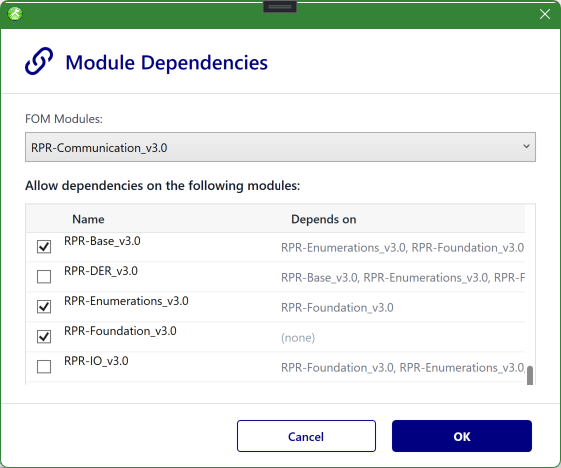

# Managing Modules

This chapter covers the everyday operations on FOM/SOM modules. For the underlying ideas (roles, dependencies, composition), see [Modular FOM Concepts](ModularFOM.md). Module commands live in the [Project Explorer](ProjectExplorer.md) — right-click the **Object Models**, **FOM Modules** or **SOM Modules** folder, or an individual module.

## Adding modules

| Command | Where | What it does |
|---|---|---|
| **New ▸ FOM Module… / SOM Module…** | **Object Models** | Creates a fresh, empty module, ready to edit in the [OME](OME.md). |
| **New FOM Module… / New SOM Module…** | **FOM Modules** / **SOM Modules** | The same, for the folder's type. |
| **Import Module(s)…** | **Object Models** | One multi-select dialog for HLA files (`*.xml` FDD, `*.fed`) and SimGe object models (`*.fom`). |

**Import Module(s)…** chooses the loader by file extension: HLA files are validated and imported with an import report (a batch report when several are selected), while a `.fom` file appends all of its modules. FOM or SOM placement follows each module's content. You can also **drop files** from Windows Explorer onto any of the three module folders — the drop uses the same import.

When the import finishes, the status bar names the added modules with their type — for example *Imported module: RPR-Base (FOM).* — and the last one is selected in the tree. For a long list, the first five names are shown followed by *+N more*.

> For HLA file formats and export, see [Importing & Exporting](ImportExport.md).

## Opening a module

**Double-click** a module (or use **Open in Editor**) to open it in the [Object Model Editor](OME.md).

- Editable **FOM/SOM** modules open for editing.
- **Dependency** and **Standard** (MOM) modules open **read-only**, so a consumed or system module is not changed by accident.

## Renaming

**Rename Module…** changes the module's name and renames its files on disk (`.sfom` and `.xml`) to match, keeping the project consistent. Dependent modules continue to resolve because dependencies are tracked by the module's identity, not its file name.

## Duplicating

**Duplicate Module…** creates an independent copy of a module under a new name — useful as a starting point for a variant without affecting the original.

## Removing

| Command | What it does |
|---|---|
| **Remove Module** | Removes a single module from the project after confirmation. |
| **Remove All FOM Modules…** / **Remove All SOM Modules…** | On the **FOM Modules** / **SOM Modules** folder: removes every module of that type. The type comes from the module's content, not its position in the tree. |
| **Remove All Modules…** | On the **Object Models** folder: clears every FOM and SOM module in one batch operation, with progress shown on the shell. |

Each bulk command first asks for confirmation and shows how many modules will be removed. Module files on disk are never deleted — you can import them again later.

When you remove a module (or a type-scoped set) that **others depend on**, SimGe does not silently break those links: each dependent module's link to the removed module is converted into an **unresolved (orphan) dependency** that keeps the missing module's name. The dependents then show a warning until you add the module back or relink them. (See [Modular FOM Concepts → Dependencies](ModularFOM.md#dependencies).)

> A module whose content file failed to load can still be removed — use **Remove Module** on it.

## Merging

**Merge Modules…** combines modules into a single resulting module, applying the standard composition rules. Use this when you want one consolidated module instead of several separate ones. (Export and code generation also merge automatically without changing your authored modules — see [Modular FOM Concepts → Composition and merge](ModularFOM.md#composition-and-merge).)

## Editing dependencies

**Module Dependencies…** opens a dialog where you set which other modules a module depends on. Changes are reflected immediately in the Project Explorer hierarchy and in the [Start Page dependency graph](StartPage.md#fom-modules-dependency-graph). Removing a dependency that cannot be resolved leaves it as an orphan entry you can clean up later.

*The Module Dependencies tool. Pick the module to edit from the **FOM Modules** dropdown (here `RPR-Communication_v3.0`), then check the modules it may depend on; the **Depends on** column shows each candidate's own dependencies. Confirmed links appear in the Project Explorer hierarchy and the dependency graph, while unresolved references are flagged as orphan dependencies.*

## Recovering a module with missing files

If a module's `.sfom` or `.xml` is missing on disk, the module is flagged with a warning badge and double-clicking it starts a recovery flow (locate, remove, or — for samples — repair). See [Project Explorer → Recovering Missing Module Files](ProjectExplorer.md#recovering-missing-module-files).

---

**Next:** [OME — Object Model Editor](OME.md)

---
Updated September 22, 2026