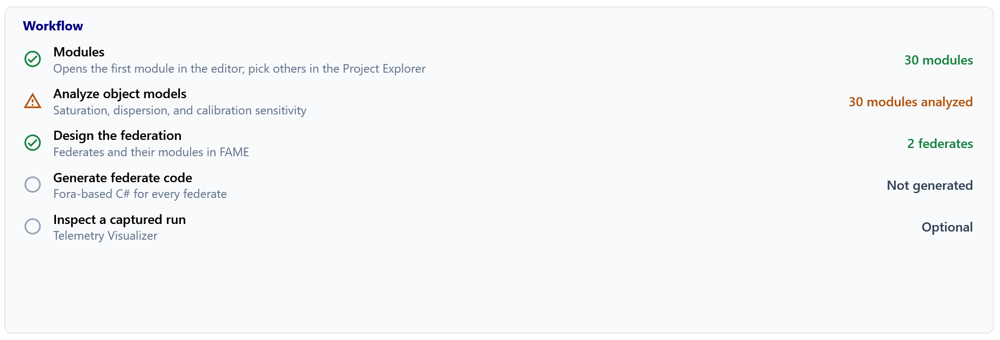
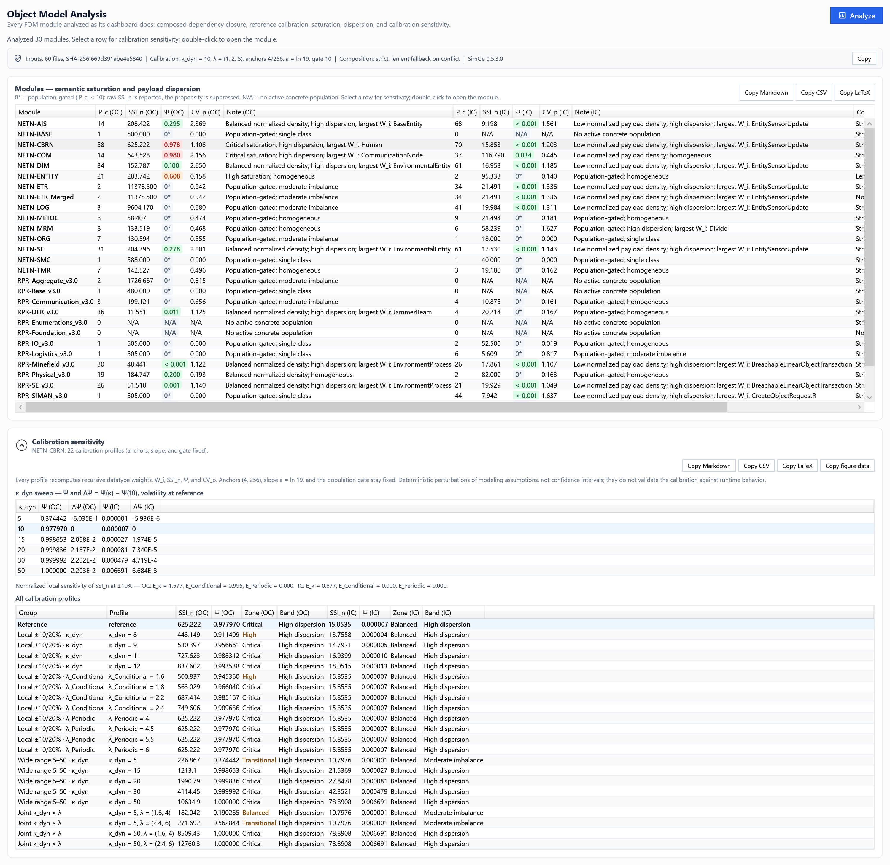
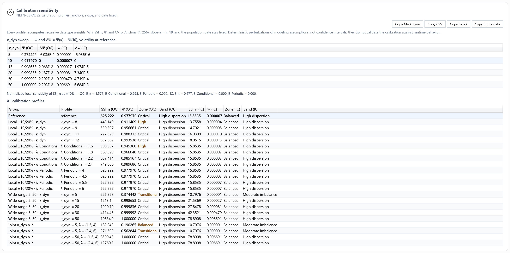

# Model Metrics & Reports

SimGe can quantify a model with **metrics** and produce a formatted, printable **report** of its full contents. Metrics drive the [FOM Dashboard](Dashboard.md) and the analysis reports; the model report documents every table for review or archiving.

## Model metrics

Metrics fall into two groups:

- **Direct volume counters** — straightforward inventory counts taken directly from the model:
  - object-class count, interaction-class count,
  - attribute count, parameter count,
  - data-type count, dimension count,
  - the **OC/IC ratio** (object classes ÷ interaction classes).
- **Derived architectural metrics** — computed indicators over the class hierarchies (for example, hierarchy depth/breadth and complexity/architecture measures), evaluated separately for the Object Class and Interaction Class domains.

The dashboard and analysis reports share the same analysis engine. Compare results for the same model, dependency closure, scope, and calibration settings.

## Metric definitions and published reference

The definitions and methodology for **Weighted Hierarchy Load (WHL)**, **Topological Skewness (S_top)**, **Depth Variation Index (CV_D)**, and **Polymorphic Potential (PP)** are given in Okan Topçu's [*Structural and topological complexity analysis in HLA object models*](https://doi.org/10.1016/j.simpat.2026.103328), *Simulation Modelling Practice and Theory*, 152 (2026), 103328.

Use the paper for the structural metric definitions and their analytical basis. This manual focuses on selecting an analysis scope, using the dashboard, and reading the resulting reports; it does not repeat the paper's derivations. These structural indicators describe pre-execution risk conditions; runtime cost and strategy benefits require measured evidence.

SimGe also displays semantic indicators, archetypes, and runtime validation results. These additional surfaces are not all definitions from that paper. Use the dashboard's information panels and report notes for their interpretation and current scope.

## Reading an analysis report

The **module analysis report**, available through the [dashboard](Dashboard.md), summarizes metrics, integrity findings, and engineering guidance. It differs from the printable OMT content report described below.

- **Object Model Archetype** describes the balance of object and interaction semantic mass. **Domain Dominance (A)** expresses distance from a balanced model; it is not confidence in the archetype label. Read the direction from the semantic-mass ratio **R** and the archetype label. A low dominance value is expected for a balanced Hybrid model.
- **Data-Type Impact** identifies the elements and, where available, modules affected by a datatype change.
- **Code-Generation Hints** are advisory suggestions. A hint does not activate a generator option; inspect the [generation settings and generated README](CodeGenerator.md).

When comparing reports across exports, use the same model and analysis scope. Corrected datatype bindings can change semantic masses and archetype labels without a change to the metric formula. The RPR/NETN corpora and their sample reports are repository research resources; they are not included in the SimGe installer.

> In a merged (composed) analysis, breakdowns may distinguish elements you declared locally from those that come from base modules, while the direct totals remain raw counts of the analyzed content.

## The model report

The report renders a model's full OMT content as a formatted document using the built-in report viewer. It covers the model's tables, including:

- object classes and interaction classes,
- attributes and parameters,
- dimensions, time representations, tags, transportations, update rates, switches, services, notes,
- data types (basic representations, simple, enumerated, array, fixed-record, and variant-record).

The report opens in its own **Reports** workspace, where you can review it on screen, print it, or export it through the viewer's standard controls.

## Generating a report

1. Select the module you want to document.
2. Open its **Report** (Reports workspace).
3. The report builds from the module's current content; if you edit the model, regenerate to refresh it.

Report generation runs in the background, so the application stays responsive while a large model is rendered; a status-bar indicator shows progress and the report appears when it is ready.

## Data-type impact analysis

The analysis report includes a **Data-Type Impact** section that answers a practical question before you change a model: *if I change this datatype, what else is affected?* It works from the model's datatype reference graph and covers two kinds of change:

- **Removal or rename** — identifies the references that depend on the type's identity. Deletion leaves unresolved type names that block code generation until repaired. The editor updates in-module references during a rename; references in dependent modules and already-generated code still require review.
- **Wire-format shift** — changing a type's representation or encoding does not break references, but it forces every codec that embeds the type to be regenerated and re-coordinated with other federates that share the FOM.

For each datatype the section reports its **blast radius** — the total number of elements (attributes, parameters, record fields, variant discriminants/alternatives, and the classes that carry them) reached transitively by such a change — and ranks the declared types by that reach. A high blast radius marks a load-bearing type to change carefully; a low one is comparatively safe to edit.

The same analysis drives the interactive impact warning shown when you delete a datatype in the [Object Model Editor](OME.md).

Composed analysis reports include a **Dependent Modules** column when ownership information is available. It identifies the modules containing affected elements; single-module reports omit this column. For an on-demand preview, right-click a datatype in the [Project Explorer](ProjectExplorer.md) and choose **Show Impact / Usages**.

## Object Model Analysis

**Object Model Analysis** analyzes every FOM module of the open project in one workspace, so modules can be compared side by side, their inputs identified, and their results exported as tables. It is the project-level counterpart of the per-module [dashboard](Dashboard.md#semantic-diagnosis).

**Opening it.** Select the **Analyze object models** row in the [Start Page workflow](StartPage.md#workflow), or **View → Project Workspace → Object Model Analysis**. The workspace opens as a tab and starts analyzing immediately; progress appears under the title. Select **Analyze** to run it again after editing or saving modules, and **Cancel** to stop a run.

*The NETN sample project: 30 modules analyzed, NETN-CBRN selected, and its calibration sensitivity below.*

**Same values as the dashboard.** Each module is analyzed exactly as its dashboard analyzes it: its declared dependency closure is composed (strict, with lenient fallback on a merge conflict), and the same reference calibration, saturation, and dispersion rules are applied. A module therefore shows identical numbers here and in its dashboard.

### Provenance

The line under the progress message records what produced the numbers:

| Item | Meaning |
| --- | --- |
| Inputs | The number of input files and a combined SHA-256 over every module's `.sfom` and content file. |
| Calibration | κ_dyn, λ, anchors, slope, and population gate used for the table. |
| Composition | Strict merge with lenient fallback on conflict. |
| SimGe | The application version. |
| Unsaved edits | Shown when a module has unsaved changes: the hashes describe the files on disk, not the edits in memory. |

The metrics are deterministic: the same input files, calibration, and version give the same values. **Copy** places the line on the clipboard; every exported table also carries it.

### Modules table

One row per module, with the object domain first and the interaction domain second:

| Column | Meaning |
| --- | --- |
| Module | Module name. Hover a row for its analysis scope and composition summary. |
| \|P_c\| | Number of classes with active sharing; concrete is an analysis convention based on the sharing declaration. |
| SSI_n | Normalized Semantic Saturation Index, three decimals. `N/A` when there is no concrete population. |
| Ψ | Diagnostic propensity score (not a probability), tinted with the zone color: `0*` when the population is gated (\|P_c\| < 10), `< 0.001` for very small scores, otherwise three decimals. |
| CV_p | Payload dispersion, three decimals. |
| Note | Short diagnosis, for example *Critical saturation; high dispersion; largest W_i: Human* or *Low normalized payload density; high dispersion; largest W_i: EntitySensorUpdate*. |
| Composition | **Strict**, **Lenient fallback**, or **Not applied** (standalone module). |
| Modules | Number of modules in the analysis closure. |
| Unresolved | Unresolved data type references. A nonzero value means payload may be understated. |
| Inputs | First 12 characters of the SHA-256 over the files of this module's closure. |

Select a row to compute its calibration sensitivity. Double-click a row to open the module.

### Calibration sensitivity

*NETN-CBRN. Object classifications span Balanced through Critical; interactions remain Balanced, while their dispersion band changes to Moderate imbalance at κ_dyn = 5.*

The section is collapsible. It starts collapsed, opens when you select the first module, and stays collapsed if you close it; the results are still computed. The selected module is recomputed under the same 22 profiles as the dashboard (see [Calibration sensitivity](Dashboard.md#calibration-sensitivity) for the profile groups). Every profile recalculates datatype weights, W_i, SSI_n, Ψ, and CV_p; the anchors, slope, and population gate stay fixed.

| Part | Meaning |
| --- | --- |
| κ_dyn sweep | Ψ at κ_dyn = 5, 10, 15, 20, 30, 50 for both domains, with the volatility multipliers at reference, and ΔΨ = Ψ(κ) − Ψ(10). The reference row is highlighted. |
| Normalized local sensitivity | E_p = [SSI_n(1.1 p₀) − SSI_n(0.9 p₀)] / (0.2 SSI_n,₀) for κ_dyn, λ_Conditional, and λ_Periodic. About 1 means SSI_n changes proportionally with the parameter; 0 means the parameter has no effect on this model. |
| All calibration profiles | The 22 profiles with SSI_n, Ψ, zone, and band for both domains. A zone that differs from the reference is shown in bold amber. |

How to read NETN-CBRN: E_κ = 1.577 for objects, so SSI_n reacts more than proportionally to κ_dyn, and the zone changes in five of the 22 profiles. E_Periodic = 0 because no Periodic attribute contributes weight. The interaction domain remains Balanced throughout the sampled profiles.

These are **deterministic perturbations of modeling assumptions, not confidence intervals**; they do not validate the calibration against runtime behavior.

### Export

| Button | Output |
| --- | --- |
| Copy Markdown | The table as Markdown, followed by the provenance line. |
| Copy CSV | Full precision. The sensitivity CSV also keeps the sample's group and profile ids (for example `wide-kappa`, `k50`), so rows can be matched with the Fom2 sensitivity runs. |
| Copy LaTeX | `tabular` environments in the Fom2 case-study layout; the sensitivity export gives the κ_dyn sweep (Ψ and ΔΨ, for example `$-1.201\times10^{-2}$`) and the E table. |
| Copy figure data | The κ_dyn sweep as a whitespace-separated table (`kappa ssi_oc psi_oc ssi_ic psi_ic`) for `\addplot table`. |

All exports go to the clipboard.

### Agreement with the published tables

For the corrected Restaurant and NETN samples, Object Model Analysis reproduces the Fom2 case-study tables: Table 4 (Restaurant), Tables 5 and 6 (NETN object and interaction domains, including the lenient NETN-ENTITY composition), and the sensitivity values of Tables 7 and 8. Automated tests enforce this. The only difference is notation: for an empty population SimGe shows `N/A` where the paper prints `0` as a convention for an unavailable index.

## When to use metrics and reports

- Use the **[dashboard](Dashboard.md)** for quick, interactive assessment while you work.
- Use **Object Model Analysis** to compare every module of a project, check provenance, and export tables for reports or publications.
- Use a **report** when you need a complete, presentable document of the model — for design reviews, archiving, or sharing with stakeholders.
- Use both together: the dashboard points you at what to inspect; the report captures the full detail.

---

**Next:** [Telemetry Visualizer](TelemetryVisualizer.md)

---
Updated October 8, 2026
