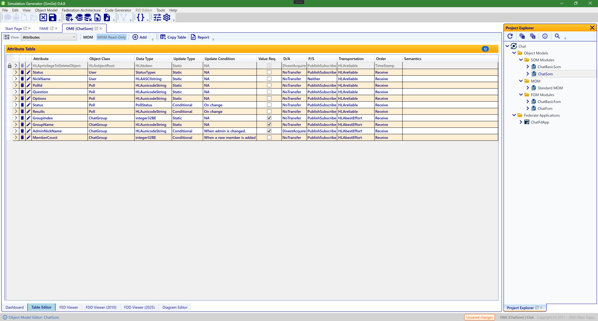

# OME (Object Model Editor)

The Object Model Editor (OME) is the main workspace for editing a FOM or SOM module in tabular form. It combines hierarchy-oriented table views, flat property tables, and item editors for detailed OMT work.

*The OME table editor, here showing a module's **Attribute** table as editable rows (name, object class, data type, update type/condition, P/S, transportation, order, …). The toolbar's Add/edit controls adapt to what the active table supports, and double-clicking a row opens its dedicated item editor. The module workspace also carries tabs along the bottom — **Dashboard**, **Table Editor**, **FED Viewer**, **FDD Viewer (2010)**, **FDD Viewer (2025)**, and **Diagram Editor** — covered in their own chapters.*

---

## Workspace Scope

OME is module-scoped. Each open OME tab works on one active module and can expose:

- identification metadata
- object classes
- interaction classes
- directed interactions
- attributes
- parameters
- dimensions
- time representations
- tags
- synchronizations
- transportations
- update rates
- switches
- datatypes
- notes
- services

Changes made in OME mark the active module as modified and set the project save state to `Unsaved changes` until the next successful save.

Sample references in this document use the installed Chat sample under `C:\ProgramData\SimGe\Samples\Chat\Fom`, primarily `ChatSom.xml`.

---

## 1. Identification Table

The `Identification` table is used for module-level descriptive metadata.

Typical `Information` copy-table shape:

| Field | Value |
| --- | --- |
| Name | module name |
| Type | `FOM` / `SOM` |
| Version | semantic or project version |
| Modification Date | last model date |
| Security Classification | classification text |
| Copyright | copyright text |
| Application Domain | domain label |
| Use Limitation | limitation text |
| Purpose | purpose text |
| Description | description text |
| Other | free text |

### Typical Use

Use this table when you are documenting the module itself rather than editing class structure.

### Chat Sample Example

`ChatSom.xml` example:

| Field | Value |
| --- | --- |
| Name | `ChatSom` |
| Type | `SOM` |
| Version | `0.4.4` |
| Modification Date | `2026-04-24` |
| Security Classification | `Unclassified` |
| Application Domain | `HLA General` |
| Purpose | `Chat Federation is a sample project for SimGe.` |
| Description | `Chat Federation is a sample project for SimGe.` |
| Use Limitation | `NA` |

The same area also includes one keyword row, one POC row, and one reference row in their own sub-tables.

### Add Behavior

The generic OME `Add` button is meaningful here only for the `POC` sub-view.

---

## 2. Objects Table

The `Objects` table is the hierarchy view for `Object Classes (OC)`.

Typical copy-table shape:

| Name | Sharing | Semantics |
| --- | --- | --- |
| object class name | publish/subscribe mode | class semantics |

### Object Class Editor

Opening an object class from the `Objects` table shows the `Object Class` editor.

The editor covers parent, sharing, declared dimensions, directed interactions, semantics, notes, and the embedded `Attributes` list for attributes declared on that class.

### Recommended Use

Use the `Objects` table and `Object Class` editor when working on one object class in context.

### Chat Sample Example

`ChatSom.xml` example:

| Name | Sharing | Semantics |
| --- | --- | --- |
| `HLAobjectRoot` | `Neither` | root object class |
| `User` | `PublishSubscribe` | user entity for chat participation |
| `Poll` | `PublishSubscribe` | poll state object |
| `ChatGroup` | `PublishSubscribe` | chat room / group state object |

Open `ChatGroup` when you want to review one concrete object class with several declared attributes and a different transportation policy than the default `User` / `Poll` branch.

---

## 3. Interactions Table

The `Interactions` table is the hierarchy view for `Interaction Classes (IC)`.

Typical copy-table shape:

| Name | Transportation | Order | Sharing | Semantics |
| --- | --- | --- | --- | --- |
| interaction class name | transportation | order type | publish/subscribe mode | semantics |

### Interaction Class Editor

Opening an interaction class from the `Interactions` table shows the `Interaction Class` editor.

The editor covers parent, transportation, order, sharing, declared dimensions, semantics, notes, and the embedded `Parameters` list for parameters declared on that class.

### Recommended Use

Use the `Interactions` table and `Interaction Class` editor when working on one interaction class in context.

### Chat Sample Example

`ChatSom.xml` example:

| Name | Transportation | Order | Sharing | Notes |
| --- | --- | --- | --- | --- |
| `HLAinteractionRoot` | `HLAreliable` | `TimeStamp` | `Neither` | root interaction class |
| `CastVote` | `HLAreliable` | `Receive` | `PublishSubscribe` | poll vote payload |
| `ChatMessage` | `HLAreliable` | `Receive` | `PublishSubscribe` | uses dimension `Group` |
| `GroupManagement` | `HLAbestEffort` | `Receive` | `Neither` | parent for group control interactions |
| `GroupManagement.JoinGroup` | `HLAbestEffort` | `Receive` | `PublishSubscribe` | join request |
| `GroupManagement.LeaveGroup` | `HLAbestEffort` | `Receive` | `PublishSubscribe` | leave request |

`ChatMessage` is a good example for an interaction class that also uses a declared dimension.

---

## 4. Directed Interactions Table

The `Directed Interactions` table shows directed interaction relationships defined on object classes.

Typical use:

- inspect which interaction classes are associated with which object classes
- review directed-interaction coverage while designing object behavior

Typical review shape:

| Object Class | Directed Interaction |
| --- | --- |
| class name | referenced interaction class |

### Chat Sample Example

`ChatSom.xml` example:

| Object Class | Directed Interaction |
| --- | --- |
| `User` | `HLAinteractionRoot.ChatMessage` |

---

## 5. Attributes Table

The `Attributes` table is the flat property table for object-class attributes across the active module.

Typical copy-table shape:

| Name           | Data Type | Update Type             | Ownership      | Transportation | Semantics |
| -------------- | --------- | ----------------------- | -------------- | -------------- | --------- |
| attribute name | datatype  | static/conditional/etc. | ownership mode | transportation | semantics |

### Attribute Editor

When an attribute editor is opened directly from the `Attributes` table:

- the current parent object class is shown
- parent reassignment is allowed
- the change is applied when the editor is confirmed with `OK`

### Recommended Use

Use the `Attributes` table when the task is cross-cutting:

- cleanup across many classes
- compare similar attributes
- reparent an attribute

### Chat Sample Example

`ChatSom.xml` example:

| Name | Parent | Data Type | Update Type | Ownership | Sharing | Transportation | Order |
| --- | --- | --- | --- | --- | --- | --- | --- |
| `Status` | `User` | `StatusTypes` | `Static` | `NoTransfer` | `PublishSubscribe` | `HLAreliable` | `Receive` |
| `NickName` | `User` | `HLAASCIIstring` | `Static` | `NoTransfer` | `Neither` | `HLAreliable` | `Receive` |
| `PollId` | `Poll` | `HLAunicodeString` | `Static` | `NoTransfer` | `PublishSubscribe` | `HLAreliable` | `Receive` |
| `Question` | `Poll` | `HLAunicodeString` | `Static` | `NoTransfer` | `PublishSubscribe` | `HLAreliable` | `Receive` |
| `Options` | `Poll` | `HLAunicodeString` | `Static` | `NoTransfer` | `PublishSubscribe` | `HLAreliable` | `Receive` |
| `Status` | `Poll` | `PollStatus` | `Conditional` | `NoTransfer` | `PublishSubscribe` | `HLAreliable` | `Receive` |
| `Results` | `Poll` | `HLAunicodeString` | `Conditional` | `NoTransfer` | `PublishSubscribe` | `HLAreliable` | `Receive` |
| `GroupIndex` | `ChatGroup` | `integer32BE` | `Static` | `NoTransfer` | `PublishSubscribe` | `HLAbestEffort` | `Receive` |
| `GroupName` | `ChatGroup` | `HLAunicodeString` | `Static` | `NoTransfer` | `PublishSubscribe` | `HLAbestEffort` | `Receive` |
| `AdminNickName` | `ChatGroup` | `HLAunicodeString` | `Conditional` | `DivestAcquire` | `PublishSubscribe` | `HLAbestEffort` | `Receive` |
| `MemberCount` | `ChatGroup` | `integer32BE` | `Conditional` | `NoTransfer` | `PublishSubscribe` | `HLAbestEffort` | `Receive` |

This table is a good place to compare datatype and transportation choices across `User`, `Poll`, and `ChatGroup`.

For modular FOMs, the **Data Type** column also shows dependency-defined type names. For example,
`NETN-CBRN.ProcessingTime` displays `TimeSecondInteger32` even though that datatype is declared in
`RPR-Base`. OME keeps the active module independent and displays its preserved XML reference; the
live datatype object is resolved when the complete module dependency closure is composed.

### Case Study: Group Administration Ownership Transfer

For a concrete scenario utilizing attribute ownership transfer, consider the **Group Administration** coordination pattern where the administration role is managed dynamically across chat participants:

- **Object Model Elements**:
  - **Object Class**: `HLAobjectRoot.ChatGroup`
  - **Ownership Attribute**: `AdminNickName` with ownership mode set to **DivestAcquire** (Conditional)

- **Ownership Transfer Workflow**:
  1. **Initial Ownership**: The creator of a group registers the `ChatGroup` object and becomes the initial owner of the `AdminNickName` attribute, gaining administrative privileges (e.g. muting users, deleting messages).
  2. **Negotiated Divestiture**: When the current admin decides to hand over administrative duties to another member, they initiate a divestiture request via `NegotiatedAttributeOwnershipDivestiture`.
  3. **Acquisition Request**: The target user requests acquisition of the attribute via `AttributeOwnershipAcquisition`.
  4. **Handover & Notification**: The RTI coordinates the handover. Once confirmed, the old admin loses ownership, and the new admin is notified via the `OwnershipAcquisitionNotification` callback. The application UI dynamically enables administrative tools only for the new owner.

---

## 6. Parameters Table

The `Parameters` table is the flat property table for interaction-class parameters across the active module.

Typical copy-table shape:

| Name | Data Type | Semantics |
| --- | --- | --- |
| parameter name | datatype | semantics |

### Parameter Editor

When a parameter editor is opened directly from the `Parameters` table:

- the current parent interaction class is shown
- parent reassignment is allowed
- the change is applied when the editor is confirmed with `OK`

### Recommended Use

Use the `Parameters` table when the task spans multiple interaction classes or requires parameter reparenting.

### Chat Sample Example

`ChatSom.xml` example:

| Name | Parent | Data Type |
| --- | --- | --- |
| `PollId` | `CastVote` | `HLAunicodeString` |
| `OptionIndex` | `CastVote` | `HLAunicodeString` |
| `VoterNickName` | `CastVote` | `HLAunicodeString` |
| `Sender` | `ChatMessage` | `HLAASCIIstring` |
| `Content` | `ChatMessage` | `HLAASCIIstring` |
| `TimeStamp` | `ChatMessage` | `DateTime` |
| `NickName` | `GroupManagement` | `HLAunicodeString` |
| `GroupIndex` | `GroupManagement` | `integer32BE` |

Use the flat `Parameters` table when you want to compare how `ChatMessage` and `CastVote` carry different kinds of payload.

As with attributes, a parameter whose datatype is declared by another FOM module displays the
preserved datatype name instead of `NA` or an empty value.

---

## 7. Dimensions Table

The `Dimensions` table is used for dimension definitions referenced by classes and properties.

Typical copy-table shape:

| Name | Data Type | Value | Semantics |
| --- | --- | --- | --- |
| dimension name | datatype | policy/value | semantics |

Use this table when maintaining routing or dimensional metadata shared across the model.

### Chat Sample Example

`ChatSom.xml` example:

| Name | Data Type | Value | Notes |
| --- | --- | --- | --- |
| `Group` | `integer32BE` | `Excluded` | upper bound `1024`, used by `ChatMessage` for group isolation |

---

## 8. Time Representations Table

The `Time Representations` table shows the module's time representation entries.

Typical copy-table shape:

| Name | Data Type | Semantics |
| --- | --- | --- |
| logical time row | datatype | semantics |

### Add Behavior

The generic OME `Add` button is intentionally disabled in this table.

This is expected behavior. New entries are not created from the generic top-level add path in this view, and the toolbar button should appear visibly disabled while this table is active.

### Chat Sample Example

`ChatSom.xml` example:

| Name | Data Type | Semantics |
| --- | --- | --- |
| `LogicalTime` | `HLAfloat64Time` | standardized float HLA time type |
| `LogicalTimeInterval` | `HLAfloat64Time` | standardized float HLA time interval |

---

## 9. Tags Table

The `Tags` table shows user-supplied tag entries.

Typical copy-table shape:

| Name | Data Type | Semantics |
| --- | --- | --- |
| tag name | datatype | semantics |

### Add Behavior

The generic OME `Add` button is intentionally disabled in this table.

This is expected behavior. The table supports inspection and editing, but not generic top-level creation from the main toolbar, and the toolbar button should appear visibly disabled while this table is active.

### Chat Sample Example

`ChatSom.xml` example:

| Name | Data Type | Notes |
| --- | --- | --- |
| `sendReceiveTag` | `QoS` | user-supplied runtime metadata for `SendInteraction` / `ReceiveInteraction` |

---

## 10. Synchronizations Table

The `Synchronizations` table is used for synchronization point definitions.

Typical copy-table shape:

| Name | Capability | Semantics |
| --- | --- | --- |
| sync label | capability | semantics |

### Synchronization Editor

The synchronization editor is used for:

- label
- tag datatype
- capability
- semantics
- notes

#### Label Naming Rules

Synchronization point labels (Name property) must conform to standard HLA OMT identifier rules:
- **Case-Sensitive Uniqueness**: Sibling labels must be unique within the module.
- **Valid Characters**: Labels must start with a letter (`A-Z`, `a-z`) or underscore (`_`), followed by letters, digits (`0-9`), underscores, or hyphens (`-`).
- **Reserved Prefix**: User-defined labels must not start with the reserved prefix `"HLA"` (case-insensitive).
- **Reserved Value**: Labels must not be exactly the sentinel value `"NA"` (case-insensitive).

Use this table when defining federation-level synchronization coordination data.

### Chat Sample Example

`ChatSom.xml` example:

| Name | Data Type | Capability | Notes |
| --- | --- | --- | --- |
| `poll` | `HLAunicodeString` | `RegisterAchieve` | label format `poll-{pollId}` |

Its semantics describe a poll lifecycle label format such as `poll-{pollId}`.

### Case Study: Distributed Polling Coordination

For a concrete scenario using synchronization points, consider the **Distributed Polling** coordination pattern where a participant initiates a poll and synchronizes votes across the federation:

- **Object Model Elements**:
  - **Object Class**: `HLAobjectRoot.Poll` (attributes: `PollId`, `Question`, `Options`, `Status`, `Results`)
  - **Interaction Class**: `HLAinteractionRoot.CastVote` (parameters: `PollId`, `OptionIndex`, `VoterNickName`)
  - **Synchronization Point**: A dynamic synchronization point labeled `poll-{pollId}`

- **Coordination Workflow**:
  1. **Start Poll**: The initiator registers a `Poll` object instance and updates its attributes (`Status = Open`).
  2. **Register Sync Point**: The initiator registers a federation synchronization point with the label `poll-{pollId}` targeting the set of active users.
  3. **Vote & Achieve**: Participants discover the `Poll` and receive the synchronization point announcement. They submit their vote via `CastVote` interactions, and immediately call `SynchronizationPointAchieved` for the label `poll-{pollId}` to signal completion.
  4. **Federation Synchronized**: Once all members have voted/achieved, the RTI triggers the `FederationSynchronized` callback on the initiator.
  5. **Freeze & Clean up**: The initiator closes the poll (`Status = Closed`), updates final results, and deletes the `Poll` object instance, resetting the state for subsequent polls.

---

## 11. Transportations Table

The `Transportations` table manages transportation definitions used by interaction classes and attributes.

Typical copy-table shape:

| Name | Reliability | Semantics |
| --- | --- | --- |
| transportation name | yes/no | semantics |

Use this table when maintaining the transport definitions referenced elsewhere in the model.

### Chat Sample Example

`ChatSom.xml` example:

| Name | Reliability | Notes |
| --- | --- | --- |
| `HLAreliable` | `Yes` | `Provide reliable delivery of data in the sense that TCP/IP delivers its data reliably` |
| `HLAbestEffort` | `No` | `Make an effort to deliver data in the sense that UDP provides best-effort delivery` |

You can cross-check here why `User` and `Poll` attributes use `HLAreliable`, while `ChatGroup` attributes and `GroupManagement` interactions use `HLAbestEffort`.

---

## 12. Update Rates Table

The `Update Rates` table manages update-rate definitions.

Typical copy-table shape:

| Name | Rate | Semantics |
| --- | --- | --- |
| update rate name | numeric/rate text | semantics |

Use this table when the model requires explicit reusable update-rate definitions.

### Chat Sample Example

`ChatSom.xml` example:

| Name | Rate | Semantics |
| --- | --- | --- |
| no rows | no rows | valid empty table |

---

## 13. Switches Table

The `Switches` table shows switch definitions.

Typical review shape:

| Switch | State |
| --- | --- |
| switch name | enabled/disabled |

### Add Behavior

The generic OME `Add` button is intentionally disabled in this table.

The toolbar button should appear visibly disabled while this table is active.

### Chat Sample Example

`ChatSom.xml` example:

| Switch | State |
| --- | --- |
| `attributeScopeAdvisory` | enabled |
| `attributeRelevanceAdvisory` | enabled |
| `objectClassRelevanceAdvisory` | enabled |
| `interactionRelevanceAdvisory` | enabled |

---

## 14. Datatypes Table

The `Datatypes` table groups multiple datatype categories under one area.

Covered categories:

| Category                   | Typical copy-table columns                                               |
| -------------------------- | ------------------------------------------------------------------------ |
| basic data representations | `Name`, `Size`, `Interpretation`, `Endian`, `Encoding`                   |
| simple datatypes           | `Name`, `Representation`, `Units`, `Resolution`, `Accuracy`, `Semantics` |
| enumerated datatypes       | `Name`, `Representation`, `Semantics`                                    |
| array datatypes            | `Name`, `Element Type`, `Cardinality`, `Encoding`, `Semantics`           |
| fixed-record datatypes     | `Name`, `Encoding`, `Semantics`                                          |
| variant-record datatypes   | `Name`, `Discriminant`, `Discriminant Type`, `Encoding`, `Semantics`     |
| reference datatypes        | model-dependent reference rows                                           |

Typical use:

- define reusable data foundations before assigning them to attributes, parameters, tags, or synchronization points
- inspect cross-category datatype dependencies

This is one of the most important tables in day-to-day model authoring.

### Chat Sample Example

`ChatSom.xml` reuse map:

| Datatype | Category | Example Use |
| --- | --- | --- |
| `DateTime` | simple | `ChatMessage.TimeStamp` |
| `integer32BE` | simple | dimension `Group`, parameter `GroupIndex` |
| `PollStatus` | enumerated | `Poll.Status` |
| `StatusTypes` | enumerated | `User.Status` |
| `QoS` | enumerated | `sendReceiveTag` |
| `HLAASCIIstring` | array | `User.NickName`, `ChatMessage.Sender`, `ChatMessage.Content` |
| `HLAunicodeString` | array | sync `poll`, `Poll.*`, `GroupManagement.NickName` |
| `SynchPointFederate` | fixed record | synchronization-related support type |

---

## 15. Notes Table

The `Notes` table is the central place for project/module notes stored in the active model.

Typical copy-table shape:

| Name | Semantics |
| --- | --- |
| note name | note text |

Use this table when maintaining textual documentation assets across the model.

### Chat Sample Example

`ChatSom.xml` example:

| Name | Semantics |
| --- | --- |
| `MOM1` | `The value of the Dimension Upper Bound entry for the Federate dimension is RTI implementation dependent.` |

---

## 16. Services Table

The `Services` table is used for service usage declarations.

Typical review shape:

| Section | Service | Used | Callback |
| --- | --- | --- | --- |
| service chapter | service name | yes/no | yes/no |

### Add Behavior

The generic OME `Add` button is intentionally disabled in this table.

The toolbar button should appear visibly disabled while this table is active.

This table is mainly for validation and standards-alignment review.

### Chat Sample Example

`ChatSom.xml` example subset:

| Section | Service | Used | Callback |
| --- | --- | --- | --- |
| `4. Federation Management` | `createFederationExecution` | yes | no |
| `4. Federation Management` | `joinFederationExecution` | yes | no |
| `5. Declaration Management` | `publishInteractionClass` | yes | no |
| `5. Declaration Management` | `subscribeObjectClassAttributes` | yes | no |

---

## Table View vs Editor

Use the two surfaces for different tasks:

- **Table View**
  Best for scanning many rows, sorting, and making small field edits quickly.
- **Editor Dialog**
  Best for structural changes or when several related fields must be reviewed together before commit.

### Typical End-User Pattern

1. browse in `Objects` or `Interactions`
2. open the class editor for structural work
3. use `Attributes` or `Parameters` tables for cross-cutting cleanup
4. use `Datatypes`, `Dimensions`, `Transportations`, or `Update Rates` as supporting definition tables
5. save once the module reaches a stable state

If you are working on one class in isolation, prefer the class editor. If you are comparing many properties across multiple classes, prefer the flat table views.

For the Chat sample, a typical walkthrough is:

1. open `Objects` and inspect `User`, `Poll`, and `ChatGroup`
2. open `Interactions` and review `ChatMessage` and `GroupManagement`
3. switch to `Attributes` to compare `Status`, `NickName`, `MemberCount`, and `Results`
4. switch to `Parameters` to compare `ChatMessage.Content` and `CastVote.OptionIndex`
5. use `Dimensions`, `Tags`, `Synchronizations`, and `Datatypes` as supporting definition tables

---

## Embedded Editors in Class Editors

The embedded `Attributes` list inside the `Object Class` editor and the embedded `Parameters` list inside the `Interaction Class` editor behave more conservatively than the top-level flat tables.

### Parent Reassignment Rule

Those embedded lists are part of the outer class editor's draft state. If nested attribute or parameter editors were allowed to change parent immediately, the nested dialog could mutate the live model even when the outer class editor is later cancelled.

To preserve correct `OK / Cancel` behavior:

- opening an attribute editor from `Object Class -> Attributes` shows the current parent but does not allow changing it
- opening a parameter editor from `Interaction Class -> Parameters` shows the current parent but does not allow changing it

If you need to move an attribute or parameter to another parent class, use the dedicated top-level `Attributes` or `Parameters` table instead of the embedded list.

---

## Save and Cancel Semantics

The commit boundary depends on where the editor is opened:

- **Top-level table item editor**
  `OK` commits that item edit immediately.
- **Object Class / Interaction Class editor**
  `OK` commits the class draft and its embedded local edits together.
- **Cancel**
  Cancels the active editor scope and leaves the model unchanged for that scope.

In practice:

- cancelling an `Object Class` editor discards its class-level draft changes
- cancelling an `Interaction Class` editor discards its class-level draft changes
- cancelling a nested attribute or parameter dialog does not commit changes from that nested dialog

---

## Practical Guidance

- Use `Identification` for module documentation.
- Use `Objects` and `Interactions` for class-structure design.
- Use `Attributes` and `Parameters` for cross-cutting property maintenance.
- Use `Datatypes` before assigning complex properties.
- Use `Synchronizations`, `Transportations`, and `Update Rates` for reusable infrastructure definitions.
- Save the project after a set of structural edits so the shell state returns to `All changes saved`.

---

**Next:** [Diagram Editor](Diagrams.md)
