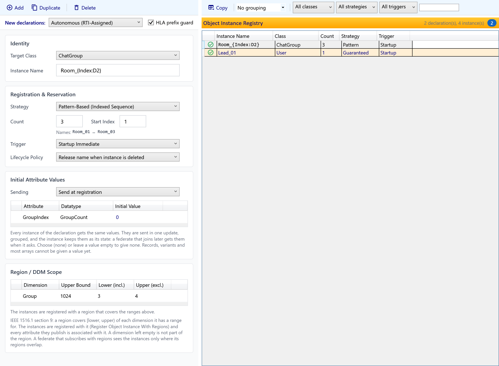

# Object Instance Registry

The **Object Instance Registry** lists the object instances a federate registers when it runs, and tells the code generator how and when to register them. It belongs to a **SOM** module: instances are declared by the federate that registers them, so a FOM module has no registry.

For the rest of the editor see [OME — Object Model Editor](OME.md). For what the generator makes of the declarations, see [Code Generator](CodeGenerator.md).

*The registry tab. The selected declaration is edited on the left; the list of all declarations is on the right.*

---

## Where to find it

- **OME tab** — the last tab of a SOM module's workspace, after **Diagram Editor**. It lists every declaration of the module. In a FOM module the tab is not shown.
- **Object Class editor** — the **Instances (n)** tab, next to **Attributes**. It shows only the declarations of the class you are editing, with the class already chosen. The tab is disabled in a FOM, and until the class itself has been created.

Both views show the same declarations. A change made in one appears in the other, and it marks the module as modified.

---

## Layout

Like the other split views, the **detail** (properties) is on the left and the **master** list is on the right. Each side has its own toolbar:

| Toolbar | Where | What it does |
|---|---|---|
| **Detail toolbar** | above the detail | **Add**, **Duplicate** and **Delete** change the declarations. |
| **Master toolbar** | above the list | One row: **Copy** copies the listed declarations to the clipboard as a Markdown table (Instance Name, Class, Count, Strategy, Trigger, Release Name On Delete, Issue), the **grouping** box groups the list, and — in the module-wide view — the filters narrow it by object class, naming strategy and trigger, and a text search on name or class. The copied table contains only the rows the list shows. |

Under the detail toolbar, the OME tab shows **New declarations**: the naming strategy a newly added declaration starts with, and the **HLA prefix guard** (see [Validation](#validation)). Inside the Object Class editor the filters and these defaults are hidden, because the list is already limited to one class; **Copy Table** stays.

**Grouping** offers *No grouping*, *Group by class*, *Group by strategy* and *Group by trigger*. Each group has a round chevron header, like the sections of the Dashboard, that shows its name and how many declarations it holds, and can be collapsed; a row moves to its new group when you edit the field it is grouped by. Filters and grouping combine.

Pressing **Delete** with a row selected in the list also deletes it. The list header shows how many declarations the view has and how many instances they register.

---

## A declaration

Each row is one **declaration**: a class, a way of getting the instance name, and a moment to register.

### Identity

- **Target Class** — the object class the instances are registered for. The federate has to publish the class.
- **Instance Name** — shown for the Guaranteed strategy only.

### Registration & Reservation

**Strategy** decides where the name comes from:

| Strategy | Names | Count |
|---|---|---|
| **Autonomous (RTI-Assigned)** — the default | The RTI assigns the name when the instance is registered. The list shows *(RTI-assigned)*. | The **Count** field: several instances of the class in one row. |
| **Guaranteed Reservation (Pre-Reserved)** | One name that you give; it is reserved first and registered as given. | Always 1. |
| **Pattern-Based (Indexed Sequence)** | A pattern such as `UAV_{Index:D2}`, a **Start Index** and a **Count**; the card previews the first and last name (`UAV_01 … UAV_04`). | The **Count** field. |

To tell instances apart by name, give them a name: the strategy then is Guaranteed or Pattern-Based. The registry has no separate label.

**Trigger** decides when the generated federate registers the instances:

| Trigger | Registered |
|---|---|
| **Startup Immediate** | As soon as the federation is ready. |
| **Advisory-Driven (Start Registration)** | When the RTI advises the federate to start registering instances of the class — that is, when another federate of the federation subscribes to a published attribute of it. Needs the **Object Class Relevance Advisory** switch of the SOM to be enabled. |
| **On-Demand (Manual)** | When your code asks for it. |

**Lifecycle Policy** (shown for reserved names only) decides what happens to the name when its instance is deleted: **Release name when instance is deleted** gives it back to the RTI, **Keep name reserved** holds it until the federate resigns.

Names are reserved while the federate starts, whatever the trigger, so the instance of an advisory-driven declaration is registered as soon as the advisory arrives.

### Initial Attribute Values

The grid lists every attribute of the target class, the ones it inherits included, with its data type and an **Initial Value** you can type. Every instance of the declaration gets the same values. An empty value (or **(none)**) gives none.

**Sending** decides when the values go out. *Send at registration* (the default) sends them in one update, grouped, right after each instance is registered. *Send only when requested* only sets the state of the instance; the values are sent when another federate asks for them. Either way the instance keeps the values as its state and the generated federate answers a request for them from that state, so a federate that joins later receives them too, with whatever the application has updated since.

What you type is checked against the attribute's data type as you type; a wrong value gets a red icon with the reason, and blocks code generation:

| Data type | Accepted |
|---|---|
| Boolean (`HLAboolean`) | Chosen from **(none)**, `true` and `false` |
| Integers | A whole number inside the range of the type (`HLAinteger16BE`: −32768 … 32767, unsigned types: no negative numbers) |
| Floating point | A decimal number with a point (`1.5`, `-2e3`); not `NaN` or infinity |
| Character | One character, or its code as `X`; `HLAASCIIchar` takes ASCII only |
| String | Any text; `HLAASCIIstring` takes ASCII only |
| Enumeration | Chosen from a list of the enumerators, led by **(none)** |
| Opaque data and other byte arrays | Hexadecimal pairs, for example `0A 1B`; a fixed-size array needs exactly that many bytes |

Records, variant records, references and arrays of other element types cannot be given a value yet; their rows are greyed and cannot be edited. Choosing another class for the declaration starts without values, and an attribute that is deleted from the class disappears from the grid together with its value. Renaming an attribute keeps its value.

### Region / DDM Scope

When the object class has dimensions (its own and the ones it inherits), the **Region / DDM Scope** section lists them, each with the **Upper Bound** the module gives the dimension. Give a dimension a **Lower (incl.)** and an **Upper (excl.)** bound and the generated federate registers every instance of the declaration with a region that covers `[lower, upper)` of it (IEEE 1516.1-2025 §9, Register Object Instance With Regions): the region is created and committed once, every attribute the instances publish is associated with it, and it is deleted again before the federate resigns. A federate that subscribes with regions receives the instances only where its regions overlap theirs.

Give both bounds of a dimension or none; a dimension left empty is not part of the region. The bounds are whole numbers, the lower one below the upper one, and the upper one at most the dimension's upper bound. A wrong range gets a red icon with the reason and blocks code generation.

With no range at all, or for a class that has no dimensions, the instances are registered in the default region (§9.1.3.2): every subscriber, with or without regions, can receive them. The generator reports this for a class that has dimensions (`CG5012`, information only). Choosing another class starts without ranges, and a dimension that leaves the class disappears from the section together with its range.

---

## Validation

Every row shows a status icon: a green check, an amber warning, or a red error whose tooltip says why. The card repeats the message under the field.

| Check | Level |
|---|---|
| No class selected, or the class no longer exists in the module | Error |
| Guaranteed: the name is empty | Error |
| Pattern: no `{Index}` placeholder, or an invalid format | Error |
| A name begins with **"HLA"** — IEEE 1516.1-2025 §6.2.3 (d) and §6.5.3 (d) do not allow reserving such a name. The check is case-sensitive, so `hlaLead` is accepted. | Error |
| Another Guaranteed declaration reserves the same name | Error |
| An initial value does not fit its attribute's data type | Error |
| A region range is not a valid range of its dimension (one bound only, not whole numbers, lower not below upper, upper above the dimension's upper bound) | Error |
| The class is not published by the federate, so the RTI would refuse the registration | Warning |

The **HLA prefix guard** can be switched off; the generator then only warns. Turn it off only when you know the RTI you use accepts such names.

If you delete a class that has declarations, the declarations are kept and shown with an error, so you can choose another class or delete them. Renaming or moving a class needs no maintenance: the declarations follow it.

---

## Saving

Declarations are saved with the module, in its `.sfom` metadata file. They are not written to the module's `.xml` content file, which stays a standard IEEE 1516.2 object model, and they do not appear in exported FDD or FED files. A module that declares nothing writes nothing.

In the Object Class editor the changes apply at once, but **Cancel** puts the declarations back as they were when the editor opened, and **Save** keeps them.

---

## Code generation

For a SOM with declarations the generated Fora federate:

1. checks the declarations before writing any file; an error stops generation (codes `CG5001`–`CG5009`, see [Code Generator](CodeGenerator.md));
2. reserves the declared names while the federate starts and waits for the RTI's answer (IEEE 1516.1-2025 §6.2 – §6.8);
3. registers each instance with its name only after the reservation succeeded; if the RTI refuses a name, the run fails with `InstanceNameReservationException` and nothing is registered under that name;
4. registers startup declarations when the federation is ready, advisory-driven ones after the Start Registration advisory, and on-demand ones when `Register<Class>InstancesAsync()` is called;
5. sends the declaration's initial attribute values in one update right after each instance is registered (or keeps them as state, if the declaration sends them only on request), and answers a later request for them from the instance's state;
6. releases a name when its instance is deleted, if the declaration asks for it.

`SimulationManagerBase.DeclaredInstances` reports, for every declaration, whether its names are reserved, whether it is registered, and the instances registered so far. The generated `README.generated.md` lists the declarations.

Declarations of a class the federate does not publish are skipped with a warning. A model with no declarations generates the same code as before.

---

## Tips

- Give an instance its starting state in **Initial Attribute Values** instead of updating it by hand after registering.
- Use Autonomous for populations whose members need no name; use Pattern-Based for a numbered fleet.
- Prefer **Advisory-Driven** for instances nobody needs until a federate subscribes; enable the **Object Class Relevance Advisory** switch in the module's [Switches table](OME.md#13-switches-table) first.
- Two federates cannot reserve the same name in one federation execution. Give each federate's declarations distinct names, or use Autonomous.

---

**Previous:** [OME — Object Model Editor](OME.md) · **Next:** [Diagram Editor](Diagrams.md)

---
Updated October 2, 2026

