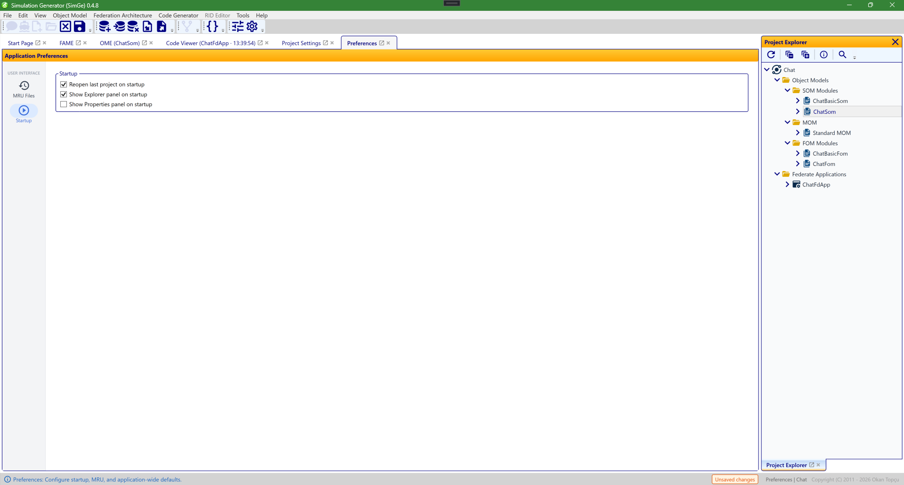

# Preferences & Options

Application preferences control SimGe's start-up behavior and the recent-projects list. They apply to the whole application, independent of any open project.

## Opening Preferences

Open the **Preferences** workspace from the application. Preferences are grouped into sections you select on the left.

## Startup

Control what happens when SimGe launches and how a project opens.

| Setting | Effect |
|---|---|
| **Reopen last project** | When enabled, SimGe reopens the most recently used project on launch instead of starting empty. |
| **Show Explorer on startup** | Shows the Project Explorer panel automatically when a project opens. |
| **Show Properties on startup** | Shows the Properties panel automatically when a project opens. |



*The Startup section of Preferences. Toggle whether SimGe reopens your last project on launch and whether the Project Explorer and Properties panels appear automatically when a project opens. Sections are selected from the list on the left.*

## Recently used projects (MRU)

| Setting | Effect |
|---|---|
| **Maximum recent files** | How many recent projects SimGe remembers and lists in the Get Started dialog and menus. |

The recent-projects (MRU) list itself is stored in the same preferences file (see below), so it is kept per-user alongside your other settings. See [Opening & Saving Projects](OpeningSaving.md) for how the recent list is used.

## How preferences are stored

Preferences — including the recent-projects (MRU) list — are saved as you change them to a single per-user JSON file:

```
%AppData%\Roaming\SimGe\preferences.json
```

Keeping everything in one per-user store has two benefits: it is always writable (no machine-wide permission issues, unlike the read-only sample location under `ProgramData`), and it reuses the same robust write path:

- **Atomic writes** — settings are written to a temporary file and then swapped into place, so a crash or full disk cannot leave a half-written file.
- **Corruption recovery** — if the file cannot be read, SimGe backs it up as **`.corrupt-{timestamp}`**, alerts you, and starts from clean defaults. Reapply your preferences; the backup is kept beside the file if you want to inspect it.

## Default options

SimGe ships with a **`DefaultOptions.xml`** in its installation directory that seeds default settings. It is loaded from the install location regardless of where SimGe is launched from, so defaults are consistent.

> Theme switching (light/dark) and panel layout are controlled from the application shell itself, not from this Preferences surface.

---

**Next:** [Keyboard Shortcuts & Tips](Shortcuts.md)

---
Updated June 25, 2026, 16:28:09