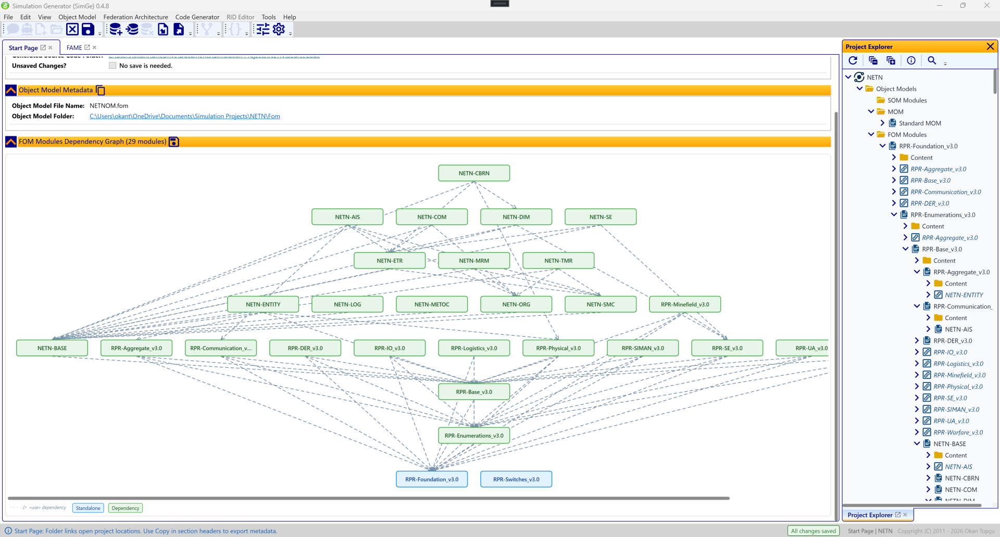

# Start Page

The Start Page is the landing workspace for opening projects and reviewing project metadata. It opens automatically at startup and stays available as a workspace tab.

*The Start Page for the NETN sample. The metadata panels at the top summarize the project and its object model (with **Copy** buttons and folder links), while the **FOM Modules Dependency Graph** below visualizes all 29 modules. Dashed «use» arrows point from each module to the modules it depends on, with the standalone base modules (e.g. `RPR-Foundation`, `RPR-Switches`) at the bottom of the hierarchy.*

## Opening projects from the Start Page

The Start Page complements the **SimGe — Get Started** dialog:

- **Recent projects** — reopen a project you used recently.
- **Open a project** — browse for an existing `.fap` file.
- **Bundled samples** — open the Chat or STMS sample to explore SimGe.

See [Opening & Saving Projects](OpeningSaving.md) for the full open/save behavior.

## FOM Modules Dependency Graph

The Start Page hosts a dependency graph that displays the relationships between the FOM modules in your project.

- **Visualization**: Shows base and dependent module links, so you can see at a glance which modules build on which.
- **Missing-file indicators**: A module whose backing files are missing on disk is flagged with a red warning badge; hover it to see what is missing. (See [Project Explorer → Recovering Missing Module Files](ProjectExplorer.md#recovering-missing-module-files).)
- **Export**: The graph can be saved as an image file for external documentation.

### How to read the graph

| Aspect | Detail |
|---|---|
| **Layout** | Dependent modules sit at the **top** (higher layer); base/root modules sit at the **bottom** — the standard UML component-diagram convention. |
| **Arrow direction** | `A → B` means **A depends on B**: the arrow runs downward from the client (top) to the supplier (bottom). |
| **Line style** | Dashed (`5, 3` dash pattern). |
| **Arrowhead** | An open chevron (▷) drawn as two separate, unfilled lines — a true UML open arrowhead. |
| **Edge color** | Normal dependencies are muted blue-grey (`#7890A8`); **unresolved (orphan)** dependencies are **red** (`#C62828`). |
| **Node color** | By module role — **Standalone** (blue), **Dependency** (green), **Composed From** (orange), **Standard** (grey). A module with unresolved dependencies gets a red border. |
| **`«use»` stereotype** | Shown **once in the legend**, not on each edge, to keep the graph readable. |
| **Tooltip** | Hovering a node shows its FOM name, type, file, **fan-out** (modules it depends on), **fan-in** (modules that depend on it), and any unresolved dependency names. |
| **Hover highlight** | Hovering a node highlights its dependency chain — ancestors (what it depends on) in navy, dependents (what depends on it) in orange — and dims everything else. |
| **Legend** | An edge-notation chip (`- - - - ▷  «use» dependency`), one colored chip per module role present, and — when any exist — a red `⚠ Unresolved dependency` chip. |

> The general diagram interaction model (pan, zoom, selection, mini-map) is described in [Diagram Editor](Diagrams.md).

## Metadata panels

The Start Page summarizes the open project's metadata in two panels:

- **Project metadata** — project name, home folder, the object-model and FAM folders, and whether the project has unsaved changes.
- **Object-model metadata** — the object-model index file name and its folder.

Each panel's header has a **Copy** action that copies the table to the clipboard as plain text, handy for sharing or pasting into notes.

## Folder shortcuts

The Start Page exposes quick links to the project's key folders — **project home**, **FOM**, **FAM**, and **source** — opening them directly in Windows Explorer.

---

**Next:** [Creating a Project](CreatingProjects.md)

---
Updated June 25, 2026, 16:28:09