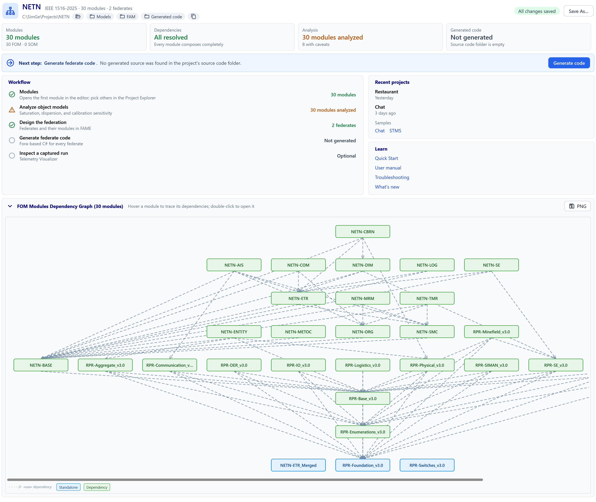

# Start Page

The Start Page is the landing workspace of an open project. It opens automatically when a project loads and stays available as a workspace tab. It answers three questions at a glance: *what is in this project*, *is anything wrong*, and *what should I do next*.

*The Start Page for the NETN project (30 modules, two federates). From top to bottom: the project header with its folder chips, four status tiles, the next-step card, the workflow with recent projects and learning links beside it, and the **FOM Modules Dependency Graph**. Here every dependency resolves, the analysis has run (eight modules carry caveats), and no code has been generated yet, so the next step is **Generate code**.*

## Project header

The header shows the project name, its HLA standard, and how many modules and federates it has. A chip shows the save state (**All changes saved**, **Unsaved changes**, or **Sample · read-only** for the bundled samples), and **Save As…** sits beside it.

Under the name are the project's locations: the project folder path with a button that opens it in Explorer, and a chip for each working folder (**Models**, **FAM**, **Generated code**). A chip is dimmed until its folder exists (the generated-code folder, for example, appears after the first generation). Hover a chip for the full path; the **Models** chip also names the object model index file. The last button copies the project and object model metadata (name, folders, index file name, and save state) to the clipboard as plain text.

## Status tiles

Four tiles summarize the project. They update as you edit, and every time you return to the Start Page. The Analysis tile only reports results; the page never starts an analysis on its own.

| Tile | Shows | Turns amber when |
|---|---|---|
| **Modules** | Total modules with the FOM, SOM, and standard counts | One or more modules have backing files missing on disk |
| **Dependencies** | **All resolved**, or how many modules have unresolved dependencies | A module depends on something that is not in the project (a red stub in the graph) |
| **Analysis** | **Not run yet**, or how many modules the [Object Model Analysis](MetricsReports.md#object-model-analysis) workspace has analyzed | Some analyzed module carries a caveat (for example unresolved data type references) |
| **Generated code** | **Up to date**, **Out of date**, or **Not generated**, with the time of the newest generated file | A module file is newer than the generated code |

The code check compares file timestamps, not content: it looks at the newest file under the project's source code folder (ignoring `bin`, `obj`, and `.vs`) and at the module files in the FOM folder. Saving a module after generating makes it read **Out of date**. A sample reads **Not checked**, because its files are all stamped at install time.

## Next step

The blue card suggests one concrete action for the project's current state, with a button that does it. Suggestions are chosen in this order, and the first one that applies is shown:

1. **Save your own copy**: the project is a read-only sample.
2. **Modules with missing files**: double-click a flagged module in the graph or Project Explorer to locate or remove it.
3. **Modules with unresolved dependencies**: opens the module and dependency manager.
4. **Add your first module**: the project has no modules.
5. **Save your changes**.
6. **Define a federate**: opens FAME. Code generation needs at least one federate.
7. **Generate** or **Regenerate federate code**.
8. **Analyze your object models**: opens Object Model Analysis once everything above is in order.

## Workflow

The **Workflow** panel lists the stages of a SimGe project in the order they are usually done. Each row shows its current status, and selecting the row opens it:

| Row | Opens | Status shows |
|---|---|---|
| **Modules** | The first module (a FOM when there is one) in the [Object Model Editor](OME.md); open others from the Project Explorer | Module count |
| **Analyze object models** | [Object Model Analysis](MetricsReports.md#object-model-analysis) | **Not run yet** or the analyzed module count |
| **Design the federation** | [FAME](FAME.md) | Federates defined |
| **Generate federate code** | The code generator | The generated-code state from the tiles |
| **Inspect a captured run** | The [Telemetry Visualizer](TelemetryVisualizer.md) | **Optional** |

## Recent projects and samples

The **Recent projects** card lists the other projects you opened lately, with when each file was last changed; a project whose file is gone reads **File not found** and cannot be opened. Select one to switch to it. SimGe first asks whether to save unsaved changes, closes the open project, then opens the one you chose. **Chat** and **STMS** under *Samples* switch to the bundled samples the same way. File → Load… (Ctrl+O) and the **SimGe — Get Started** dialog at launch offer the same choices. See [Opening & Saving Projects](OpeningSaving.md) for the full open/save behavior.

## Learn

The **Learn** card links to the Quick Start, the user manual, Troubleshooting, and the release notes on the SimGe site.

## Object Model Analysis

The **Analyze object models** workflow row opens the [Object Model Analysis](MetricsReports.md#object-model-analysis) workspace and analyzes every FOM module in the project. Each module is analyzed with its dependency closure, exactly as its dashboard does, and the results appear in one table: semantic saturation (SSI_n and Ψ), payload dispersion (CV_p), and, for the selected module, calibration sensitivity across 22 profiles. A provenance line records the input-file hashes, calibration, and version, and every table can be copied as Markdown, CSV, or LaTeX.

The same workspace is available from **View → Project Workspace → Object Model Analysis**. The analysis runs when the tab opens; select **Analyze** in the tab to run it again after edits.

## FOM Modules Dependency Graph

The Start Page hosts a dependency graph that displays the relationships between the FOM modules in your project. Select the chevron beside its title to hide or show the graph.

- **Visualization**: Shows base and dependent module links, so you can see at a glance which modules build on which.
- **Missing-file indicators**: A module whose backing files are missing on disk is flagged with a red warning badge; hover it to see what is missing. (See [Project Explorer → Recovering Missing Module Files](ProjectExplorer.md#recovering-missing-module-files).)
- **Open**: Double-click a module to open it in the editor.
- **Export**: **PNG** in the graph's header saves the graph, with its legend, as an image file for external documentation.

### How to read the graph

| Aspect | Detail |
|---|---|
| **Layout** | Dependent modules sit at the **top** (higher layer); base/root modules sit at the **bottom** — the standard UML component-diagram convention. |
| **Arrow direction** | `A → B` means **A depends on B**: the arrow runs downward from the client (top) to the supplier (bottom). |
| **Line style** | Dashed (`5, 3` dash pattern). |
| **Arrowhead** | An open chevron (▷) drawn as two separate, unfilled lines — a true UML open arrowhead. |
| **Edge color** | Normal dependencies are muted blue-grey (`#7890A8`); **unresolved (orphan)** dependencies are **red** (`#C62828`). |
| **Node color** | By module role — **Standalone** (blue), **Dependency** (green), **Composed From** (orange), **Standard** (grey). A module with unresolved dependencies gets a red border. |
| **`«use»` stereotype** | Shown **once in the legend**, not on each edge, to keep the graph readable. |
| **Tooltip** | Hovering a node shows its FOM name, type, file, **fan-out** (modules it depends on), **fan-in** (modules that depend on it), and any unresolved dependency names. |
| **Hover highlight** | Hovering a node highlights its dependency chain — ancestors (what it depends on) in navy, dependents (what depends on it) in orange — and dims everything else. |
| **Legend** | An edge-notation chip (`- - - - ▷  «use» dependency`), one colored chip per module role present, and — when any exist — a red `⚠ Unresolved dependency` chip. |

> The general diagram interaction model (pan, zoom, selection, mini-map) is described in [Diagram Editor](Diagrams.md).

---

**Next:** [Creating a Project](CreatingProjects.md)

---
Updated October 8, 2026