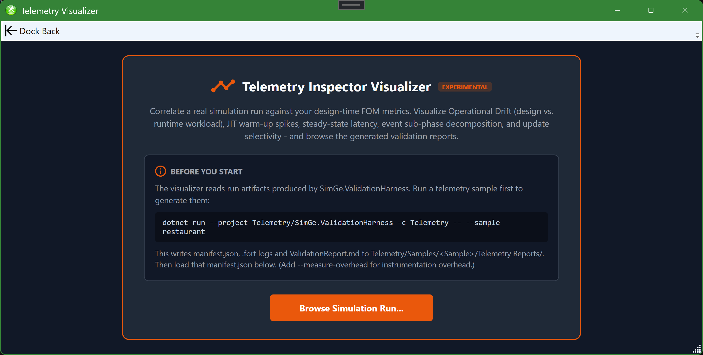
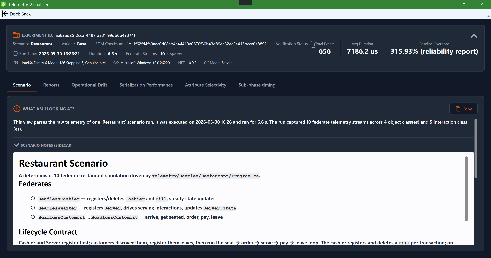
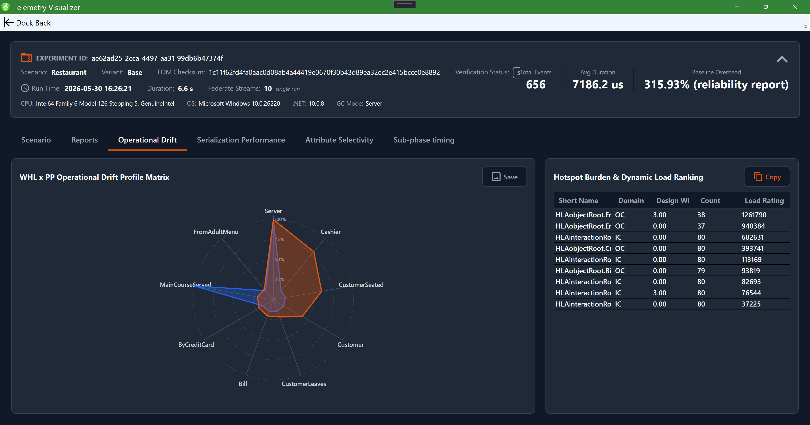

# Telemetry Visualizer

The Telemetry Visualizer inspects telemetry captured from a simulation run and visualizes how the federation behaved at run time — warm-up, latency, per-phase costs, selectivity, and how the runtime workload differs from the design-time model. It closes the loop between the model you authored in SimGe and what actually happened during execution.

> The visualizer is an **experimental** tool. Open it from **Tools → Experimental**.

## Prerequisite: a captured run

The visualizer reads artifacts produced by the **SimGe validation harness** when you run a telemetry-instrumented federate (see [Fora Telemetry & Validation](ForaTelemetry.md) and [Code Generator](CodeGenerator.md)). A run typically produces:

- a **`manifest.json`** describing the run, and
- one or more **`.fort`** log files (one per federate stream).

Optional sidecar files placed next to the manifest enrich the view: a `scenario.md` / `README.md` description, and generated reports such as `ValidationReport.md` and `TelemetryReliabilityReport.md`.

If you have not generated any run artifacts yet, the visualizer's landing screen explains what it does and how to produce them.

*The Telemetry Visualizer landing screen, shown before any run is loaded. It states the tool's purpose, shows the exact `SimGe.ValidationHarness` command that produces a telemetry sample (`manifest.json`, `.fort` logs, and `ValidationReport.md`), and offers a **Browse Simulation Run…** button to load a run's manifest.*

## Loading a run

Browse to and load a run's `manifest.json`. The visualizer reads it together with the sibling `.fort` logs and any report sidecars in the same folder. Each manifest represents a **single replication** of a scenario.

## FOM match verification

A badge shows whether the run's recorded FOM matches your current project:

| Badge | Meaning |
|---|---|
| **FOM Matched** | The run's FOM checksum matches the active merged FOM. |
| **FOM Mismatch** | The checksums differ — the run used a different FOM than the one currently open. |
| **Standalone — no project** | No project is open; the run is inspected on its own. |

A mismatch or standalone state never disables analysis — it only suppresses project-correlated design metrics in favor of the manifest's own snapshot.

## Scenario and Reports tabs

- **Scenario** — an auto-derived, plain-language picture of the run: scenario name/tier, run time and duration, the **federate roster** (from the `.fort` file names), and the **object/interaction class inventory** (from the manifest). An optional `scenario.md` / `README.md` sidecar is shown as free-text notes.
- **Reports** — auto-discovers the Markdown reports next to the manifest (e.g. `ValidationReport.md`). Reports render as formatted Markdown with a **Rendered / Raw** toggle; **Open** launches a report in its default app and **Folder** reveals it in Explorer.

*The **Scenario** tab for a loaded "Restaurant" run. A metadata bar across the top reports the experiment id, scenario/variant, FOM checksum and verification status, total events, average duration, and baseline overhead. A "What am I looking at?" panel summarizes the run in plain language (here 10 federate streams across 4 object and 5 interaction classes), and the scenario-notes sidecar shows the federate roster and lifecycle. The tab row (Scenario, Reports, Operational Drift, Serialization Performance, Attribute Selectivity, Sub-phase timing) switches views.*

## Charts

High-fidelity native charts are organized into analysis tabs:

| Tab | Shows |
|---|---|
| **Operational Drift** | A "WHL × PP" radar comparing design-time vs. runtime workload, with a hotspot burden / dynamic load-ranking grid. |
| **Serialization Performance** | The JIT compiler warm-up curve and the steady-state latency distribution. |
| **Attribute Selectivity** | An attribute/parameter selectivity grid (decoded via FNV-1a search combinations). |
| **Sub-phase timing** | A stacked breakdown of where time goes across event sub-phases (encode/serialize/decode/apply). |

*The **Operational Drift** tab. The "WHL × PP Operational Drift Profile Matrix" radar overlays the design-time workload profile against the measured runtime profile (each axis is a class, e.g. `Server`, `Cashier`, `CustomerSeated`), so divergence between design and runtime stands out. Beside it, the "Hotspot Burden & Dynamic Load Ranking" grid ranks classes by load. Save the chart as PNG and copy the grid as Markdown.*

## Exporting

- **Save as PNG…** is available for each canvas chart (Operational Drift, JIT warm-up, latency histogram, sub-phase breakdown).
- **Copy Table (MD)** copies the hotspot and selectivity grids as GitHub-flavored Markdown for pasting into docs or issues.

The toolbar groups these as flat **Copy / Open / Folder / Save** buttons with tooltips.

## Reading a run

1. Check the **FOM match** badge so you know the run corresponds to your model.
2. Read the **Scenario** tab to understand what was run.
3. Use **JIT Warm-up** to separate cold-start cost from steady state, then **Latency Histogram** and **Sub-phase Breakdown** for steady-state behavior.
4. Use **Operational Drift** and the selectivity/hotspot grids to see where runtime diverges from the design, then revisit those classes in the [OME](OME.md) or [Code Generator](CodeGenerator.md) settings.

> Each manifest is one replication. Pooling across independent runs is a job for the validation harness, not something inferred from a single manifest; the visualizer surfaces the pooled-replication count and instrumentation overhead from the accompanying reports when available.

---

**Next:** [FAME — Federation Architecture Modeling Environment](FAME.md)
