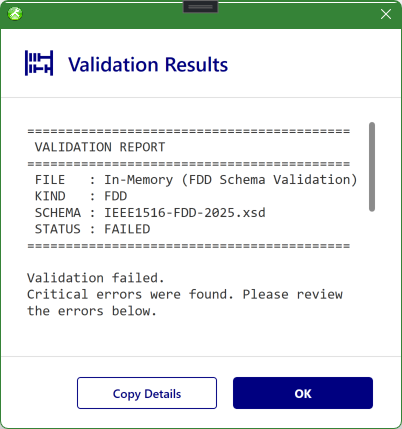

# FOM Validation

Validation checks that an object model is well-formed and standard-compliant before you export it or hand it to an RTI. Catching problems in SimGe is far cheaper than discovering them at federation start-up.

## What validation checks

Validation confirms that the generated XML document conforms to the official IEEE 1516 XML schema (`.xsd`) for the chosen standard and profile.

## Standards and schema profiles

Schema validation applies to the two IEEE 1516 standards. For **each** standard you can validate against any of three schema profiles:

| Schema profile | Validates |
|---|---|
| **OMT** | The base Object Model Template document. |
| **FDD** | The FOM Document Data (the form an RTI consumes). |
| **DIF** | The Dependency/Interface document. |

| Standard | Schema profiles available |
|---|---|
| **IEEE 1516-2010** | OMT, FDD, DIF (2010 `.xsd` files) |
| **IEEE 1516-2025** | OMT, FDD, DIF (2025 `.xsd` files) |

> **HLA 1.3 (FED) is not schema-validated.** The legacy `.fed` format has no XML schema, so the FED viewer offers no Validate action — only copy and export.

## Running validation

Validation is performed in the **FDD viewer** (the **FDD Viewer (2010)** / **FDD Viewer (2025)** tab of a module's [OME](OME.md)). Two toolbar selectors control it:

1. The **standard** selector — IEEE 1516-2010 or IEEE 1516-2025 (this also picks which viewer/document you see).
2. The **schema** selector — **DIF**, **FDD**, or **OMT**.

Click **Validate** to check the document against the selected *standard + schema profile*. Changing either selector re-targets validation, so you can verify the same model against several schemas. Validation also runs **automatically during import**, so problems in a source file are reported as it is read (see [Importing & Exporting](ImportExport.md)).

Because SimGe authors models as [modules](ModularFOM.md), validation runs against the **merged** result — the same composition that export and code generation use — so what you validate is what you ship.

## Reading the results

Validation results open in a dedicated results window:

- A clean run reports success.
- Problems are listed with enough detail to locate them (the offending element and the rule or schema constraint involved).
- The window is color-coded by outcome so you can tell success from warnings and errors at a glance.

*The validation results for an FDD document. The report header records the FILE, KIND (`FDD`), the **SCHEMA** it was checked against (here `IEEE1516-FDD-2025.xsd`, set by the FDD viewer's toolbar selector), and the STATUS (`FAILED`). Findings are listed below the header, and **Copy Details** copies the full report to the clipboard.*

Work through the listed items, fix them in the [OME](OME.md), and re-validate until the model is clean.

## Common issues and fixes

| Symptom | Likely cause | Fix |
|---|---|---|
| **Unresolved dependency** warnings | A referenced module is missing or its name does not match. | Add or relink the module; see [Managing Modules](ManagingModules.md) and [Modular FOM Concepts → Dependencies](ModularFOM.md#dependencies). |
| **Schema errors** on export | A field required by the chosen standard is empty or malformed. | Complete the required fields in the relevant OME table, then re-validate. |
| **Datatype / reference errors** | An element points at a datatype or parent that no longer exists. | Repoint it in the OME to a valid target. |
| **FomMergeConflictException** or merge errors | Synchronization points with the same label differ in definition across modules. | Align the `DataType`, `Capability`, or `Semantics` of the same-named synchronization point across modules, or rename one. |

## When to validate

- Before **exporting** a FOM for an RTI.
- After a large **edit** or a **merge** of modules.
- After **importing**, to confirm the upgraded model is clean.

---

**Next:** [FOM Dashboard](Dashboard.md)

---
Updated June 25, 2026, 16:28:09