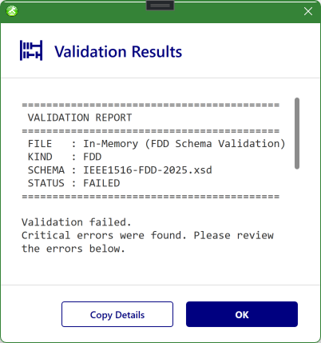

# Editing Rules and FOM Validation

SimGe checks your input while you edit an object model and can validate its exported XML before you exchange it or use it with an RTI. This page explains both the editing rules and the separate XML validation workflow.

## What validation checks

Editor validation uses the written HLA OMT specification to check names, required selections, and model relationships. XML validation checks the generated document against the official IEEE 1516 XML schema (`.xsd`) for the chosen standard, schema profile, and module-composition scope.

Being able to save an item does not mean the complete model passes XML validation. All OME editor dialogs recheck their reported Errors before saving. A successful schema check also does not establish every requirement in the standard's written specification.

## Editor validation status bar

All OME editor dialogs use the same orange validation bar, including Enumerator, Record Field, Alternative, and POC. It shows one message at a time, with **Errors first**. The bar disappears when the editor has no reported issues.

| Message | Appearance | Save / OK |
|---|---|---|
| **Error** | Navy text and an error icon. | Disabled until the errors are corrected. |
| **Warning** | Dark brown text and a warning icon. | Allowed when there are no Errors. The draft can be completed later. |

Required-field rules vary by editor; follow the severity shown. For example, a missing or unresolved enum **Representation** is a Warning, while invalid enum names/member values and known floating representations are Errors. Saving a draft does not establish XML schema conformance.

### Navigate messages

Use the **left/right arrows** to move through messages. The counter shows the current position, such as **1 / 2** or **2 / 2**.

- Arrows appear whenever there is more than one message: two Errors, two Warnings, or a mixture. A Warning is **not required** for navigation.
- With one message, the arrows and counter are hidden. At the first or last message, the corresponding arrow is disabled.
- Long messages are shortened to fit the bar. Hover over the message to read its full text.
- Messages update as you edit. When the reported issues change, navigation returns to the first message.

### Copy errors and warnings

Select the small **Copy** icon at the far right to copy **all currently reported messages from that editor**, not just the message being displayed. Each message is copied on a separate line with its severity, field label, and full text. Paste the result into a support request, report, or chat.

Copy is available even when there is only one message. Its tooltip confirms the copy; if the clipboard is busy, the tooltip asks you to try again.

### Try a Warning

1. Create an **Enumerated Data Type**, enter a valid, unique name, and leave **Representation** unselected. A Warning appears and Save / OK remains available.
2. Clear the name as well. An Error and a Warning now appear; use the arrows to switch between them. Save / OK is disabled until the name error is corrected.
3. Select **Copy** to paste both complete messages elsewhere.

The detailed rule classification in the architecture documentation (chapter 8A, *Error and Warning Policy*) distinguishes current checks from planned rule alignment. XML validation reports violations of the selected schema independently.

## Current coverage and known gaps

The development version checks many rules while you edit, but some checks remain incomplete:

| Area | Current behavior / action |
|---|---|
| Datatype names, enumerator values/names, Fixed Record field names, array cardinality | Checked in the relevant editor confirmation paths. |
| Inherited Attribute/Parameter names | Conflicts block Save in both standalone and nested editors. Adding a superclass property and moving a class also check affected descendant classes. |
| Object/Interaction Class name errors | Shown in the shared status bar and block Save, including direct confirmation. |
| Enumerated datatype representation | Missing/unresolved selection is a Warning; the draft can be saved and reopened. A known floating representation is an Error, including with no enumerators. |
| Unassigned or NA datatypes | Drafts may remain incomplete. For an Attribute, the specification also permits NA when Transportation/Order are valid and Update Type, Update Condition, and Available Dimensions are NA. An actual Parameter requires a datatype. XML acceptance is checked separately against the selected schema. |

For the standard clauses, editor checks, and outstanding editor reviews, see the common and element-specific rules in the architecture documentation (chapter 8A, *Element-Specific Rules*). Rules marked **unreviewed** need further assessment; they are not confirmed defects. XML profile behavior is documented separately in the architecture documentation (chapter 8B, *FOM Schema Validation*). Schema optionality does not define editor requirements.

## Names while editing

User-defined names follow XML naming rules with the HLA restrictions:

- Start with an XML name-start character, such as a letter or underscore (`_`). Unicode letters are supported.
- Continue with XML name characters, including letters, digits, underscores, hyphens (`-`), and permitted combining marks.
- Do not use spaces, dots, colons, or characters outside the XML name rules. Enter the local class name; SimGe derives its full path from the hierarchy.
- Do not begin a user-defined name with `HLA`, in any combination of upper/lower case.
- Do not use the exact name `NA`, in any case. `Navy` and `name` are permitted.

| Example | Result for an ordinary user-defined element |
|---|---|
| `Vehicle`, `_Vehicle`, `Vehicle2`, `Vehicle-State`, `Ölçüm`, `位置` | Accepted if no conflicting name exists. |
| `2Vehicle`, `Vehicle State`, `Vehicle.State` | Rejected by the name format check. |
| `HLAvehicle`, `hlaVehicle`, `NA`, `na` | Reserved; choose a different name. |
| `Speed` and `speed` | Distinct names, including inherited properties and datatype members. |

Name errors explain the problem first and show the relevant standard clause at the end. Character positions start at 1; tabs and line breaks are identified by name so copied diagnostics remain readable. Correct the reported problem to see any remaining issue.

| Input | Explanation shown before the standard reference |
|---|---|
| `2Vehicle` | Name cannot start with '2'. Start with a letter or underscore. |
| `Vehicle State` | Name contains a space at position 8. Remove it or use an underscore. |
| `Vehicle:State` | Name contains ':' at position 8. Colons are not allowed in HLA names; remove or replace it. |
| `Vehicle@State` | Character '@' at position 8 is not allowed in a name. Remove or replace it. |

For example, the colon message ends with `(Reference: IEEE 1516.2-2025 §3.3.1(b).)`. Hover over a shortened message or use **Copy** to read the complete explanation and reference.

Tags and Time Representations use predefined categories rather than arbitrary names. A label such as `HLAreliable` supplied by the standard is not a pattern to copy for a new user-defined name.

### Data type names

Names must be unique across **all seven tables** in the same Object Model: Basic Data Representation, Simple, Enumerated, Array, Fixed Record, Variant Record, and Reference. This follows IEEE 1516.2-2025 §4.14.1. For example, an enum named `State` prevents an array or basic representation from also being named `State`. `State` and `state` are distinct names.

All seven editors check this when creating or renaming a definition. A conflicting name shows the table containing the existing definition and disables **Save**. Editing a definition without changing its name remains valid unless another definition already shares that name.

Older models containing conflicting names can still be opened. The dashboard identifies the conflict; rename one definition before saving its editor. Independent Object Models have separate naming scopes. Check dependency composition separately when combining modules.

### Class and property names

From **0.5.3**, a child Object Class and an Attribute may share a name under the same parent. For example, Object Class `X` may contain both child class `Y` and Attribute `Y`. The same rule applies to Interaction Classes and Parameters. A property may also share its owning class's name.

Both of these structures are allowed with respect to naming:

```text
Object Class X                  Object Class X
└── Object Class Y              ├── Object Class Y
    └── Attribute Y             └── Attribute Y
```

The same applies to Interaction Classes and Parameters. The class name and property name serve different purposes.

| Situation | Rule |
|---|---|
| Two child classes named `Y` directly under `X` | Rejected. Rename one or place it under a different parent. |
| Two Attributes named `Y` directly under `X` | Rejected. Keep one definition or use different names. |
| Two Parameters named `Y` directly under the same Interaction Class | Rejected. |
| Child class `Y` and Attribute/Parameter `Y` under `X` | Allowed from 0.5.3. |
| Child class declares an Attribute/Parameter already inherited from an ancestor | An Error blocks Save in the property and class editors. Use the inherited property or choose a different name. |
| Classes named `Y` under different parents | Allowed when their complete class paths differ. |

These class/property naming scopes follow IEEE 1516.2-2025 clauses 4.2.2, 4.3.2, 4.5.2, and 4.6.2.

Adding or renaming a property in a superclass is also rejected if it would conflict with a property already declared in a descendant. Moving a class checks the properties throughout its subtree against the new ancestry. Moving a property checks its destination scope and excludes its original definition.

### Datatype member names

Enumerator, Fixed Record field, and Variant Record alternative names are checked within their enclosing datatype. The same member name can be reused in another datatype. `Value` and `value` are distinct; an exact duplicate within a member collection is rejected. Editing a member without changing its name remains valid. The Alternative dialog and enclosing Variant Record editor use the same checks.

Some relationship checks outside these name scopes, such as directed-interaction target matching, still ignore case; their alignment is tracked in the architecture rule table.

## Parent selection and inherited items

An Attribute belongs to an Object Class; a Parameter belongs to an Interaction Class. Select the intended owner before confirming the editor. A class cannot become its own parent or be moved below one of its descendants. Fixed root classes cannot be moved.

An inherited property is already available to a child class. Do not add another local property of the same name. Class editors also report dimensions already inherited from an ancestor and directed interactions already covered by an existing relationship with the same or broader sharing setting.

When editing an Attribute or Parameter from inside a class editor, its parent selection is fixed to that enclosing class. To change ownership, use the standalone Attributes or Parameters table. The enclosing class editor's confirmation is the commit point for its nested edits; cancelling it discards those draft edits. You can use **Attributes → Add** or **Parameters → Add** before saving a new class. The owner is the class being created; if it has no name yet, the selector shows **(New class)**. Saving the property adds it to that temporary class only. Cancelling the new class creates neither the class nor an orphan property in the project.

## Required selections and values

The status bar distinguishes errors that prevent saving from warnings that let you complete a draft later:

| Item | What to check |
|---|---|
| Object Class | Valid parent, no hierarchy cycle, no duplicate name within its class scope, and no conflicting inherited declarations. |
| Interaction Class | Class/name errors block Save. Missing Sharing, Transportation, or Order produces a Warning. Invalid supplied enum values are Errors. |
| Attribute | Owner and valid name are required to save. Missing/unresolved datatype or Transportation and incomplete NA settings produce Warnings. Invalid sharing, order, update type, or ownership values are Errors. |
| Parameter | Owner and valid name are required to save. Missing/unresolved datatype produces a Warning; the editor also reports incomplete Transportation/Order in the owning IC. |
| Directed Interaction | Select an owner Object Class. Missing/unresolved target or sharing produces a Warning. Leave Publish and Subscribe unchecked for valid **Neither**. A relationship already covered by existing sharing settings is rejected by the editor's redundancy rule. |
| Synchronization | Label and Semantics; enter `NA` for Semantics if appropriate. Select a supported tag datatype if one is needed. |
| Tag | Semantics and a supported datatype if supplied. Its category determines the name. |
| Time Representation | A supported datatype when supplied. Semantics may be empty. |
| Update Rate | A positive number, for example `10`, `0.5`, or `100.25`; use a decimal point. |

Not every metadata field is mandatory in every editor. Identification requirements also depend on the selected XML profile. Check the validation report for the actual export requirements rather than filling every optional field merely to enable Save.

### Incomplete class and property drafts

An unassigned datatype stays unassigned when saved; it is not silently replaced with `NA`. If a definition is unavailable, the warning retains its name so you can load the defining module or select another type later. Object/Interaction Class dialogs also show warnings for their declared Attributes/Parameters, identifying each member in the field label.

For an **Attribute** with datatype `NA`, set **Update Type** and **Update Condition** to `NA`, choose a valid **Transportation** and **Order**, and ensure its owning class has no available dimensions, including inherited ones. Inconsistent settings produce Warnings. **Static** updates also require Update Condition `NA`; **Periodic** and **Conditional** updates need a description of their rate or triggering conditions.

A named **Parameter** needs an actual datatype. `NA` denotes an interaction with no parameters; selecting it for a named Parameter leaves a Warning. Missing model-wide MOM/MIM content is not assessed by an individual element dialog.

### Dimensions

If Upper Bound is supplied, enter a positive whole number; leave it empty for an RTI-defined dimension. Supply Normalization Function, Input Data Description, and Output Data Semantics. If no input datatype is selected, give an unambiguous input description instead of `NA`.

Value accepts forms such as `3`, `[0..10)`, `[3)`, `Excluded`, or an empty value. With Upper Bound `10`, a single value must be below `10`; a two-ended range must have a lower start than end and must not end above `10`. Brackets such as `[0..10)` include `0` and exclude `10`. The editor does not fully check every open-ended or unbounded expression; validate the exported model as well.

### Datatypes and record contents

| Kind | Editing guidance |
|---|---|
| Basic Data Representation | Give it a valid name and complete the representation details needed by the target profile; the editor's confirmation alone is not a completeness check. |
| Simple | Select a representation. |
| Enumerated | Use Add/Edit for enumerators. Names must be valid and unique within the type. Enter one or more comma-separated values; a value cannot belong to two different enumerators. Complete the representation and validate the exported model. |
| Array | Select an element type and encoding. Fixed mode accepts a nonnegative count, including `0`. Multi-dim / Range accepts comma-separated counts, `[lower..upper]` ranges, and `Dynamic` dimensions. Lower bounds cannot exceed upper bounds. Malformed expressions disable OK. |
| Fixed Record | Use Add/Edit for fields. Each field needs a valid name and datatype. Names are case-sensitive: `Value` and `value` are distinct; two `Value` fields are rejected. |
| Variant Record | Select an Enumerated discriminant type and name the discriminant. Give each alternative a distinct name, at least one enumerator, and a datatype. `HLAother` is available only with `HLAvariantRecord` encoding and may appear in at most one alternative. |
| Reference | Select a referenced Object Class and Attribute; inherited attributes are listed too, as are `HLAobjectInstanceHandle` and `HLAobjectInstanceName`. The representation is the attribute's data type, as IEEE 1516.2-2025 requires. When an imported file declares a representation that differs from the attribute's type, the import report lists it under **Reference datatype representations**, and metrics use the declared representation. |

From **0.5.3**, the Enumerators and Fixed Record Fields lists use **Add, Edit, Remove, Up, and Down**. Double-click a selected row or press **F2** to edit it. The item dialog shows a validation message and keeps **OK** unavailable until the item is valid. The enclosing datatype editor checks the complete member list again. **Cancel** in the item dialog discards its changes; **Cancel** in the datatype dialog discards the enclosing draft, including member changes and staged note edits.

Enumerator and Fixed Record field names support XML name characters, including Unicode letters, with the HLA restrictions: no dots or colons, no user-defined `HLA` prefix, and no exact `NA`. Their name comparisons are case-sensitive. Standard-defined members may retain their reserved prefix.

For example, `Ready = 0,1` and `Working = 2` are valid. Changing `Working` to `1` creates a conflict; decimal forms such as `01` and `+1` also refer to the same integer. Enter whole decimal integers, optionally signed, separated by commas. `4,2` is valid; `4,2.5//`, `2.5`, `1e3`, comments, and expressions are rejected. Standard HLA integer representations also enforce their signed/unsigned range; changing Representation rechecks the existing values. Standard HLA float representations are unsuitable for an enumeration. Custom representations use the same integer input format, but their interpretation-specific bounds are not inferred from descriptive text.

Array examples: `0`, `3,4`, `[1..10]`, and `3,Dynamic` are accepted; `garbage`, `3,`, and `[5..1]` are rejected. When cardinality is edited, fixed counts select `HLAfixedArray`; ranges or Dynamic dimensions select `HLAvariableArray` when a predefined encoding is in use. A custom encoding is preserved.

Time Representations exclude Reference datatypes. The datatype lists offer choices appropriate to the field and include available dependency types. If a required type is missing, check the module dependencies rather than replacing the reference with `NA` just to dismiss an error.

Fixed Record and Variant Record editors can accept empty member lists; that does not establish completeness for your chosen XML profile. Use distinct datatype names across categories and check the composed model when dependencies are involved.

## When confirmation is unavailable

1. Read the validation message in the item editor and correct the named field or relationship.
2. For a duplicate name, check the selected parent, declared items, and inherited items; the same text elsewhere in a different naming scope may be valid.
3. For a disabled parent selector inside a class editor, use the standalone property table when you need to change ownership.
4. Confirm the enclosing class editor after nested changes, then run XML validation for the intended export.

Standalone property editors do not repeat every whole-class inheritance check. Review the containing class after structural changes. Some tables, such as Time Representations, Tags, Switches, and Services, do not offer generic Add because they use predefined entries; this is separate from field validation.

## Standards and schema profiles


Schema validation applies to the two IEEE 1516 standards. For **each** standard you can validate against any of three schema profiles:

| Schema profile | Validates |
|---|---|
| **OMT** | The base Object Model Template document. |
| **FDD** | The FOM Document Data (the form an RTI consumes). |
| **DIF** | The Dependency/Interface document. |

| Standard | Schema profiles available |
|---|---|
| **IEEE 1516-2010** | OMT, FDD, DIF (2010 `.xsd` files) |
| **IEEE 1516-2025** | OMT, FDD, DIF (2025 `.xsd` files) |

> **HLA 1.3 (FED) is not schema-validated.** The legacy `.fed` format has no XML schema, so the FED viewer offers no Validate action - only copy and export.

## Running validation

Validation is performed in the **FDD viewer** (the **FDD Viewer (2010)** / **FDD Viewer (2025)** tab of a module's [OME](OME.md)). Three toolbar selectors control it:

1. The **standard** selector - IEEE 1516-2010 or IEEE 1516-2025 (this also picks which viewer/document you see).
2. The **schema** selector - **DIF**, **FDD**, or **OMT**.
3. The **scope** selector - **Standalone module** or **Composed dependency closure**.

The default schema profile is **DIF** and the default scope is **Standalone module**. The scope selector changes the validation input; it does not switch the viewer's export to a composed document. See [Importing & Exporting](ImportExport.md#exporting).

Click **Validate** to check the document against the selected *standard + schema profile + scope*. Changing any selector re-targets validation, so you can verify the same model against several schemas and module-composition scopes. Validation also runs **automatically during import**, so problems in a source file are reported as it is read (see [Importing & Exporting](ImportExport.md)).

Because SimGe authors models as [modules](ModularFOM.md), scope matters:

| Validation scope | Use when |
|---|---|
| **Standalone module** | You want to validate the selected module's XML by itself. XML Schema key/keyref checks are document-local, so dependency-owned data types may fail here even when the project dependency closure is complete. |
| **Composed dependency closure** | You want to validate the merged model that export and code generation rely on. Dependency-owned data types are included before the schema check runs. |

If standalone validation fails with a data-type keyref error but the type is available in a loaded dependency module, the report adds a **Dependency-Closure Advisory** section naming the modules that define the missing type.

## Reading the results

The viewer's status bar keeps a **Validation Status** of **not run**, **running**, **valid**, **failed**, or **needs dependencies**. For **needs dependencies**, inspect the dependency-closure advisory and retry with composed validation after checking the named modules. Always read the selected scope together with the status.

Validation results open in a dedicated results window:

- A clean run reports success.
- Problems are listed with enough detail to locate them (the offending element and the rule or schema constraint involved).
- Common errors include a **What to do:** hint suggesting the next edit or dependency check.
- The window is color-coded by outcome so you can tell success from warnings and errors at a glance.



*The validation results for an FDD document. The report header records the FILE, KIND (`FDD`), the **SCHEMA** it was checked against (here `IEEE1516-FDD-2025.xsd`, set by the FDD viewer's toolbar selector), and the STATUS (`FAILED`). Findings are listed below the header, and **Copy Details** copies the full report to the clipboard.*

The report footer records the validation **Scope** and the module list used for the check. For composed validation this module list is the dependency closure; for standalone validation it is the selected module.

Work through the listed items, fix them in the [OME](OME.md), and re-validate until the model is clean.

## Common issues and fixes

| Symptom | Likely cause | Fix |
|---|---|---|
| **Unresolved dependency** warnings | A referenced module is missing or its name does not match. | Add or relink the module; see [Managing Modules](ManagingModules.md) and [Modular FOM Concepts -> Dependencies](ModularFOM.md#dependencies). |
| **Schema errors** on export | A field required by the chosen standard is empty or malformed. | Complete the required fields in the relevant OME table, then re-validate. |
| **Datatype keyref errors in Standalone module scope** | The selected XML document references a dependency-owned data type that is not defined inside the same XML document. | Use **Composed dependency closure** validation, or export/validate a composed module. If the advisory names a loaded module, the dependency closure resolves the type. |
| **Datatype / reference errors in Composed dependency closure scope** | An element points at a datatype or parent that no longer exists in the full dependency closure. | Add or relink the defining module, or repoint the element in the OME to a valid target. |
| **FomMergeConflictException** or merge errors | Same-named OMT content differs in definition across modules. | Align the conflicting definitions across modules, or rename one when the standard permits distinct definitions. |

## When to validate

- Before **exporting** a FOM for an RTI.
- After a large **edit** or a **merge** of modules.
- After **importing**, to confirm the upgraded model is clean.

---

**Next:** [FOM Dashboard](Dashboard.md)

---
Updated October 8, 2026
