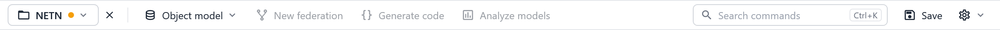
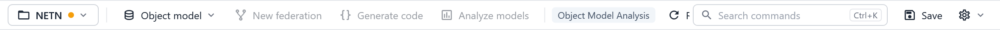
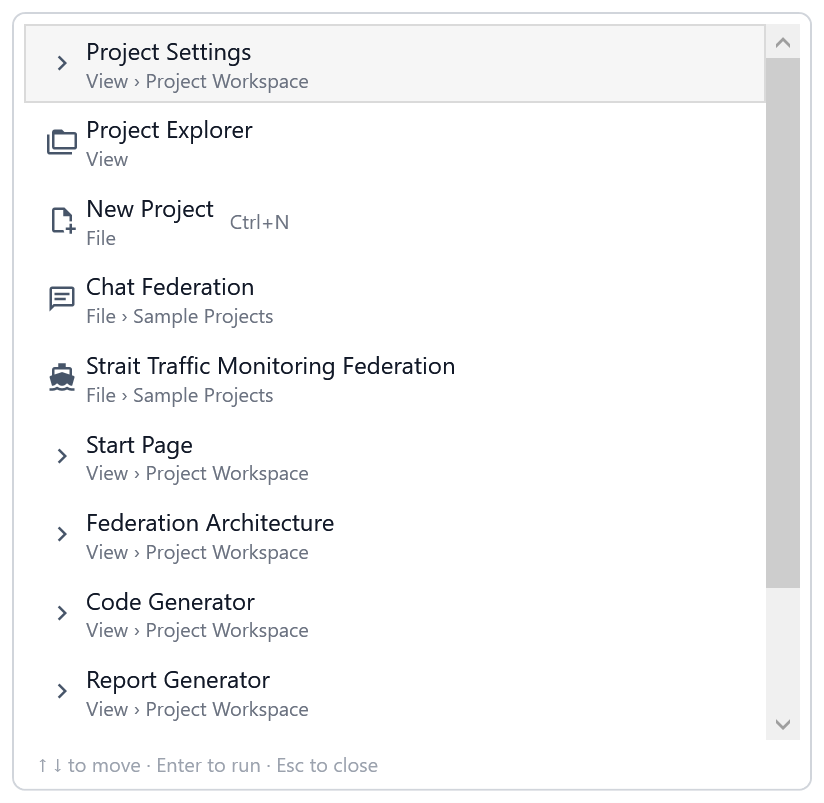

# The SimGe Workspace

This chapter describes the SimGe main window — its menus, command bar, panels, workspace tabs, and status bar.

## Main window layout

| Area | Role |
|---|---|
| **Menu bar** (top) | All commands, grouped by topic (see [Menus](#menus)). |
| **Command bar** (below the menu) | The open project and one-click access to the most common commands (see [Command bar](#command-bar)). |
| **Project Explorer** (side panel) | The unified project tree — see [Project Explorer](ProjectExplorer.md). |
| **Properties** (side panel) | Properties of the item selected in the tree or a workspace. |
| **Workspaces** (center) | Tabbed editing areas — see [Workspaces](#workspaces). |
| **Status bar** (bottom) | Live feedback, save state, and activity (see [Status bar](#status-bar)). |

The **Project Explorer** and **Properties** panels can be shown or hidden from the **View** menu, and any workspace can be floated into its own window.

## Menus

| Menu | Contains |
|---|---|
| **File** | New Project, Load…, Close…, Save, Save As, **Sample Projects** (Chat / STMS), Exit. See [Opening & Saving](OpeningSaving.md). |
| **Edit** | Cut, Copy, Paste. |
| **View** | **Project Workspace ▸** (Start Page, Federation Architecture, OMDE ▸ one entry per module, Code Generator, Report Generator, **Object Model Analysis**, Project Settings, Preferences — see [Workspaces](#workspaces)), **Project Explorer**, **Properties Window**. |
| **Object Model** | Load Object Model, Remove All Object Models, Create New FOM/SOM, **Import ▸** Any FDD (1.3 / 2010 / 2025), **Export ▸** FED / FDD. See [Importing & Exporting](ImportExport.md). |
| **Federation Architecture** | Create New Federation Architecture. See [FAME](FAME.md). |
| **Code Generator** | Generate Code. See [Code Generator](CodeGenerator.md). |
| **RID Editor** | RID file commands *(reserved / not yet enabled)*. |
| **Tools** | Project Settings, Preferences…, **FOM Dependencies…**, **Experimental ▸ Telemetry Visualizer…** |
| **Help** | SimGe User Manual, About SimGe (see [Installation & Updates](Installation.md)). |

## Command bar



The command bar below the menu shows which project is open and gives one-click access to the most common commands. The menu still holds every command.

| Item | What it does |
|---|---|
| **Project chip** | Shows the open project's name, or **Select project** when none is open; an orange dot means unsaved changes. Its menu has New project, Open project, **Recent projects**, **Sample projects** (Chat, STMS), Save as, and Close project. The **×** beside it closes the project in one click. With unsaved changes, closing the project or exiting SimGe asks whether to save them first: **Yes** saves and closes, **No** closes without saving, **Cancel** keeps the project open. If the save fails, the project stays open. |
| **Object model ▾** | New FOM/SOM, Load SimGe object model, Import FDD (HLA 1.3, 1516-2010, 1516-2025), and Export to FDD/FED. |
| **New federation** | Creates a federation architecture. See [FAME](FAME.md). |
| **Generate code** | Opens code generation. See [Code Generator](CodeGenerator.md). |
| **Analyze models** | Opens [Object Model Analysis](MetricsReports.md#object-model-analysis) for every module in the project. |
| **Context group** | The active workspace's name and its key actions (see below). |
| **Search commands** | Finds any command by name (**Ctrl+K**; see below). |
| **Save** | Saves the project (**Ctrl+S**). |
| **Settings ▾** | Project settings and Preferences. |

Commands that don't apply yet (for example **Generate code** before a project is open) are dimmed; hover them for a tooltip. **Remove All Object Models** is only in the **Object Model** menu, where it asks for confirmation.

The sample projects also stay on the startup screen and in **File → Sample Projects**.

### Context group



After the main commands, the command bar shows the active workspace's name and its most used actions. It changes when you switch tabs and is hidden for workspaces without actions, such as the Start Page.

| Workspace | Actions |
|---|---|
| **OME** (one module) | **Refresh analysis** re-runs the [dashboard](Dashboard.md) analysis; **Validate** opens the IEEE 1516-2025 FDD view and validates the module against its schema; **Report** generates the module report. |
| **FAME** | **New federate** adds a federate application; **Properties** shows or hides the properties pane. |
| **Object Model Analysis** | **Re-analyze** analyzes every module again; **Copy table** copies the module table as Markdown. |

In a narrow window the context group is clipped first; **Save**, **Settings**, and the search box stay visible.

### Command search



Press **Ctrl+K** or click **Search commands** and type part of a command's name. The list covers:

- every command in the menus, with its menu path (for example *View › Project Workspace*) and its shortcut;
- the active workspace's actions;
- **Open** *module* for each module in the project;
- the recent projects.

Every word you type must appear in the command's name or path, so `export fdd` finds *Export to HLA-1.3 FED/HLA1516-2010 FDD*. Name matches come before path matches. Commands that can't run yet are dimmed and listed last. Use **↑ ↓** to move, **Enter** to run, and **Esc** to close.

## Workspaces

The central area holds **workspace tabs**. Open a workspace from **View → Project Workspace**, from the command bar/menus, or by double-clicking an item in the Project Explorer.

| Workspace | What it is | Chapter |
|---|---|---|
| **Start Page** | Landing page: project status tiles, a next-step suggestion, the workflow (including **Analyze object models**), recent projects and samples, folder links, and the dependency graph. | [Start Page](StartPage.md) |
| **Object Model Editor (OME)** | Edits one FOM/SOM module — its tables, diagram editor, viewers, and dashboard. | [OME](OME.md), [Diagram Editor](Diagrams.md), [FOM Dashboard](Dashboard.md) |
| **FAME** | Designs the federation architecture and federate applications. | [FAME](FAME.md) |
| **Code Generator** | Generates federate code. | [Code Generator](CodeGenerator.md) |
| **Report Generator** | Renders a printable model report. | [Model Metrics & Reports](MetricsReports.md) |
| **Object Model Analysis** | Analyzes every FOM module of the project as its dashboard does: saturation, dispersion, and calibration sensitivity in one table, with input provenance and Markdown/CSV/LaTeX export. Opens from the Start Page or **View → Project Workspace**. | [Object Model Analysis](MetricsReports.md#object-model-analysis) |
| **Telemetry Visualizer** | Inspects simulation-run telemetry (Tools → Experimental). | [Telemetry Visualizer](TelemetryVisualizer.md) |
| **Project Settings** | Project and code-generator settings. | [Project Structure & Settings](ProjectSettings.md) |
| **Preferences** | Application-wide preferences. | [Preferences & Options](Preferences.md) |

> The generated **code viewer** and the **FED / FDD viewers** open from the Project Explorer or from within the OME workspace rather than as standalone top-level tabs.

## Tab controls

Main workspace tabs show a Material icon beside the title to distinguish modeling, settings, code, reports, analysis, and telemetry workspaces. Object Model Analysis uses a chart icon. OME's inner tabs keep their existing text headers.

Each workspace tab has two action buttons in its header:

| Button | Description |
|--------|-------------|
| ↗ (Open in floating window) | Detaches the workspace into a separate floating window |
| ✕ (Close) | Closes the workspace |

Right-clicking a tab opens a context menu with additional options:

| Menu Item | Description |
|-----------|-------------|
| **Close This** | Closes the current tab |
| **Close All** | Closes all open workspace tabs |
| **Close All But This** | Closes every tab except the one you right-clicked |

## Floating windows

You can move any workspace into its own independent window — useful when working with multiple monitors or when you want to compare two workspaces side by side.

The floating window's title bar keeps the workspace's Material icon, matching its main workspace tab.

### Detaching a workspace

1. Click the **↗** icon on the tab you want to detach.
2. The tab disappears from the main tab strip and the workspace opens in a new floating window.
3. The floating window is fully functional — all editing, Project Explorer interactions, and tool operations continue to work as normal.

> You can detach multiple workspaces at the same time. Each gets its own independent window.

### Bringing windows to the front

- Click any floating window's title bar to bring it to the front.
- Click the main application window to bring it in front of any floating windows.
- All windows are independent — none is forced to stay on top of another.

### Docking a workspace back

To return a floating workspace to the main tab strip:

1. Click the **← Dock Back** button in the floating window's toolbar.
2. The floating window closes and the workspace reappears as the active tab in the main window.

### Closing a floating workspace

To close (discard) a floating workspace entirely, click the standard **✕** close button on the floating window's title bar. The workspace is closed and removed — it does not return to the main tab strip.

## Status bar

The status bar along the bottom is organized into zones:

- **Primary status** (left) — the latest message or the active workspace's hint, colour-coded by category (info / success / warning / error). Click its icon to open the [message history](#message-history).
- **Save state** — a persistent badge: **Unsaved changes**, **All changes saved**, **Read-only sample**, or **No project**.
- **Busy activity** — a progress message and bar shown while a long operation runs.
- **Workspace / project info** (right) — the active workspace and project context.

### Message history

Status messages disappear after a few seconds, and a less important message is not shown while a warning or error is still on screen. SimGe keeps every message of the session so you can read it later:

```
Status bar
└─ ⓘ icon (click)            badge = unseen warnings/errors (red if any error)
   └─ Messages                [All | Errors | Warnings]  [Copy] [Clear]
      ├─ ✖ 14:32:10  Failed to load SimGe object model(s): X.fom …
      ├─ ✔ 14:31:52  Imported module: RPR-Base (FOM).
      └─ ⓘ 14:30:05  Analysis refreshed — RPR-Base.
```

- **Badge** — a small number on the icon counts warnings and errors you have not looked at yet. It turns red when at least one of them is an error, and resets when you open the panel.
- **Panel** — opens above the icon, newest message first, with its time and full text. Click anywhere outside it or press **Esc** to close it.
- **Filter** — show all messages, only errors, or only warnings.
- **Copy** — copies the shown messages as text (oldest first, with date, time and category), e.g. for a bug report.
- **Clear** — empties the history.

The history holds the last 200 messages of the current session and is not saved when SimGe closes.

OME editing dialogs also have an orange [validation status bar](Validation.md#editor-validation-status-bar) with Error/Warning messages, previous/next arrows, a position counter, and a Copy button for all reported messages.

## Tips

- If you open a module that is already detached in a floating window, SimGe brings that floating window to the front instead of opening a duplicate.
- Closing a project closes all workspaces, including any that are currently in floating windows.
- Use **View → Project Workspace** to jump to any workspace without hunting through the tree.
- Object Model Analysis opens once per project. Opening it again brings the existing tab to the front and keeps its results; the analysis runs automatically only the first time. Select **Analyze** in the tab after editing or saving modules.

---

**Next:** [Start Page](StartPage.md)

---
Updated October 8, 2026
